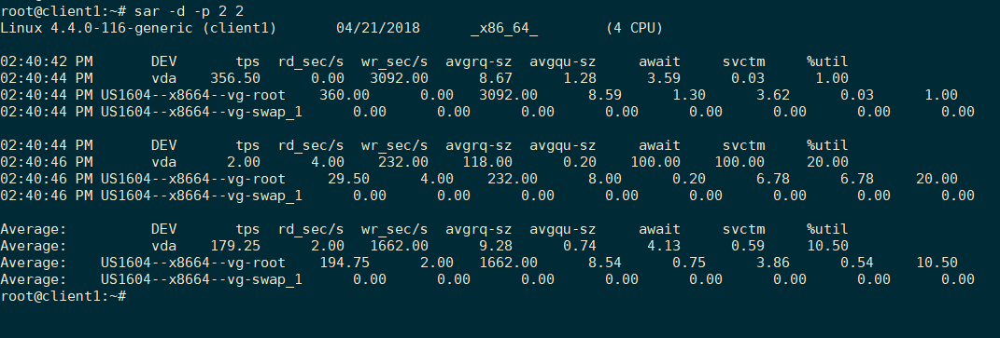

# `sar` command

Sử dụng lệnh `sar` để theo dõi hiệu suất hoạt động của hệ thống Linux theo thời gian thực (CPU, memory, I/O, ... )

Sử dụng `sar`, bạn có thể thu thập tất cả dữ liệu cơ bản nhất, lưu trữ và phân tích chúng để xác định nguyên nhân gây nút thắt cổ chai khi gặp sự cố.

`sar` là một phần trong gói `sysstat`

## 1. Cài đặt gói

- Cài đặt gói phần mềm chứa dòng lệnh `sar` trên ubuntu:

	```
	apt-get install sysstat -y
	```

## 2. Hiển thị thông số memory đã dùng và memory free:

`sar -r 1 3`

Hiển thị report về memory mỗi khoảng thời gian cách nhau 1s trong 3 lần: 

```
root@client1:~# sar -r 1 3
Linux 4.4.0-116-generic (client1)       04/05/2018      _x86_64_        (4 CPU)

05:49:49 PM kbmemfree kbmemused  %memused kbbuffers  kbcached  kbcommit   %commit  kbactive   kbinact   kbdirty
05:49:50 PM   7589428    585400      7.16     25216    270984   1313344     12.79    360428    128572      3656
05:49:51 PM   7589428    585400      7.16     25216    270984   1313344     12.79    360428    128572      3656
05:49:52 PM   7589428    585400      7.16     25224    270976   1313344     12.79    360428    128572      3656
Average:      7589428    585400      7.16     25219    270981   1313344     12.79    360428    128572      3656
```

Trong đó: `kbmemfree` và `kbmemused` là bộ nhớ free và lượng bộ nhớ đã sử dụng

## 3. Swap Space Used (sar -S)

```
root@client1:~# sar -S 1 3
Linux 4.4.0-116-generic (client1)       04/05/2018      _x86_64_        (4 CPU)

05:52:19 PM kbswpfree kbswpused  %swpused  kbswpcad   %swpcad
05:52:20 PM   2097148         0      0.00         0      0.00
05:52:21 PM   2097148         0      0.00         0      0.00
05:52:22 PM   2097148         0      0.00         0      0.00
Average:      2097148         0      0.00         0      0.00
```

Hiển thị thông số thống kê về swap, báo cáo sẽ gửi về 3 lần và cách nhau mỗi 1s. Nếu `kbswpused` và `%swpused` là 0 thì hệ thống đang không swap.


## 4. Đo loadavg và run queue:

```
root@client1:~# sar -q 1 2
Linux 4.4.0-116-generic (client1)       04/05/2018      _x86_64_        (4 CPU)

06:01:29 PM   runq-sz  plist-sz   ldavg-1   ldavg-5  ldavg-15   blocked
06:01:30 PM         0       246      0.01      0.02      0.00         0
06:01:31 PM         0       246      0.01      0.02      0.00         0
Average:            0       246      0.01      0.02      0.00         0
```

## 5. Đo thống kê về netwok 

Sử dụng lệnh `sar` với tùy chọn `-n` để hiển thị báo cáo về network.

```
sar -n KEYWORD
```

Trong đó `KEYWORD` có thể là: 

\- DEV – Hiển thị thống kê về network của các interface của hệ thống.

```
root@client1:~# sar -n DEV 1 2
Linux 4.4.0-116-generic (client1)       04/05/2018      _x86_64_        (4 CPU)

06:13:41 PM     IFACE   rxpck/s   txpck/s    rxkB/s    txkB/s   rxcmp/s   txcmp/s  rxmcst/s   %ifutil
06:13:42 PM        lo      2.00      2.00      0.20      0.20      0.00      0.00      0.00      0.00
06:13:42 PM      ens5      0.00      0.00      0.00      0.00      0.00      0.00      0.00      0.00
06:13:42 PM      ens4      0.00      0.00      0.00      0.00      0.00      0.00      0.00      0.00
06:13:42 PM      ens3      0.00      0.00      0.00      0.00      0.00      0.00      0.00      0.00

06:13:42 PM     IFACE   rxpck/s   txpck/s    rxkB/s    txkB/s   rxcmp/s   txcmp/s  rxmcst/s   %ifutil
06:13:43 PM        lo      2.00      2.00      0.20      0.20      0.00      0.00      0.00      0.00
06:13:43 PM      ens5      1.00      0.00      0.05      0.00      0.00      0.00      0.00      0.00
06:13:43 PM      ens4      1.00      0.00      0.05      0.00      0.00      0.00      0.00      0.00
06:13:43 PM      ens3      3.00      1.00      0.18      0.16      0.00      0.00      0.00      0.00

Average:        IFACE   rxpck/s   txpck/s    rxkB/s    txkB/s   rxcmp/s   txcmp/s  rxmcst/s   %ifutil
Average:           lo      2.00      2.00      0.20      0.20      0.00      0.00      0.00      0.00
Average:         ens5      0.50      0.00      0.03      0.00      0.00      0.00      0.00      0.00
Average:         ens4      0.50      0.00      0.03      0.00      0.00      0.00      0.00      0.00
Average:         ens3      1.50      0.50      0.09      0.08      0.00      0.00      0.00      0.00
```


\- EDEV – Display network device failure statistics

\- NFS – Displays NFS client activities

\- NFSD – Displays NFS server activities

\- SOCK – Displays sockets in use for IPv4

\- IP – Displays IPv4 network traffic

\- EIP – Displays IPv4 network errors

\- ICMP – Displays ICMPv4 network traffic

\- EICMP – Displays ICMPv4 network errors

\- TCP – Displays TCPv4 network traffic

\- ETCP – Displays TCPv4 network errors

\- UDP – Displays UDPv4 network traffic

\- SOCK6, IP6, EIP6, ICMP6, UDP6 are for IPv6

\- ALL – This displays all of the above information. The output will be very long.

## 5. Hiển thị thông số về CPU

Hiển thị thông số CPU với tùy chọn `-u`:

```
root@client1:~# sar -u 1 2
Linux 4.4.0-116-generic (client1)       04/05/2018      _x86_64_        (4 CPU)

06:18:23 PM     CPU     %user     %nice   %system   %iowait    %steal     %idle
06:18:24 PM     all      0.00      0.00      0.25      0.00      0.00     99.75
06:18:25 PM     all      0.00      0.00      0.00      0.00      0.00    100.00
Average:        all      0.00      0.00      0.12      0.00      0.00     99.88
```

## 6. Hiển thị thông số về ổ cứng

`sar` cung cấp các thông số về ổ cứng (block devices) với tùy chọn `-d`. 

```
root@client1:~# sar -d 2 3
Linux 4.4.0-116-generic (client1)       04/21/2018      _x86_64_        (4 CPU)

02:35:11 PM       DEV       tps  rd_sec/s  wr_sec/s  avgrq-sz  avgqu-sz     await     svctm     %util
02:35:13 PM  dev253-0      1.50      0.00    428.00    285.33      0.26    174.67    174.67     26.20
02:35:13 PM  dev252-0     53.50      0.00    428.00      8.00      0.26      4.90      4.90     26.20
02:35:13 PM  dev252-1      0.00      0.00      0.00      0.00      0.00      0.00      0.00      0.00

02:35:13 PM       DEV       tps  rd_sec/s  wr_sec/s  avgrq-sz  avgqu-sz     await     svctm     %util
02:35:15 PM  dev253-0      0.00      0.00      0.00      0.00      0.00      0.00      0.00      0.00
02:35:15 PM  dev252-0      0.00      0.00      0.00      0.00      0.00      0.00      0.00      0.00
02:35:15 PM  dev252-1      0.00      0.00      0.00      0.00      0.00      0.00      0.00      0.00

02:35:15 PM       DEV       tps  rd_sec/s  wr_sec/s  avgrq-sz  avgqu-sz     await     svctm     %util
02:35:17 PM  dev253-0      7.00      0.00     56.00      8.00      0.00      0.00      0.00      0.00
02:35:17 PM  dev252-0      7.00      0.00     56.00      8.00      0.00      0.00      0.00      0.00
02:35:17 PM  dev252-1      0.00      0.00      0.00      0.00      0.00      0.00      0.00      0.00

Average:          DEV       tps  rd_sec/s  wr_sec/s  avgrq-sz  avgqu-sz     await     svctm     %util
Average:     dev253-0      2.83      0.00    161.33     56.94      0.09     30.82     30.82      8.73
Average:     dev252-0     20.17      0.00    161.33      8.00      0.09      4.33      4.33      8.73
Average:     dev252-1      0.00      0.00      0.00      0.00      0.00      0.00      0.00      0.00
```

Trong đó, các giá trị:

- `DEV`: tên block device. Hiển thị theo số major và minor của thiết bị.

- `tps` : Transfers per second

- `rd_sec/s` : Sector reads per second (sector is 512 byte)

- `wr_sec/s` : Sector writes per second 

- `avgrq-sz` :  average size (in sectors) of the requests that were issued to the device

- `avgqu-sz` : average queue length of the requests that were issued to the device

- `await` :The average time (in milliseconds) for I/O requests

- `svctm` : The average service time (in milliseconds) for I/O requests

- `%util` : Percentage  of  CPU  time  during  which  I/O requests were issued to the device


Kết hợp với tùy chọn `-p` để hiển thị các device dưới dạng tên dành cho người dùng:



## Tham khảo

https://www.thegeekstuff.com/2011/03/sar-examples/?utm_source=feedburner