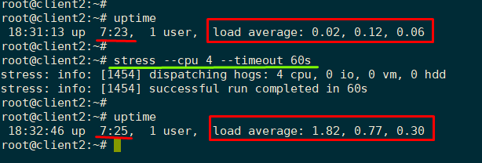
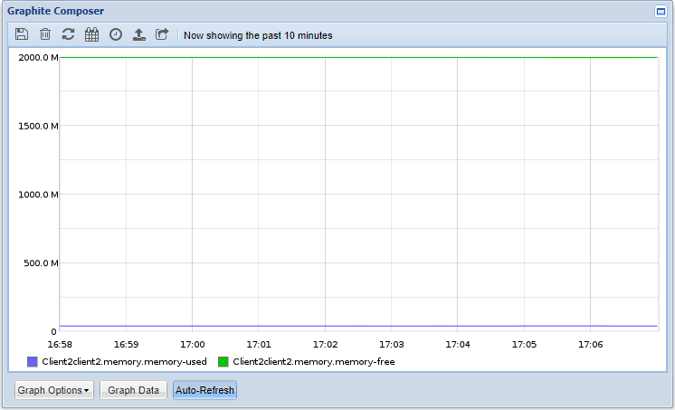
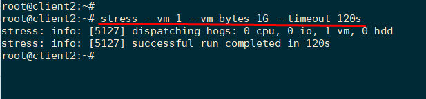
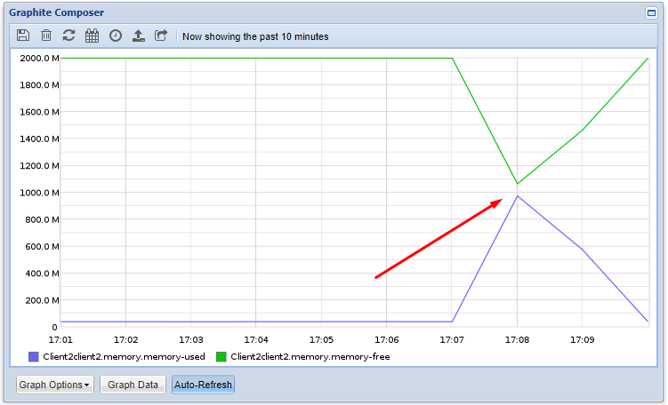
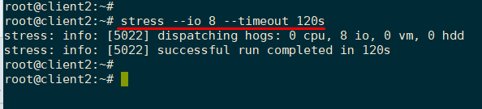
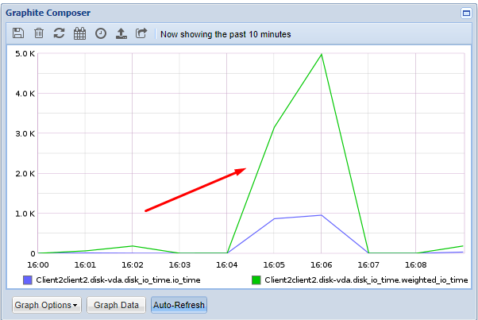
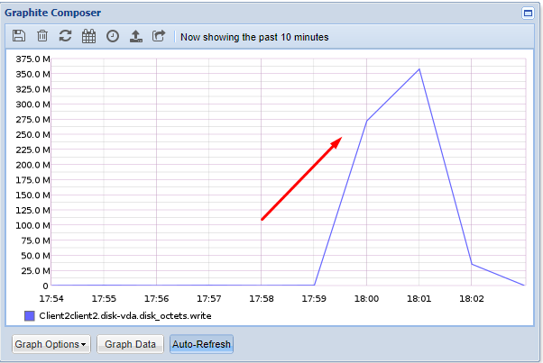

# Kiểm tra hiệu năng hệ thống với `stress` 


## Giới thiệu

- `stress` và `stress-ng` là công cụ để giám sát và kiểm tra khả năng xử lý của hệ thống khi phải chịu áp lực hoạt động cao. Là công cụ hữu ích dành cho các nhà quản trị hệ thống và lập trình viên để:

	- Điều chỉnh các hoạt động trên hệ thống

	- Giám sát các hoạt động của kernel hệ điều hành

	- Kiểm tra các thành phần phần cứng của Linuw như CPU, RAM, disk và nhiều thành phần khác dưới sự hoạt động cao.

	- Đo đạc hiệu năng tiêu thụ trên hệ thống.


- `stress`:  là một công cụ sinh tải đơn giản cho các hệ thống  POSIX. Nó đẩy cấu hình đẩy các thông số của CPU, bộ nhớ, I/O và disk của hệ thống lên rất cao. 

- `stress-ng`: là phiên bản cập nhật của `stress` và kiểm tra  các tính năng sau của máy chủ:

	- Tính toán CPU

	- CPU compute

	- drive stress

	- I/O syncs

	- Pipe I/O

	- cache thrashing

	- VM stress

	- socket stressing

	- Tạo và kết thúc tiến trình

	- context switching properties

## `stress`

`stress` là công cụ dễ dàng và được đề xuất sử dụng cho người dùng mới làm quản trị hệ thống. Nó làm việc trên các hệ thống x86 Linux và FreeBSD/OpenBSD, powerpc AIX và Linux, SPARC Solaris, Compaq Alpha Tru64 UNIX, và nhiều hệ thống khác.

- Cài đặt gói `stress`: bạn có thể cài đặt gói công cụ `stress` trên nhiều distro khác nhau. Ví dụ trên ubuntu:

	```
	# apt-get install stress -y
	```
- Các tùy chọn tham khảo: http://manpages.ubuntu.com/manpages/xenial/man1/stress.1.html

### Một số ví dụ sử dụng

Để kiểm tra hiệu quả câu lệnh, sử dụng lệnh `uptime` trước và sau khi thực hiện lệnh `strees` để show kết quả.

1) Giả sử máy có 2 cpu: thực hiện lệnh stress đẩy cả 2 CPU làm việc ở  mức cao trong thời gian 20s (Khi chạy lệnh này, máy sẽ thực hiện liên tục hàm `sqrt()` tính căn bậc 2 của một số ngẫu nhiên bất kì sinh ra từ hàm `rand()` ngẫu nhiên) Sau đó dùng lệnh `uptime` lần nữa để kiểm tra kết quả:

	

2) Thực hiện đẩy RAM hoạt động mức cao với tùy chọn `--vm N` cấp phát cho N Wordload một lượng RAM trong một khoảng thời gian 120s. (Lệnh này ép máy thực hiện cấp phát `malloc()` và giải phóng bộ nhớ `free()` liên tục). Lượng RAM cho mỗi workload mặc định là 256MB, tùy chỉnh thêm với tùy chọn `--vm-bytes`. 

	- Trước khi thực hiện lệnh (hiển thị với graphite-web) : 

		

	- Thực hiện lệnh:

		

	- Sau khi thực hiện lệnh, lượng RAM đã sử dụng bị đẩy lên khoảng 1G do có 1 workload chạy với 1G bộ nhớ:

		 


3) Thực hiện đẩy hoạt động trên ổ cứng:

	- Tùy chọn `--io` thực hiện hàm đồng bộ `sync()` để đồng bộ dữ liệu trên bất kì trong bộ đệm buffer vào ổ cứng. 

		

		Kết quả show trên graphite khi giám sát: 
		
		
	
	- Tùy chọn `--hdd` thực hiện thao tác đọc ghi dữ liệu liên tục lên ổ cứng trong một thời gian nhất định: Ghi một file dung lượng 1G lên ổ cứng trong thời gian 3 phút: 

		

		Kết quả show trên graphite khi giám sát:
		
		

## Tham khảo

[1] http://manpages.ubuntu.com/manpages/trusty/man1/stress.1.html