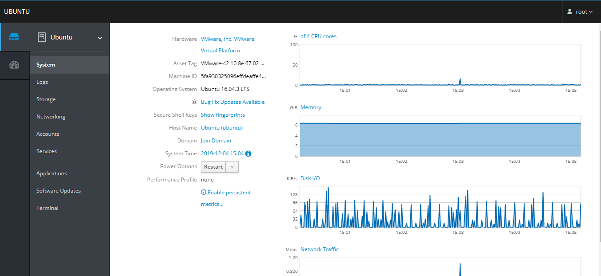
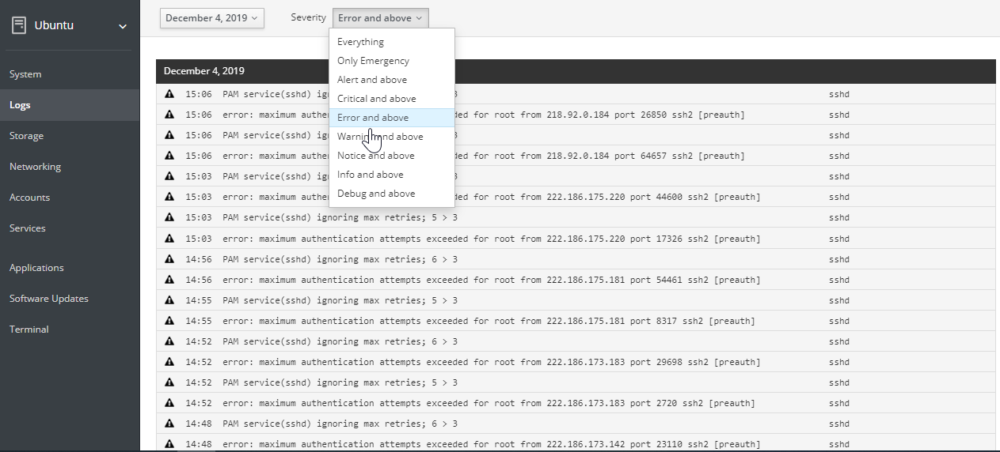
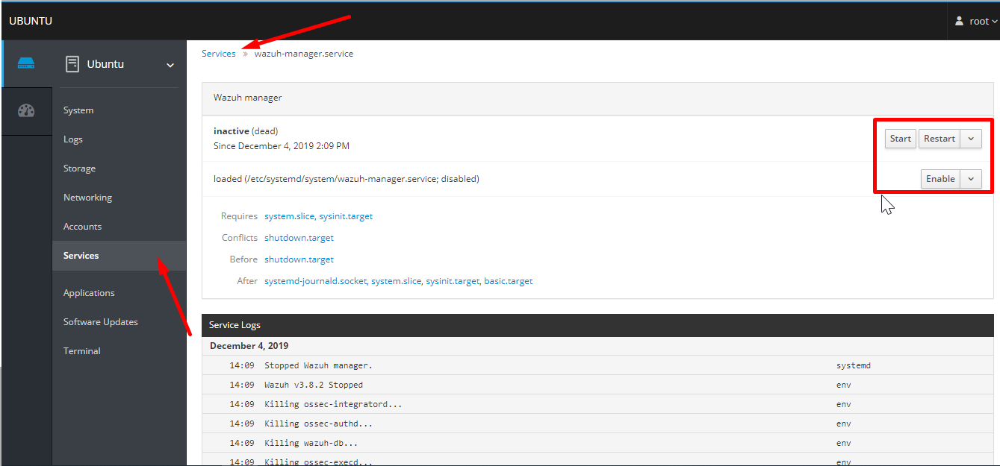
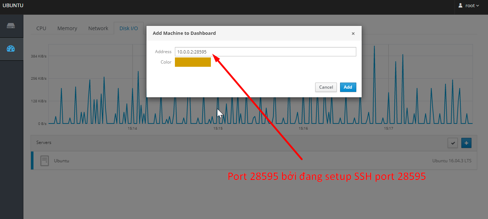
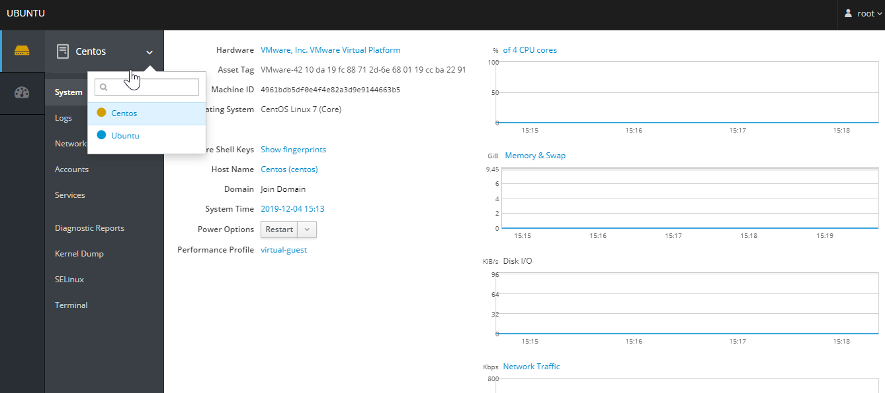

# Cockpit - 5' deploy và quản trị nhẹ tênh

Vô tình nhận được thông báo về bài viết này:  https://news.cloud365.vn/centos-8-gioi-thieu-va-huong-dan-cai-dat-cockpit-tren-centos-8  thấy khá hay nên vọc qua thử. 

Trải nghiệm dùng khá là ok. Chỉ với vài thao tác setup là lên ngay một giao diện dashboard đủ chức năng monitoring, logging, terminal để tương tác, giao diện thân thiện, dễ sử dụng - cả trong việc quản lý các service (start, stop, reload, restart, enable, disable,...) => ***Nói chung là khá cool và quá tiện còn gì nữa :D***. 

Mò vào trang chủ thì thấy tool này cũng xuất hiện khá lâu rồi (có vẻ từ năm 2013), nhưng giờ nhờ bài viết kia mình mới biết tới nó :v haizz. 

Cài trên con lab của mình - Ubuntu 16.04 chỉ với một câu lệnh `apt install cockpit -y` duy nhất, 3' sau tèn ten có ngay cái giao diện dashboard nhìn xịn xò dư này: 

Monitor đủ các thông số cần thiết, loging đầy đủ và có cả chế độ show log theo level nữa

Như này thì lúc setup còn lo gì tìm log ở đâu nữa. Chỉ tội là không có chức năng filter hay tìm log. Nhưng thôi, free mà nhanh như này thì quá ngon bổ rồi. @@ 

Do là cái máy để lab linh tinh nên khá nhiều service sau khi test xong mình quên chưa stop và disable đi để bớt tốn tài nguyên, vô đây ngó cái tab **Services** mừng quýnh, tắt đi được vài cái service không dùng tới để đỡ ngốn tài nguyên, mà chỉ cần click cái nhẹ là xong: 

 👍👍  👍👍  👍👍  👍👍 

Rồi cả mấy cái Quản lý account, Terminal ... dùng thích mê :v

Đọc một chút về cockpit thì thấy nó quản lý nhiều server một lúc, nên thử add thêm server vào xem nó ra làm sao. Click vô Dashboard thì thấy có phần add server: 

Táy máy add thử xem như nào. Nhớ cái link đầu tiên có mô hình hoạt động của cockpit, các server muốn cockpit quản trị thì cần phải cài cockpit bridge và các server phải connect được thông qua SSH. Nên mình mạnh dạn add key của user root con ubuntu hiện tại vào user root của con server centos mới muốn add vào. Đồng thời setup cockpit trên server centos mới kia (Cũng chỉ với dòng lệnh `yum install cockpit -y` là xong  😂 ). Setup để từ user root của con ubuntu hiện tại ssh vào được root của centos muốn thêm vào. Quay lại dashboard add thêm : 

Click Add cái là ok luôn. 

Cảm thấy xịn xò!! **(ﾉ◕ヮ◕)ﾉ*:･ﾟ✧**

