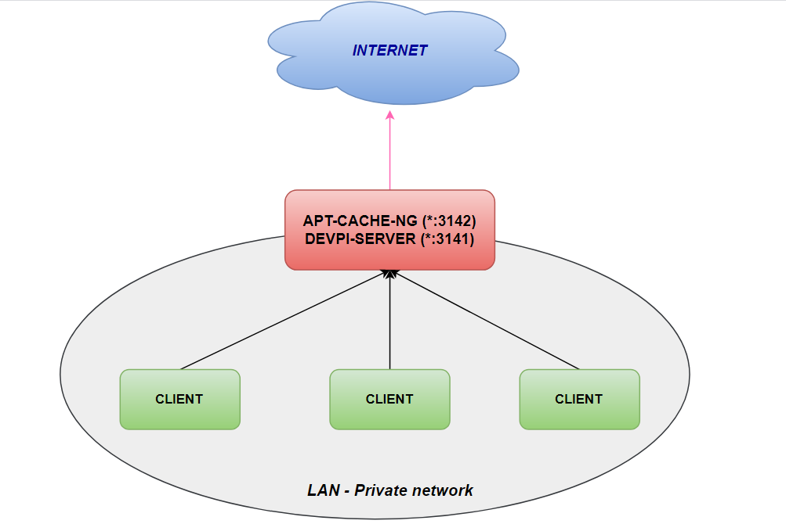

# Deploy devpi-server - proxy install for python pip

Note lại một chút về việc deploy devpi-server - Đại loại nó là một kiểu proxy để cài đặt các phần mềm thông qua pip. 

Use case thực tế gặp phải là: cần setup một app chạy python trên các server không được phép kết nối thông ra Internet, không sử dụng iptables để route. Tuy nhiên vẫn chấp nhận cách xử lý làm việc qua proxy. 

App python kia yêu cầu setup virtualenv và một số gói python phụ thuộc mà cài đặt qua python pip. Phần cài đặt python-pip trên các server kia tạm xử lý bằng cách sử dụng [apt-cache-ng]( https://github.com/ThanhTamPotter/thuctap012017/blob/master/TamNT/Tim_hieu_apt-cacher-ng.md ). Tuy nhiên, apt-cache-ng chỉ giải quyết bài toán cài đặt các gói phần mềm từ repository sử dụng công cụ quản lý gói `apt` của ubuntu, không cache lại hay đóng vai trò như proxy setup các gói phần mềm khi cài bằng `python-pip`. Google thấy họ giới thiệu sử dụng **devpi-server**. Dựng lên test thử xem sao thì thấy hoạt động khá ổn với case của mình. Nên là note lại vài dòng setup để sau này dùng tới. :)) 

Mô hình triển khai: 



#### Setup apt-cache-ng theo note [tại đây]( https://github.com/ThanhTamPotter/thuctap012017/blob/master/TamNT/Tim_hieu_apt-cacher-ng.md).

#### Setup devpi-server

Tìm hiểu chi tiết về devpi tại đây:  https://devpi.net/docs/devpi/devpi/stable/%2Bd/index.html 

Trên server setup proxy, thực hiện cài đặt python-pip (nếu chưa có) và cài đặt devpi-server như sau: 

```bash
# apt install python-pip -y
# pip install Virtualenv
# cd /opt
# mkdir devpi-server
# virtualenv env
# source env/bin/activate
# pip install -q -U devpi-server
```

Sau khi cài đặt, check version của devpi-server đã được setup: 

```bash
(env) root@localhost:~# devpi-server --version
5.3.0
```

Khởi tạo devpi-server: 

```bash
(env) root@localhost:~# devpi-init
INFO  NOCTX Loading node info from /tmp/root/.devpi/server/.nodeinfo
INFO  NOCTX generated uuid: cfd8cd68eb384f349935a210670415fb
INFO  NOCTX wrote nodeinfo to: /tmp/root/.devpi/server/.nodeinfo
INFO  NOCTX DB: Creating schema
INFO  [Wtx-1] setting password for user 'root'
INFO  [Wtx-1] created user 'root' with email None
INFO  [Wtx-1] created root user
INFO  [Wtx-1] created root/pypi index
INFO  [Wtx-1] fswriter0: committed: keys: '.config','root/.config'
(env) root@localhost:~# 
(env) root@localhost:~# devpi-gen-config --host 0.0.0.0
It is highly recommended to use a configuration file for devpi-server, see --configfile option.
wrote gen-config/crontab
wrote gen-config/net.devpi.plist
wrote gen-config/launchd-macos.txt
wrote gen-config/nginx-devpi.conf
wrote gen-config/supervisor-devpi.conf
wrote gen-config/supervisord.conf
wrote gen-config/devpi.service
wrote gen-config/windows-service.txt
```

Đoạn gen config cần thêm tham số `--host 0.0.0.0` vào để cho phép service listen all IP, mặc định nó chỉ listen trên localhost - nếu chỉ setup tới bước này (không tạo nginx proxy) thì các client sẽ không connect được devpi-server. 

Sau khi chạy lệnh trên thì các file config được sinh ra trong thư mục `gen-config` ở `$home` của user hiện tại. 

```bash
root@localhost:~/gen-config# ll
total 40
drwxr-xr-x  2 root root 4096 Dec  9 14:42 ./
drwx------ 10 root root 4096 Dec  9 17:28 ../
-rw-r--r--  1 root root  211 Dec  9 14:41 crontab
-rw-r--r--  1 root root  458 Dec  9 14:42 devpi.service
-rw-r--r--  1 root root  529 Dec  9 14:41 launchd-macos.txt
-rw-r--r--  1 root root  487 Dec  9 14:41 net.devpi.plist
-rw-r--r--  1 root root 1284 Dec  9 14:41 nginx-devpi.conf
-rw-r--r--  1 root root  283 Dec  9 14:41 supervisord.conf
-rw-r--r--  1 root root  168 Dec  9 14:42 supervisor-devpi.conf
-rw-r--r--  1 root root 1748 Dec  9 14:41 windows-service.txt
```

Check thấy có file `devpi.service`, copy file này vào thư mục `/etc/systemd/system/` để chạy quản lý bằng systemd (:v xịn xò voãi). 

```bash
root@localhost:~/gen-config# cp devpi.service /etc/systemd/system/
root@localhost:~/gen-config# systemctl deamon-reload
root@localhost:~/gen-config# systemctl start devpi
root@localhost:~/gen-config# systemctl enable devpi
root@localhost:~/gen-config# systemctl status devpi
● devpi.service - Devpi Server
   Loaded: loaded (/etc/systemd/system/devpi.service; disabled; vendor preset: enabled)
   Active: active (running) since Mon 20yy-12-09 16:34:59 +07; 1h 17min ago
 Main PID: 6870 (devpi-server)
   CGroup: /system.slice/devpi.service
           └─6870 /opt/devpi-server/env/bin/python /opt/devpi-server/env/bin/devpi-server --host 0.0.0.0

Dec 09 17:27:03 localhost devpi-server[6870]: 20yy-12-09 17:27:03,978 INFO  [req103] [Rtx77] setting projects cache for u'contextlib2'
Dec 09 17:27:04 localhost devpi-server[6870]: 20yy-12-09 17:27:04,042 INFO  [req104] GET /root/pypi/+f/335/5078a159fbb44/contextlib2-0.6.0
Dec 09 17:27:04 localhost devpi-server[6870]: 20yy-12-09 17:27:04,089 INFO  [req105] GET /root/pypi/zipp/
Dec 09 17:27:04 localhost devpi-server[6870]: 20yy-12-09 17:27:04,097 INFO  [req106] GET /root/pypi/+simple/zipp/
Dec 09 17:27:04 localhost devpi-server[6870]: 20yy-12-09 17:27:04,229 INFO  [req106] [Rtx77] setting projects cache for u'zipp'
Dec 09 17:27:04 localhost devpi-server[6870]: 20yy-12-09 17:27:04,302 INFO  [req107] GET /root/pypi/+f/f06/903e9f1f43b12/zipp-0.6.0-py2.py
Dec 09 17:27:04 localhost devpi-server[6870]: 20yy-12-09 17:27:04,389 INFO  [req108] GET /root/pypi/scandir/
Dec 09 17:27:04 localhost devpi-server[6870]: 20yy-12-09 17:27:04,400 INFO  [req109] GET /root/pypi/+simple/scandir/
Dec 09 17:27:04 localhost devpi-server[6870]: 20yy-12-09 17:27:04,570 INFO  [req109] [Rtx77] setting projects cache for u'scandir'
Dec 09 17:27:04 localhost devpi-server[6870]: 20yy-12-09 17:27:04,699 INFO  [req110] GET /root/pypi/+f/4d4/631f6062e658e/scandir-1.10.0.t
```

Sau khi start lên, service devpi sẽ listen trên mọi interface và port 3141: 

```bash
root@localhost:~/gen-config# ss -anp | grep 3141
tcp    LISTEN     0      128       *:3141                  *:*                   users:(("devpi-server",pid=6870,fd=7))
```

#### Client setup gói python bằng pip thông qua proxy devpi

Trên các server client, thực hiện cài đặt các gói python, add thêm thông số về proxy như sau: 

```bash
root@client1:/opt# pip install --index http://<IP_devpi_proxy>:3141/root/pypi/ --trusted-host <IP_devpi_proxy> prometheus-client

Collecting prometheus-client
  Downloading http://<IP_devpi_proxy>:3141/root/pypi/+f/71c/d24a2b3eb335c/prometheus_client-0.7.1.tar.gz
Building wheels for collected packages: prometheus-client
  Running setup.py bdist_wheel for prometheus-client ... done
  Stored in directory: /root/.cache/pip/wheels/c6/9b/02/9a13ea19e2551e16cf041826aa00a662b967194ecd005ee7d9
Successfully built prometheus-client
Installing collected packages: prometheus-client
Successfully installed prometheus-client-0.7.1
```

Vậy là client 1 có thể setup được thư viện prometheus-client của python mà không cần phải truy cập ra Internet. 

**DONE  ᕙ(⇀‸↼‶)ᕗ**


### Nguồn tham khảo

[1]  https://devpi.net/docs/devpi/devpi/latest/+doc/quickstart-server.html#quickstart-server 

[2]  https://devpi.net/docs/devpi/devpi/latest/+d/quickstart-pypimirror.html 