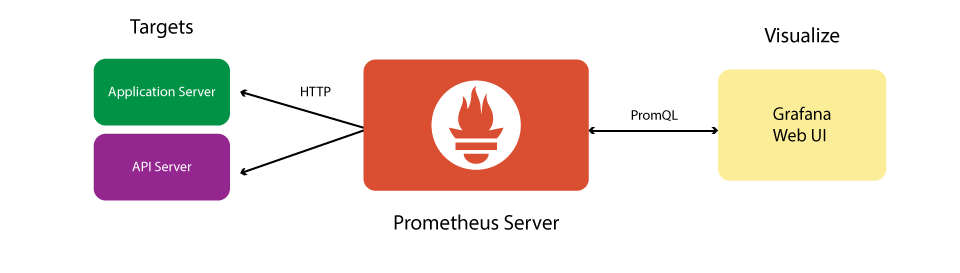
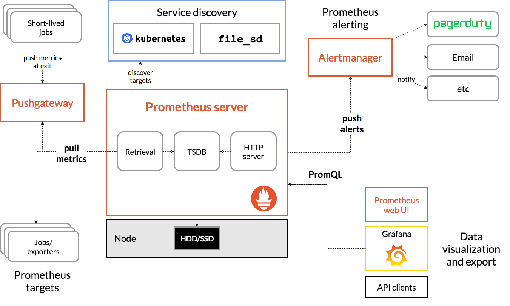

# Giới thiệu về Prometheus

### ***Mục lục***

[1. Như nào là một hệ thống monitor?](#1)

[2. Prometheus là gì?](#2)

[3. Các thành phần trong Prometheus](#3)

[4. Nguồn tham khảo](#4)

---

## 1. Như nào là một hệ thống monitor? 

Hệ thống monitor là hệ thống đáp ứng được các tính năng sau: 

- Thu thập thông tin trạng thái của server, service. Lưu trữ các metrics đó.
- Visual các metrics để người dùng biết được trạng thái server, service của mình. 
- Cảnh báo khi có lỗi, hoặc tài nguyên dùng gần chạm tới mức ngưỡng nào đó (ví dụ: service not running, cpu sử dụng quá 80%,     ...) 

**=>**Lựa chọn bộ giải pháp monitor của prometheus gồm các thành phần: 

- **Prometheus**: Server thu thập metrics về trạng thái server, service từ các host cần giám sát. Lưu trữ metrics. 

- **Grafana**: Có trách nhiệm visual các metrics từ prometheus server thành các dashboard với giao diện đẹp mắt, dễ nhìn cho người dùng. 

- **Alertmanager**: Sinh ra cảnh báo (alert) cho người dùng. 

  

## 2.Prometheus là gì? 

Prometheus là hệ thống giám sát và cảnh báo mã nguồn mở. Hiện prometheus đã dần trở nên phổ biến và được nhiều công ty, tổ chức sử dụng. 

Các tính năng của prometheus: 

- Mô hình dữ liệu đa chiều với việc định danh time series data bởi tên metric pair với giá trị key/value.
- Truy vấn PromQL - truy vấn metric linh hoạt, đơn giản.
- Lưu trữ metric tự động trên node server 
- Thu thập dữ liệu theo thời gian (time series - metric) thông qua mô hình pull (tức là server sẽ tới các node agent để pull metric về) thông qua http.
- Có hỗ trợ push metric (agent đẩy metric lên) thông qua gateway trung gian. (Thành phần Pushgateway)
- Các node target (hay agent, host cần monitor) được khám phá thông qua service discover hoặc qua file cấu hình của prometheus. 
- Hỗ trợ đồ họa và dashboard hóa metric. 

## 3. Các thành phần trong Prometheus

Hệ sinh thái của Prometheus gồm nhiều thành phần, và một vài thành phần của nó có thể là thành phần option (có cũng được, không có cũng không sao, không phải thành phần core):

- Thành phần chính [Prometheus server](https://github.com/prometheus/prometheus) có nhiệm vụ quét metrics định kì và lưu lại vào database. 
- [client libraries](https://prometheus.io/docs/instrumenting/clientlibs/) for instrumenting application code
- a [push gateway](https://github.com/prometheus/pushgateway) for supporting short-lived jobs
- Các [exporters](https://prometheus.io/docs/instrumenting/exporters/) cụ thể cho các ứng dụng: như HAproxy, nginx, mysql, ... có nhiệm vụ giám sát trạng thái và các metrics liên quan cúa service này. 
- [Alertmanager](https://github.com/prometheus/alertmanager) để xử lý và sinh ra các cảnh báo (alert)
- Một số công cụ hỗ trợ khác

Hầu hết các thành phần của Prometheus được viết bằng [Go](https://golang.org/), để dễ dàng trong việc xây dựng và triển khai các binary tĩnh.

Kiến trúc hệ sinh thái Prometheus

Prometheus quét các metrics từ các job exporter, hoặc quét trực tiếp hoặc thông qua một push gateway trung gian. Nó lưu các mẫu metrics quét được đó trên chính nó, và chạy các rule trên các metrics này để tích hợp lại với các metrics đã có trước đó, hoặc sinh ra alert. [Grafana](https://grafana.com/) được sử dụng để visualize các dữ liệu thu thập được.

=> Prometheus hoạt động theo mô hình client-server. Các host cần giám sát sẽ cài đạt các exporter đóng vai trò agent. Prometheus server sẽ quét exporter trên các host cần giám sát định kì theo thời gian. 

=> Setup Promtheus server => install exporter trên các host cần giám sát => Setup Alertmanager => Setup Grafana. 

## 4. Nguồn tham khảo

[1] https://prometheus.io/docs/introduction/overview/