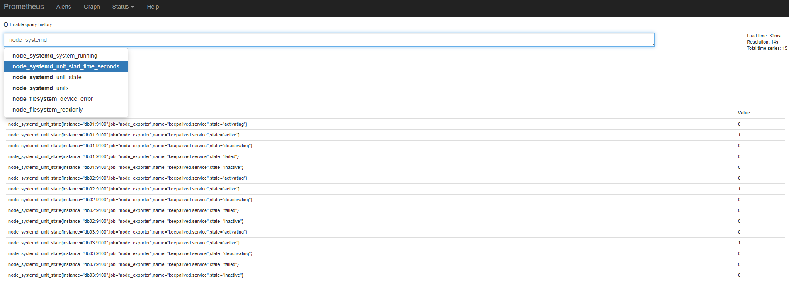
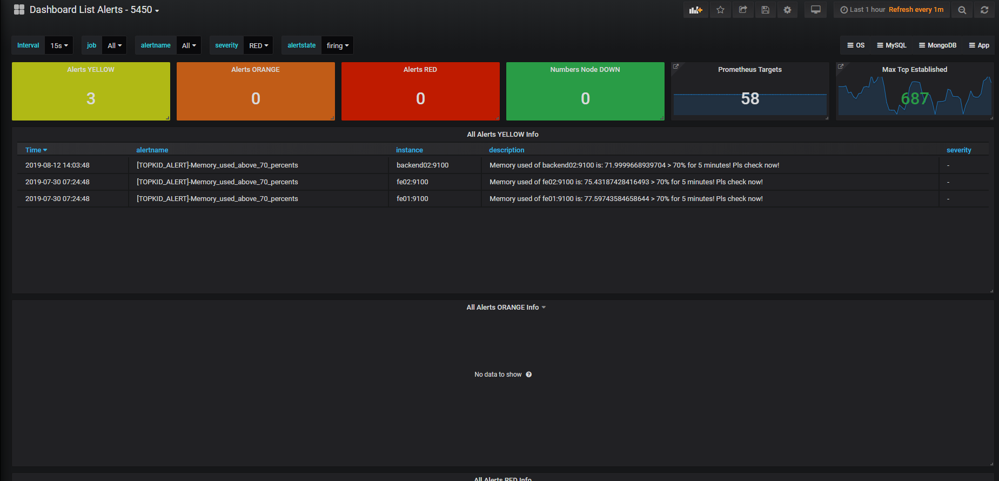

# Một số cấu hình bổ sung

Phần này mô tả bổ sung một số cầu hình monitor theo yêu cầu. 

- [1) Thêm giám sát status của service sử dụng node_exporter ](#1)
- [2) Cấu hình mysqld_exporter show các thông số userstats](#2)
- [3) Cấu hình kích hoạt plugin prometheus alertmanager để dùng dashboard hiển thị các alert đang firing](#3)

---

<a name = "1"></a>

## 1) Thêm giám sát status của service sử dụng node_exporter 

node_exporter hỗ trợ khá nhiều collector thu thập các loại metrics của hệ thống. Thông tin cụ thể tham khảo tại: https://github.com/prometheus/node_exporter#collectors

Các collector được enable bằng cách cung cấp thêm flag **--collector**. Các collector được enable mặc định có thể disable bằng cách thêm flag `--no-collector`

Hiện tại mình đang sử dụng collector systemd để thu thập metric của các service quản lý bởi systemd trên hệ thống (Chi tiết về systemd collector: https://github.com/prometheus/node_exporter/blob/master/collector/systemd_linux.go), cụ thể là service keepalived. 

Cấu hình node_exporter (file `/etc/systemd/system/node_exporter.service`) : 

```bash
[Unit]
Description=Node Exporter
Wants=network-online.target
After=network-online.target
 
[Service]
User=node_exporter
Group=node_exporter
Type=simple
ExecStart=/usr/local/bin/node_exporter --collector.systemd  --collector.systemd.unit-whitelist="keepalived\\.service"
 
[Install]
WantedBy=multi-user.target
```

Thêm whitelist để chỉ lấy các thông số của service keepalived mà không lấy tất cả các service khác. 

***Note***: 

- Để theo dõi nhiều service khác nữa: sử dụng cú phá như sau: 

  ```bash
  --collector.systemd.unit-whitelist="service1\\.service | service2\\.service | ... | service_n\\.service"
  ```

- Dấu escape '\\' có thể khác nhau ở mỗi hệ điều hành. Ví dụ trên là CentOS.Metric thu thập được trên prometheus: 

Metric thu thập được trên prometheus: 



Từ đây có thể tạo thêm một số rule khi phát hiện service keepalived đang không active. 

<a name = "2"></a>

## 2) Cấu hình mysqld_exporter show các thông số userstats

Cấu hình mặc định của mysqld_exporter sẽ chỉ thu thập các metric sử dụng tài nguyên của mysqld. Nếu bạn muốn thu thập thêm các thông số như số lượng đang kết nối tới db, user nào đang sử dụng bao nhiêu kết nối, ... thì sử dụng collector `info_schema.userstats`. Tham khảo nguồn mysqld_exporter : https://github.com/prometheus/mysqld_exporter

Cấu hình trong file **/etc/systemd/system/mysqld_exporter.service** 

```bash
[Unit]
Description=Mysql Exporter Service
Wants=network-online.target
After=network-online.target
 
[Service]
User=mysql_exporter
Group=mysql_exporter
Type=simple
ExecStart=/usr/local/bin/mysqld_exporter    --config.my-cnf="/etc/mysqld_exporter/.my.cnf" --collect.info_schema.userstats --collect.info_schema.processlist
Restart=always
 
[Install]
WantedBy=multi-user.target
```

Trên grafana, enable plugin percona (nguồn: https://grafana.com/grafana/plugins/percona-percona-app/installation) để sử dụng một số dashboard mẫu của mysqld vể userstats. 

Cấu hình database enable [userstats ](https://mariadb.com/kb/en/library/documentation/replication/optimization-and-tuning/query-optimizations/statistics-for-optimizing-queries/user-statistics/)cho phép exporter đọc thông số từ database. Có thể setup theo 2 cách: 

- 1 là dùng lệnh để apply luôn cấu hình mới vào database,  nhưng sẽ mất đi cấu hình này sau khi restart. 
- 2 là cấu hình trong file config tham số `userstat = 1` và restart lại service mysqld. 

Với các host mà mysqld đang chạy, không thể thực hiện được việc restart ngay lập tức thì mình sẽ kết hợp cả 2 cách trên: dùng lệnh để apply cấu hình mới, và cấu hình luôn vào file cnf của mysqld để lần sau khi restart lại service mysqld thì cấu hình đó sẽ được apply luôn. 

B1: Access vào mysqld, set biến userstat = 1: 

```bash
$ mysql -u root -p
Enter password:
Welcome to the MariaDB monitor.  Commands end with ; or \g.
Your MariaDB connection id is 58291
Server version: 10.2.25-MariaDB-10.2.25+maria~xenial-log mariadb.org binary distribution
 
Copyright (c) 2000, 2018, Oracle, MariaDB Corporation Ab and others.
 
Type 'help;' or '\h' for help. Type '\c' to clear the current input statement.
 
MariaDB [(none)]> show variables like '%userstat%';
+---------------+-------+
| Variable_name | Value |
+---------------+-------+
| userstat      | OFF   |
+---------------+-------+
1 row in set (0.00 sec)
 
MariaDB [(none)]>
MariaDB [(none)]> set global userstat = 1;
Query OK, 0 rows affected (0.00 sec)
 
MariaDB [(none)]>
MariaDB [(none)]> show variables like '%userstat%';
+---------------+-------+
| Variable_name | Value |
+---------------+-------+
| userstat      | ON    |
+---------------+-------+
1 row in set (0.00 sec)
 
MariaDB [(none)]>
```

B2: Thêm dòng sau vào file cấu hình `my.cnf` block `[mysqld]`: 

```bash
[mysqld]
userstat        = 1
```

Vậy là ok. 

Sau khi enable plugin percona, trên giao diện của grafana sẽ hiển thị gợi ý add thêm các dashboard mẫu của percona, trong đó có dashboard **MySQL User Statistics | Percona App** khá là hay. Nhưng có một số đoạn cần tùy chỉnh để ra được theo ý mình để được hiển thị như sau:


File json của dashboard tại đây: [MySQL_User Statistics_Percona App Copy.json](./templates/grafana/MySQL User Statistics _ Percona App Copy-1554295055955.json)    

<a name = "3"></a>

## 3) Cấu hình kích hoạt plugin prometheus alertmanager để dùng dashboard hiển thị các alert đang firing

Nhu cầu khi muốn show ra các alert đang firing trong hệ thống trên grafana. 

Enable plugin trên grafana: https://grafana.com/grafana/plugins/camptocamp-prometheus-alertmanager-datasource/installation

Sau đó import dashboard ID: Dashboard List Alerts (ID: 5450) 

Mình đã tùy chỉnh lại dashboard một chút cho khớp với severity trong mô hình của mình. Tham khảo file json dashboard tại đây: [Dashboard List Alerts - 5450](./templates/grafana/Dashboard List Alerts - 5450-1557751328418.json)

Kết quả sẽ được màu mè hoa lá như sau: 



 Updating....