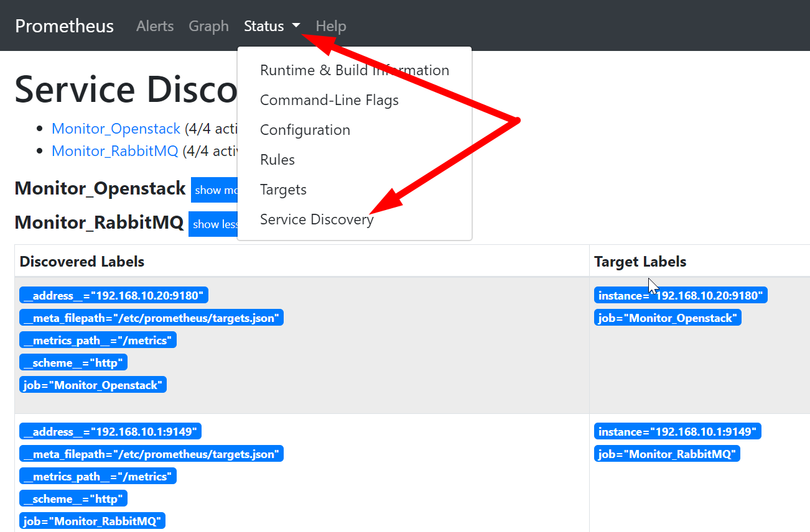
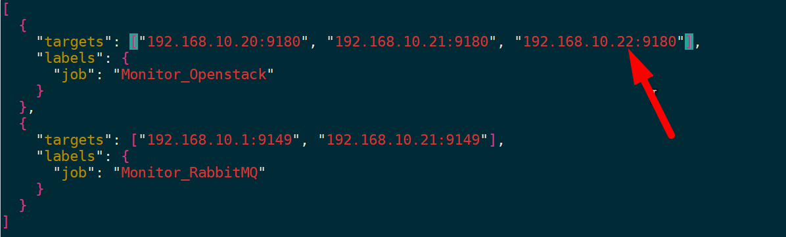
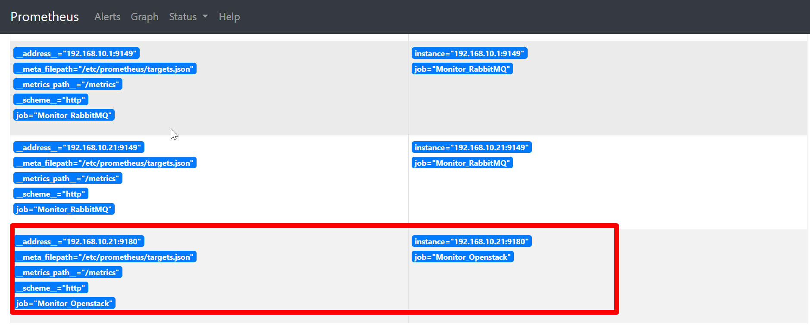
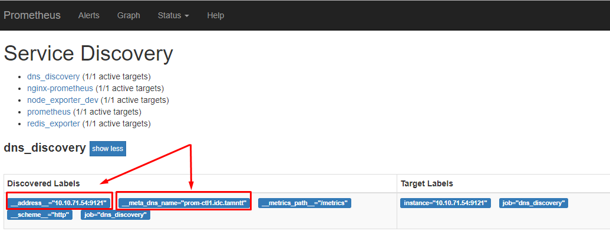
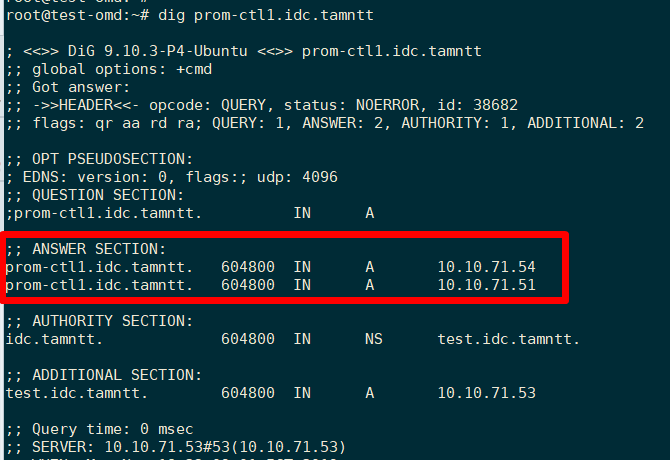
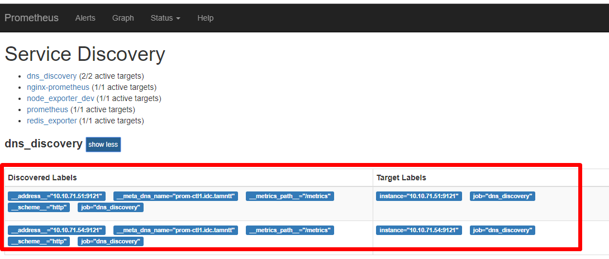

# Cấu hình service discovery trên prometheus 

### ***Mục lục***

[1. Giới thiệu](#1)

[2. File-based service discovery : file_sd_configs](#2)

[3. DNS-based service discovery: dns_sd_config ](#3)

[4. Openstack service discovery: openstack_sd_config](#4)

[Tham khảo](#thamkhao)

---

<a name = '1'></a>

## 1. Giới thiệu

Như hướng dẫn ở phần setup exporter trước, mình đang xử lý việc cập nhật các target cần monitor thông qua cách đơn giản nhất là cấu hình tĩnh thông qua `static_config`. Các xử lý này khá ổn trong các trường hợp mô hình monitor đơn giản, ít target cần monitor, nhưng đi kèm một nhược điểm là cần phải update thủ công  thông tin các target thêm vào hoặc xóa đi thông qua file `prometheus.yml` + reload lại prometheus để nhận thông tin cấu hình mới. Nhược điểm này càng trở nên trầm trọng và gây "ngu xi" khi quản trị prometheus trong môi trường với các target update liên tục được thêm vào hoặc xóa đi theo từng phút. 

**☞** Để giải quyết vấn đề này thì Prometheus đã hỗ trợ tính năng **service discovery** cho phép chúng ta có thể cấu hình để prometheus update liên tục các target cần monitor mà không cần các tác động thủ công lên hệ thống và file cấu hình `prometheus.yml`. Theo như tài liệu chính thức của Prometheus thì hiện tại đang hỗ trợ các cơ chế discovery sau: 

- azure_sd_configs: Azure Service Discovery
- consul_sd_configs: Consul Service Discovery
- dns_sd_configs: DNS Service Discovery
- ec2_sd_configs: EC2 Service Discovery
- openstack_sd_configs: OpenStack Service Discovery
- file_sd_configs: File Service Discovery
- gce_sd_configs: GCE Service Discovery
- kubernetes_sd_configs: Kubernetes Service Discovery
- marathon_sd_configs: Marathon Service Discovery
- nerve_sd_configs: AirBnB’s Nerve Service Discovery
- serverset_sd_configs: Zookeeper Serverset Service Discovery
- triton_sd_configs: Triton Service Discovery

Phù hợp với nhu cầu thực tế cần sử dụng thì phần ghi chép này sẽ lưu lại các thông tin khi cấu hình service discovery sử dụng: **file_sd_configs**, **dns_sd_configs**, **openstack_sd_configs**.

<a name = '2'></a>

## 2. File-based service discovery : file_sd_configs

Prometheus chó phép nhiều tùy chọn  cho cơ chế service discovery để khám phá ra các target cần scrape metrics, bao gồm: Kubernetes, Consul, Zookeeper, ... Tuy nhiên, nếu bạn cần cấu hình cho các target mà chưa có option hỗ trợ tận răng như các hệ thống trên thì đơn giản sẽ sử dụng cơ chế discovery thông qua file-based và dns based. 

Cơ chế  [file-based service discovery](https://prometheus.io/docs/prometheus/latest/configuration/configuration/#file_sd_config)  cho phép update các target cần monitor trong file định dạng json hoặc yaml. Khi các file này thay đổi, danh sách các target được đọc từ file và prometheus sẽ scrape chính xác các target mới được update và không cần phải restart/reload lại prometheus. 

File list các target có  thể viết dưới dạng yaml (vd: `targets.yml`) : 

```yaml
- targets: ['192.168.10.20:9149', '192.168.10.21:9149']
  labels:
    job: 'Monitor_RabbitMQ'

- targets: ['192.168.10.20:9180', '192.168.10.20:9180']
  labels:
    job: 'Monitor_Openstack'
```

Hoặc định dạng json  (vd:  `targets.json`):

```json
[
  {
    "targets": ["192.168.10.20:9180", "192.168.10.20:9180"],
    "labels": {
      "job": "Monitor_Openstack"
    }
  },
  {
    "targets": ["192.168.10.1:9149", "192.168.10.21:9149"],
    "labels": {
      "job": "Monitor_RabbitMQ"
    }
  }
]
```

Trong file config của prometheus (`prometheus.yml`), cấu hình file-based service discovery như sau: 

```yml
scrape_configs:
...
- job_name: 'Monitor_RabbitMQ'
  file_sd_configs:
  - files: ['targets.json'] # or ['targets.yml']
  
- job_name: 'Monitor_Openstack'
  file_sd_configs:
  - files: ['targets.json'] # or ['targets.yml']
```

Như vậy, prometheus sẽ load cấu hình các target từ file `targets.json` / `targets.yml` trong thư mục cấu hình của prometheus (`/etc/prometheus/`). Show trên giao diện của Prometheus ta thấy như sau: 



Các target đã được update để prometheus có thể discover ra và pull metrics về. Ở đây có một lưu ý nhỏ là tại prometheus mình có cấu hình thành 2 job cùng trỏ vào file `targets.json` nên lúc show ra ở đây thì sẽ bị duplicate các service discovery. 

Thực hiện update thay add thêm targets vào file để thấy sự thay đổi trên prometheus:



Ngay lập tức, prometheus phát hiện ra có sự thay đổi và reload lại config của nó. Check trên giao diện web thấy đã có target mới thêm vào : 



**☞**: Với cơ chế file-based discovery thì khi mình add hoặc remove một target, ngay lập tức prometheus update lại cấu hình và thông tin các target. ***Nếu file targets.json cấu hình bị lỗi sai cú pháp thì lúc đó, prometheus sẽ không pull dữ liệu từ các target trong file đó về nữa.***

<a name = '3'></a>

## 3. DNS-based service discovery: dns_sd_config 

Cơ chế DNS-based service discovery cho phép xác định tập các DNS domains name mà định kì được truy vấn lại để tìm ra danh sách các target. DNS server phải được cấu hình để truy vấn tới trong file `/etc/resolv.conf`

Phương thức này chỉ hỗ trợ các bản ghi DNS cơ bản: A, AAAA và SRV.

Cách thức làm việc của cơ chế này đó là: prometheus sẽ được cấu hình để lấy cái target mà đang được trỏ tới một domain name. Theo chu kì, prometheus sẽ query lại tới DNS server để biết được các IP đang trỏ tới domain đó, và nó sẽ nhận các IP này là target cần pull metric về. 

Khi Prometheus truy vấn tới các bản ghi DNS (A, AAAA, SRV), mỗi target sẽ được gán với label tên là `__meta_dns_name`. Giá trị đó được đặt cho bản ghi cấu hình trong Prometheus. 

Để hiểu rõ hơn cơ chế làm việc thì ta sẽ thực hiện lab như sau: 

- Dựng một DNS server trên local. (Có thể tham khảo hướng dẫn sau:  https://www.alibabacloud.com/blog/how-to-setup-dns-server-using-bind9-on-ubuntu-16-04_594469 )

- Cấu hình DNS server với bản ghi A cho domain bất kì: 

  Ví dụ: 

  ```bash
  ;
  ; BIND reverse data file for local loopback interface
  ;
  $TTL    604800
  @       IN      SOA     test.idc.tamntt. root.idc.tamntt.  (
                                1         ; Serial
                           604800         ; Refresh
                            86400         ; Retry
                          2419200         ; Expire
                           604800 )       ; Negative Cache TTL
  ;
  @       IN      NS      test.idc.tamntt.
  test    IN      A       10.10.71.53
  prom-ctl1       IN      A       10.10.71.54
  ```

  Cấu hình server prometheus add thêm nameserver là DNS server local vừa dựng (chỉnh trong file `/etc/resolv.conf`). Kiểm tra thông tin domain đã được trỏ thành công như sau: 

  ```bash
  # dig prom-ctl1.idc.tamntt
  
  ; <<>> DiG 9.10.3-P4-Ubuntu <<>> prom-ctl1.idc.tamntt
  ;; global options: +cmd
  ;; Got answer:
  ;; ->>HEADER<<- opcode: QUERY, status: NOERROR, id: 3035
  ;; flags: qr aa rd ra; QUERY: 1, ANSWER: 1, AUTHORITY: 1, ADDITIONAL: 2
  
  ;; OPT PSEUDOSECTION:
  ; EDNS: version: 0, flags:; udp: 4096
  ;; QUESTION SECTION:
  ;prom-ctl1.idc.tamntt.          IN      A
  
  ;; ANSWER SECTION:
  prom-ctl1.idc.tamntt.   604800  IN      A       10.10.71.54
  
  ;; AUTHORITY SECTION:
  idc.tamntt.             604800  IN      NS      test.idc.tamntt.
  
  ;; ADDITIONAL SECTION:
  test.idc.tamntt.        604800  IN      A       10.10.71.53
  
  ;; Query time: 0 msec
  ;; SERVER: 10.10.71.53#53(10.10.71.53)
  ;; WHEN: Mon Nov 18 22:59:18 ICT 2019
  ;; MSG SIZE  rcvd: 100
  
  ```

  Như vậy, ở trên đã cấu hình bản ghi A domain: prom-ctl1.idc.tamntt trỏ về IP: 10.10.71.54.

- Thực hiện cấu hình `dns_sd_config` trong file cấu hình của prometheus: 

  ```yaml
  scrape_configs:
  # ...
    - job_name: 'dns_discovery'
      scrape_interval: 20s
      scrape_timeout: 20s
      dns_sd_configs:
      - names:
        - 'prom-ctl1.idc.tamntt'
        type: A
        port: 9121
  ```

  Reload lại prometheus, check trên giao diện thấy có serivce discovery của DNS như sau: 

  

- Tiến hành add thêm IP vào domain **prom-ctl1.idc.tamntt** vào DNS server. Check lại truy vấn tới domain ta có 2 IP như sau: 

  

- Check lại trên prometheus, ta thấy nó đã discover ra thêm target mới - chính là IP mới vừa được trỏ domain trong DNS: 

  


<a name = '4'></a>

## 4. Openstack service discovery: openstack_sd_config 

Trong lúc lang thang nghịch ngợm về service discovery thông qua file-based và dns-based, mình đã vô tình va phải cái này. Thấy có vẻ hay hay nên test thử luôn. Mà thật éo le là cảm giác đọc cái này rồi mình mới ngộ ra được công dụng của service discovery là gì vậy. haha.  😌 

Openstack SD cho phép truy xuất được các target từ các Nova instance. Có 2 kiểu cấu hình discover target: 

- **hypervisor**: role này cho phép discover một target cho mỗi một Nova node. Địa chỉ của target sẽ đặt mặc định là thông số `host_ip` của node. 

  Một số meta label cho role này: 

  - `__meta_openstack_hypervisor_host_ip`: the hypervisor node's IP address.
  - `__meta_openstack_hypervisor_name`: the hypervisor node's name.
  - `__meta_openstack_hypervisor_state`: the hypervisor node's state.
  - `__meta_openstack_hypervisor_status`: the hypervisor node's status.
  - `__meta_openstack_hypervisor_type`: the hypervisor node's type.

- **instance**: role instance cho phép discover một target theo mỗi network interface của instance. Địa chỉ của target đặt mặc định là địa chỉ IP private của network interface. 

  Một số meta label cho metric role này: 

  - `__meta_openstack_address_pool`: the pool of the private IP.
  - `__meta_openstack_instance_flavor`: the flavor of the OpenStack instance.
  - `__meta_openstack_instance_id`: the OpenStack instance ID.
  - `__meta_openstack_instance_name`: the OpenStack instance name.
  - `__meta_openstack_instance_status`: the status of the OpenStack instance.
  - `__meta_openstack_private_ip`: the private IP of the OpenStack instance.
  - `__meta_openstack_project_id`: the project (tenant) owning this instance.
  - `__meta_openstack_public_ip`: the public IP of the OpenStack instance.
  - `__meta_openstack_tag_`: each tag value of the instance.
  - `__meta_openstack_user_id`: the user account owning the tenant.

Kịch bản sử dụng Openstack SD là prometheus sẽ discover ra và thực hiện monitor khi có một instance mới trong hệ thống được tạo ra. Nó sẽ ngay lập tức discover ra địa chỉ IP của instance đó và thực hiện pull metric từ port của node_exporter đã được cài sẵn trong các image này của instance chẳng hạn. 

Ví dụ: Cấu hình prometheus discover instance của Openstack: 

```yaml
  - job_name: 'openstack_sd'
    scrape_interval: 60s
    scrape_timeout: 60s
    openstack_sd_configs:
    - role: instance
      region: 'RegionOneTwoThree'
      identity_endpoint: 'https://<keystone_endpoint>:35357/v3'
      username: admin
      password: <admin_password>
      domain_name: 'Default'
      project_name: 'admin'
      port: 9100
```

Reload lại cấu hình của Prometheus. Mỗi khi instance mới được tại, promtheus sẽ discover ra IP_X của nó và add thêm target IP_X:9100 để thực hiện pull metrics từ đó về. 

<a name = 'thamkhao'></a>

### Tham khảo

[1] https://prometheus.io/blog/2015/06/01/advanced-service-discovery

[2]  https://prometheus.io/docs/guides/file-sd/ 

[2]  https://prometheus.io/docs/prometheus/latest/configuration/configuration/ 

[3]  https://medium.com/@pasquier.simon/monitoring-your-openstack-instances-with-prometheus-a7ff4324db6c 