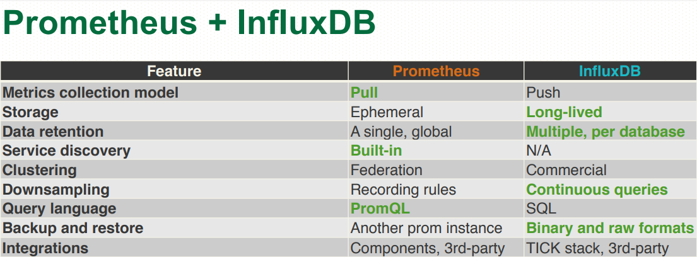
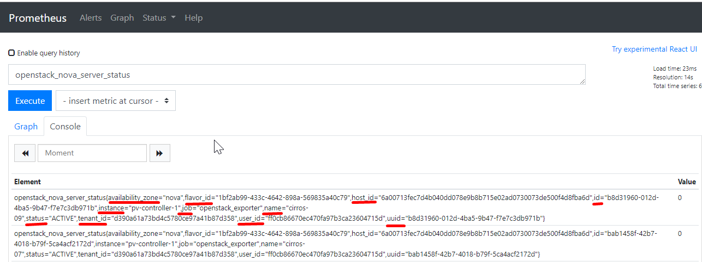

# Setup Prometheus với InfuxDB 

### ***Mục lục***

[1. Tổng quan](#1)

[2. Dựng InfluxDB](#2)

[3. Cấu hình prometheus](#3)

[4. Một số ghi chép](#4)

[Tham khảo](#thamkhao)

---

<a name = '1'></a>

## 1. Tổng quan 

Prometheus là hệ thống giám sát và lưu trữ dữ liệu theo thời gian (time series) mã nguồn mở. Prometheus khá đơn giản để setup, sử dụng và không có thêm các phụ thuộc khác. Bên cạnh đó thì còn có ngôn ngữ truy vấn mạnh mẽ để lấy và phân tích số liệu (metric).

Tuy nhiên, cơ chế lưu trữ của prometheus hiện chỉ được thiết kế để lưu dữ liệu trong thời gian ngắn (mặc định là 28 ngày). Để giải quyết hạn chế này, prometheus hỗ trợ tích hợp thêm thành phần lưu trữ thứ 3 - "external storage" - để đảm bảo dữ liệu được lưu trữ lâu dài hơn, đảm bảo tính sẵn sàng cao hơn cho hệ thống monitor.  

Ở đây mình chọn giải pháp kết hợp với InfluxDB bởi đó là cơ sở lưu trữ dữ liệu thời gian thực đáng tin cậy cùng rất nhiều tính năng tuyệt vời (@@).

Xem thêm về InfluxDB [tại đây]( [https://docs.influxdata.com](https://docs.influxdata.com/) ).

Prometheus kết hợp với InfluxDB sẽ tận dụng những ưu điểm của cả hai: 




<a name = '2'></a>

## 2. Dựng influxdb 

Thực hiện dựng influxdb sử dụng container, mount thư mục data ra volume. 

```bash
# docker run -itd -p 8086:8086 --hostname influxdb-test --name infuxdb-test -v influxDB_tamntt:/var/lib/influxdb influxdb
```

Sau khi container up lên, thực hiện tạo database và user cho prometheus: 

```sql
# docker exec -it infuxdb-test bash
root@influxdb-test:/# influx
Connected to http://localhost:8086 version 1.7.9
InfluxDB shell version: 1.7.9
> CREATE USER "admin" WITH PASSWORD '<admin_password' WITH ALL PRIVILEGES;
> auth
username: admin
password:
> CREATE DATABASE prometheus;
> CREATE USER "prom" with password '<prom_password>';
> GRANT ALL ON prometheus TO prom;
> SHOW RETENTION POLICIES ON prometheus;
```

Vậy là thực hiện dựng xong influxdb + tạo database prometheus để lưu trữ metric. Tiếp theo cấu hình prometheus để đẩy metrics mà prometheus pull về lưu vào influxdb. 

<a name = '3'></a>

## 3. Cấu hình prometheus

Hiện tại, có 2 lựa chọn cấu hình prometheus đẩy dữ liệu vào influxdb là: 

- 1) Using remote_storage_adapter: https://github.com/prometheus/prometheus/tree/master/documentation/examples/remote_storage/remote_storage_adapter 
- 2) Writing to InfluxDB directly (nightly builds of not yet released v1.4): https://www.influxdata.com/blog/influxdb-now-supports-prometheusremote-read-write-natively/ (posted on Sep 14, 2017) 

Bước tiếp theo sẽ cấu hình theo cách thứ 2 là đọc/ghi dữ liệu trực tiếp và influxDB. Để kích hoạt sử dụng API của promethus cho phép đọc/ghi remote vào influxdb, thêm vào các url sau trong cấu hình ` prometheus.yml` : 

```bash
scrape_configs:
...
remote_write:
  - url: "http://<ip_influxdb>:8086/api/v1/prom/write?db=prometheus&u=prom&p=<prom_password>"

remote_read:
  - url: "http://<ip_influxdb>:8086/api/v1/prom/read?db=prometheus&u=prom&p=<prom_password>"
```

Các URL phải truy cập được từ prometheus server và sử dụng port mà influxdb đang chạy. Đồng thời cũng đi kèm các thông tin tham số về db name và user để xác thực.

Reload lại prometheus để nhận cấu hình mới. 

Metric trên prometheus khi đẩy vào InfluxDB sẽ được chuyển sang cấu trúc dữ liệu của InfluxDB theo quy tắc như sau: 

- Prometheus metric name sẽ được đổi thành InfluxDB `measurement` : 

  Ví dụ: Show các metric thu thập được: 

  ```bash
  root@influxdb-test:/# influx
  Connected to http://localhost:8086 version 1.7.9
  InfluxDB shell version: 1.7.9
  >
  > use prometheus
  Using database prometheus
  >
  > show measurements
  name: measurements
  name
  ----
  go_gc_duration_seconds
  go_gc_duration_seconds_count
  go_gc_duration_seconds_sum
  go_goroutines
  go_info
  go_memstats_alloc_bytes
  go_memstats_alloc_bytes_total
  go_memstats_buck_hash_sys_bytes
  go_memstats_frees_total
  go_memstats_gc_cpu_fraction
  go_memstats_gc_sys_bytes
  go_memstats_heap_alloc_bytes
  go_memstats_heap_idle_bytes
  go_memstats_heap_inuse_bytes
  go_memstats_heap_objects
  go_memstats_heap_released_bytes
  go_memstats_heap_sys_bytes
  go_memstats_last_gc_time_seconds
  go_memstats_lookups_total
  go_memstats_mallocs_total
  go_memstats_mcache_inuse_bytes
  go_memstats_mcache_sys_bytes
  go_memstats_mspan_inuse_bytes
  go_memstats_mspan_sys_bytes
  go_memstats_next_gc_bytes
  go_memstats_other_sys_bytes
  go_memstats_stack_inuse_bytes
  go_memstats_stack_sys_bytes
  go_memstats_sys_bytes
  go_threads
  openstack_cinder_agent_state
  openstack_cinder_snapshots
  openstack_cinder_volume_status
  openstack_cinder_volumes
  openstack_glance_images
  openstack_identity_domains
  openstack_identity_groups
  openstack_identity_projects
  openstack_identity_regions
  openstack_identity_users
  openstack_neutron_agent_state
  openstack_neutron_floating_ips
  openstack_neutron_network_ip_availabilities_total
  openstack_neutron_network_ip_availabilities_used
  openstack_neutron_networks
  openstack_neutron_ports
  openstack_neutron_routers
  openstack_neutron_security_groups
  openstack_neutron_subnets
  openstack_nova_agent_state
  openstack_nova_availability_zones
  openstack_nova_current_workload
  openstack_nova_flavors
  openstack_nova_local_storage_available_bytes
  openstack_nova_local_storage_used_bytes
  openstack_nova_memory_available_bytes
  openstack_nova_memory_used_bytes
  openstack_nova_running_vms
  openstack_nova_security_groups
  openstack_nova_server_status
  openstack_nova_total_vms
  openstack_nova_vcpus_available
  openstack_nova_vcpus_used
  process_cpu_seconds_total
  process_max_fds
  process_open_fds
  process_resident_memory_bytes
  process_start_time_seconds
  process_virtual_memory_bytes
  process_virtual_memory_max_bytes
  promhttp_metric_handler_requests_in_flight
  promhttp_metric_handler_requests_total
  scrape_duration_seconds
  scrape_samples_post_metric_relabeling
  scrape_samples_scraped
  scrape_series_added
  up
  ```

- Prometheus sample (value)  trở thành giá trị trường `value`, và luôn luôn thuộc kiểu float. 

  Ví dụ: 

  ```
  > select value from "openstack_nova_flavors" limit 5;
  name: openstack_nova_flavors
  time                value
  ----                -----
  1574051394826000000 4
  1574051454826000000 4
  1574051514826000000 4
  1574051574826000000 4
  1574051685145000000 4
  >
  ```

- Prometheus labels sẽ trở thành InfluxDB tags: 

  Ví dụ: show các trường thông tin labels từ một metric bất kì: 

  ```
  > show tag keys from "openstack_nova_flavors";
  name: openstack_nova_flavors
  tagKey
  ------
  __name__
  instance
  job
  >
  > show tag keys from "openstack_nova_server_status";
  name: openstack_nova_server_status
  tagKey
  ------
  __name__
  availability_zone
  flavor_id
  host_id
  id
  instance
  job
  name
  status
  tenant_id
  user_id
  uuid
  >
  ```

  So sánh với prometheus : 

  

<a name = '4'></a>

## 4. Một số ghi chép

- Luồng làm việc khi tích hợp InfluxDB với Prometheus là metrics được pull về, sau đó nó được ghi đồng thời vào local storage của prometheus và vào InfluxDB. 
- Dữ liệu được đọc ra từ InfluxDB theo API cũ của Prometheus, hoặc được đọc từ InfluxDB - tùy phần visualize chọn data source từ đâu. Dù chọn đọc ra theo query của prometheus hay của InfluxDB thì phần dữ liệu vẫn sẽ ưu tiên lấy ra từ InfluxDB trước, nếu InfluxDB unavailable thì sẽ chỉ đọc dữ liệu từ storage local của prometheus. => ***Thực ra méo phải, nó sẽ đọc metric ra từ thằng nào đang có nhiều data hơn. Ví dụ: Nếu storage local prometheus có nhiều data hơn lượng data trên influxdb (giả sử do mình xóa data trong influxdb đi), thì dữ liệu sẽ lấy ra từ storage local***.
- Trong InfluxDB có khái niệm **RP-retention policy**: mô tả về việc bạn sẽ giữ lại dữ liệu trong thời gian bao lâu. InfluxDB sẽ so sánh thười gian trên server của nó với thời gian (timestamp) trên metrics và xóa đi những metric cũ hơn khoảng thời gian giữ lại cho phép.  ***Mặc định, khi một database được tạo ra sẽ có duration là `INF` tức sẽ được lưu lại vô thời hạn***. Để phù hợp với nhu cầu lưu trữ thì có thể cấu hình theo hướng dẫn chi tiết [tại đây]( https://docs.influxdata.com/influxdb/v1.7/query_language/database_management/#retention-policy-management ).

<a name = 'thamkhao'></a>

### Tham khảo

[1]  https://www.percona.com/live/e17/sessions/using-prometheus-with-influxdb-for-metrics-storage 

[2]  https://prometheus.io/docs/prometheus/latest/configuration/configuration 

[3]  https://devopstales.github.io/monitoring/prometheus-influxdb/ 

[4]  https://hub.docker.com/_/influxdb 

[5] InfluxDB HA:  https://docs.openstack.org/developer/performance-docs/methodologies/monitoring/influxha.html 

[6]  https://docs.influxdata.com/influxdb/v1.7/query_language/database_management 

[7]  https://docs.influxdata.com/influxdb/v1.7/supported_protocols/prometheus 