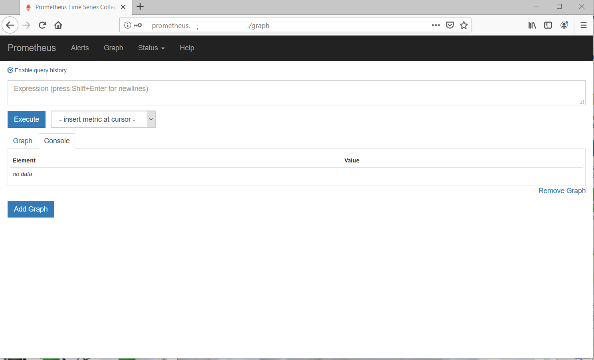

# Cài đặt prometheus server 

### ***Mục lục***

[1. Cài đặt và setup service prometheus](#1)

- [B1: Tạo user chạy service prometheus](#B1)
- [B2: Download prometheus](#B2)
- [B3: Tạo file cấu hình cho prometheus](#B3)
- [B4: Start service prometheus](#B4)
- [B5: Setup nginx làm proxy web cho prometheus](#B5)

[2. Giải thích một số cấu hình](#2)

[3. Tham khảo](#3)

---

Hướng dẫn setup trên Ubuntu server 16.04. (Với distro Centos có thể chạy các lệnh tương tự). Chạy các lệnh sau với user có quyền sudo.

<a name ="1"></a>

## 1. Cài đặt và setup service prometheus

<a name = "B1"></a>

### B1: Tạo user chạy service prometheus

```bash
$ sudo useradd --no-create-home --shell /bin/false prometheus
```

Tạo thư mục cấu hình và thư mục lưu trữ các data của prometheus, phân quyền cho các thư mục đó owner là user prometheus:

```bash
$ sudo mkdir /etc/prometheus
$ sudo mkdir /var/lib/prometheus
$ sudo chown prometheus:prometheus /etc/prometheus
$ sudo chown prometheus:prometheus /var/lib/prometheus
```

<a name = "B2"></a>

### B2: Download prometheus 

Download file bin của prometheus đã được build sẵn từ trang chủ của prometheus. Chọn version mới nhất, hoặc version phù hợp với nhu cầu. Link: https://prometheus.io/download/

```bash
$ cd /opt/
$ curl -LO https://github.com/prometheus/prometheus/releases/download/v2.11.1/prometheus-2.11.1.linux-amd64.tar.gz
$ tar xvf prometheus-2.11.1.linux-amd64.tar.gz
$ sudo cp prometheus-2.11.1.linux-amd64/prometheus /usr/local/bin/
$ sudo cp prometheus-2.11.1.linux-amd64/promtool /usr/local/bin/
$ sudo chown prometheus:prometheus /usr/local/bin/prometheus
$ sudo chown prometheus:prometheus /usr/local/bin/promtool
$ sudo cp -r prometheus-2.11.1.linux-amd64/consoles /etc/prometheus
$ sudo cp -r prometheus-2.11.1.linux-amd64/console_libraries /etc/prometheus
$ sudo chown -R prometheus:prometheus /etc/prometheus/
```

<a name = "B3"></a>

### B3: Tạo file cấu hình cho prometheus

Tạo file cấu hình cho prometheus **/etc/prometheus/prometheus.yml** có nội dung như sau: 

```bash
global:
scrape_interval: 15s
 
scrape_configs:
  - job_name: 'prometheus'
    scrape_interval: 5s
    static_configs:
      - targets: ['localhost:9090']
```

 File cấu hình của prometheus được viết dưới định dạng yaml, nên cần chú ý cách viết

Để check và test file cấu hình mới của prometheus, chạy lệnh sau:

```bash
`$ sudo promtool check config /etc/prometheus/prometheus.yml`
```

Phân quyền owner là prometheus cho thư mục chứa cấu hình của prometheus: 

```bash
$ sudo chown prometheus:prometheus /etc/prometheus/
```

Tạo file cấu hình cho phép quản lý service prometheus thông qua systemd: 

Tạo file **/etc/systemd/system/prometheus.service** có nội dung như sau: 

```bash
[Unit]
Description=Prometheus
Wants=network-online.target
After=network-online.target
 
[Service]
User=prometheus
Group=prometheus
Type=simple
ExecStart=/usr/local/bin/prometheus \
--config.file /etc/prometheus/prometheus.yml \
--storage.tsdb.path /var/lib/prometheus/ \
--web.console.templates=/etc/prometheus/consoles \
--web.console.libraries=/etc/prometheus/console_libraries --web.external-url=http://prometheus.example.com
 
[Install]
WantedBy=multi-user.target
```

<a name = "B4"></a>

### B4: Start service prometheus: 

Chạy các lệnh sau để start prometheus và khởi động prometheus cùng hệ thống:

```
$ sudo systemctl daemon-reload
$ sudo systemctl start prometheus
$ sudo systemctl enable prometheus
$ sudo systemctl status prometheus
 
● prometheus.service - Prometheus
Loaded: loaded (/etc/systemd/system/prometheus.service; enabled; vendor preset: enabled)
Active: active (running) since Thu 2019-mm-dd 10:03:41 +07; 8h ago
Main PID: 2062 (prometheus)
Tasks: 16
Memory: 1.0G
CPU: 51min 15.798s
CGroup: /system.slice/prometheus.service
└─2062 /usr/local/bin/prometheus --config.file /etc/prometheus/prometheus.yml --storage.tsdb.path /var/lib/prometheus/ --web.console.templa
 
Jul 18 14:00:03 monitor.nativefriend.vn prometheus[2062]: level=info ts=2019-mm-ddT07:00:03.933762701Z caller=head.go:348 component=tsdb msg="head GC comple
Jul 18 14:00:08 monitor.nativefriend.vn prometheus[2062]: level=info ts=2019-mm-ddT07:00:08.642974356Z caller=head.go:357 component=tsdb msg="WAL truncation
Jul 18 16:00:03 monitor.nativefriend.vn prometheus[2062]: level=info ts=2019-mm-ddT09:00:03.233734421Z caller=compact.go:398 component=tsdb msg="write block
Jul 18 16:00:04 monitor.nativefriend.vn prometheus[2062]: level=info ts=2019-mm-ddT09:00:04.266565601Z caller=head.go:348 component=tsdb msg="head GC comple
Jul 18 16:00:09 monitor.nativefriend.vn prometheus[2062]: level=info ts=2019-mm-ddT09:00:09.147985749Z caller=head.go:357 component=tsdb msg="WAL truncation
Jul 18 16:00:14 monitor.nativefriend.vn prometheus[2062]: level=info ts=2019-mm-ddT09:00:14.006579945Z caller=compact.go:352 component=tsdb msg="compact blo
Jul 18 16:00:25 monitor.nativefriend.vn prometheus[2062]: level=info ts=2019-mm-ddT09:00:25.484293968Z caller=compact.go:352 component=tsdb msg="compact blo
Jul 18 18:00:03 monitor.nativefriend.vn prometheus[2062]: level=info ts=2019-mm-ddT11:00:03.051407392Z caller=compact.go:398 component=tsdb msg="write block
Jul 18 18:00:03 monitor.nativefriend.vn prometheus[2062]: level=info ts=2019-mm-ddT11:00:03.857705855Z caller=head.go:348 component=tsdb msg="head GC comple
Jul 18 18:00:08 monitor.nativefriend.vn prometheus[2062]: level=info ts=2019-mm-ddT11:00:08.760355776Z caller=head.go:357 component=tsdb msg="WAL truncation
lines 1-20/20 (END)
```

<a name = "B5"></a>

### B5: Setup nginx làm proxy web cho prometheus

Setup nginx làm proxy cho service prometheus. Tránh mở prometheus trên tất cả các interface của server để từ bên ngoài Internet có thể thoải mái truy cập vào mà không bị hạn chế gì. 

Cài đặt nginx: 

```
$ sudo apt-get update -y
$ sudo apt-get install nginx apache2-utils -y
```

Tạo file cấu hình nginx làm proxy cho prometheus ( `/etc/nginx/conf.d/prometheus.example.com.conf`) với nội dung như sau: 

```
server {
        listen 80;
        server_name prometheus.example.com;
 
        access_log /var/log/nginx/promethues-access.log ;
        error_log /var/log/nginx/prometheus-error.log warn;
 
 
 
        location / {
        proxy_pass http://localhost:9090;
        auth_basic "Login to prometheus.example.com";
        auth_basic_user_file /etc/nginx/conf.d/.htpasswd;
 
        }
}
```

 Tạo file lưu password (/etc/nginx/conf.d/.htpasswd) để đăng nhập vào: 

```
$ sudo htpasswd -c /etc/nginx/conf.d/.htpasswd admin
<enter_password_here> 
```

 Restart lại service nginx:

```
$ sudo systemctl restart nginx
```

Truy cập vào domain prometheus.example.com bằng trình duyệt, login vào thấy giao diện như sau là setup prometheus ok: 





***Lưu ý***: Nếu chưa được trỏ domain thì có thể test trước bằng cách add thêm thông tin domain vào file hosts trên máy tính của mình (thêm dòng:  `xx.yy.zz.ww prometheus.example.com` ) ( với IP xx.yy.zz.ww là IP public của server monitor) 

<a name = "2"></a>

## 2. Giải thích một số cấu hình

Tham khảo tại: https://prometheus.io/docs/prometheus/latest/configuration/configuration/

File cấu hình của prometheus được viết theo format file YAML.

Một số cấu hình toàn cục (global confiuration), các cấu hình này sẽ ảnh hưởng tới toàn bộ các cấu hình khác. (Kiểu như cấu hình mặc định)

```bash
global:
  # Chu kì quét metric (scrape targets)
  [ scrape_interval: <duration> | default = 1m ]
 ## cấu hình chu kì quét metric của prometheus. Nếu không cấu hình, mặc định là 1m. Hiện hệ thống đang sử dụng cấu hình chu kì là 15s
 
  # Thời gian timeout của một lần scrape
  [ scrape_timeout: <duration> | default = 10s ]
 
  # Chu kì so rule (chu kì prometheus thực hiện so các rule với metric hiện tại của target)
  [ evaluation_interval: <duration> | default = 1m ]
    # Các label được thêm vào time sereeries hoặc alert khi kết nối với các hệ thống mở rộng khác (federation, remote storage, Alertmanager)
  external_labels:
    [ <labelname>: <labelvalue> ... ]

# Vị trí xác định các file chứa rule. Rules và alerts được đọc từ các file này
# all matching files.
rule_files:
  [ - <filepath_glob> ... ]
 # có thể cấu hình kiểu như sau để lấy tất cả các file rule trong thư mục: - alert-rules-dev/*.yml

# Danh sách các target scrape
scrape_configs:
  [ - <scrape_config> ... ]

# Cấu hình target Alertmanager - Prometheus sẽ gửi tới một hoặc nhiều Alertmanager dựa trên cấu hình này
alerting:
  alert_relabel_configs:
    [ - <relabel_config> ... ]
  alertmanagers:
    [ - <alertmanager_config> ... ]

# Các thiết lập liên quan tới tính năng remote write.
remote_write:
  [ - <remote_write> ... ]

# Các thiết lập liên quan tới tính năng remote read
remote_read:
  [ - <remote_read> ... ]
```


**[`scrape_configs:` ](https://prometheus.io/docs/prometheus/latest/configuration/configuration/#scrape_config)**

section cấu hình thông tin các target (host / service cần giám sát) và các thông số mô tả các để prometheus server quét được metric. Thông thường, mỗi cấu hình scrape_config xác định cụ thể một job. Trong một số cấu hình nâng cao, việc này có thể thay đổi được.

Target có thể được cấu hình tĩnh thông qua thông số static_configs và có thể discover động sử dụng cơ chế service-discovery (hướng dẫn ở [tại đây](./))

**[`alertmanger_config`](https://prometheus.io/docs/prometheus/latest/configuration/configuration/#alertmanager_config)**

 Section alertmanager_config để cấu hình cho service Alertmanager mà Prometheus server sẽ gửi alert tới.

Alertmanager có thể được cấu hình tĩnh thông qua thông số static_configs.

**[`relabel_config`](https://prometheus.io/docs/prometheus/latest/configuration/configuration/#relabel_config)**

Relabeling là công cụ mạnh mẽ cho việc tự động viết lại bộ label cho target trước khi nó được scrape. Nhiều bước relabeling có thể được cấu hình với mỗi cấu hình scrape. Chúng áp dụng cho bộ lablel của từng target theo thứ tự xuất hiện của chúng trong file cấu hình.

...

<a name = "3"></a>

### 3. Tham khảo

[1] https://prometheus.io/docs/prometheus/latest/configuration/configuration/

 [2] https://github.com/locvx1234/prometheus-notes/blob/master/docs/Prometheus_server.md

 [3] https://prometheus.io/docs/prometheus/latest/configuration/configuration/