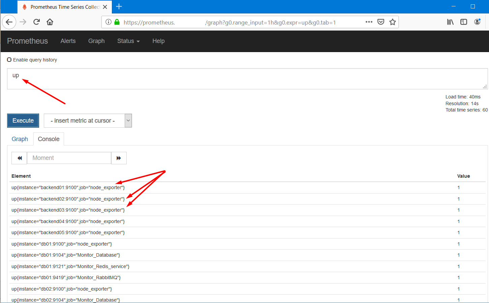
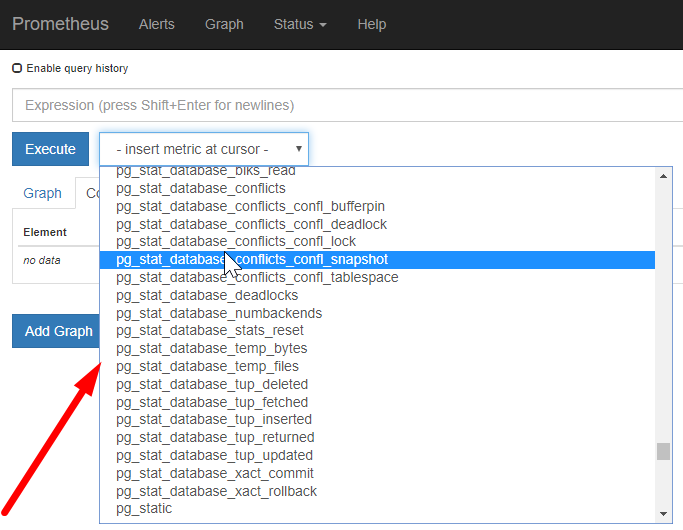

# Setup exporter

Sau khi setup xong prometheus, mặc định ban đầu prometheus chỉ thu thập các metric về chính nó (thông số tài nguyên của server: lượng tiêu thụ cpu, ram, disk, băng thông, tốc độ đọc ghi, ... ). Để giám sát các thông số server, service của các target cần monitor từ nhiều nguồn khác nhau, cần setup các exporter trên target cần monitor để nó thu thập các thông số. Sau đó "phơi" ra để prometheus có thể tới và pull metric về, lưu trữ và cho phép query visual metric.

Exporters - được phát triển bởi Prometheus và cộng đồng - cung cấp mọi thứ thông tin về cơ sở hạ tầng, cơ sở dữ liệu, các thông số của service, web server, hệ thống tin nhắn, API, ...

Một số exporter hay được sử dụng:

- node_exporter : thu thập các số liệu về hạ tầng, bao gồm CPU, memory, disk usage cũng như số liêu I/O, network, ...
- blackbox_exporter :thu thập các số liệu liên quan tới các link endpoint HTTP, HTTPs, TCP, ICMP, ... để xác định tính khả     dụng của các endpoint, thời gian phản hồi,...
- mysqld_exporter : thu thập các số liệu liên quan thông số của database mariadb, mysql.
- rabbitmq_exporter : output của exporter này liên quan tới RabbitMQ, bao gồm số lượng message được publish, số message sẵn sàng để gửi, kích cỡ các gói tin trong hàng đợi.
- nginx-vts-exporter : cung cấp các số liệu về nginx service, sử dụng module VTS bao gồm số lượng kết nối mở, số lượng phản hồi được gửi và tổng kích thước của các gói tin gửi và nhận
- ...

Ngoài ra còn một số exporter khác xem thêm tại: https://prometheus.io/docs/instrumenting/exporters/

Hiện tại mình đã setup hệ thống monitor sử dụng các exporter sau:

- [1) node_exporter](#1)
- [2) mysqld_exporter ]((#2))
- [3) redis_exporter](#3)
- [4) rabbitmq_exporter](#4)
- [5) blackbox_exporter](#5)
- [6) elasticsearch_exporter](#6)
- [7) openstack_exporter](#3)
- [8) libvirt_exporter](#8)
- [9) mongodb_exporter](#9)
- [10) postgres_exporter](#10)

[Nguồn tham khảo](#thamkhao)

---

<a name = "1"></a>

## 1) node_exporter

node_exporter được cài đặt trên các host cần giám sát, để nó thu thập các thông số về phần cứng và hệ điều hành *NIX kernel, được viết bằng Go.

Tham khảo về node_exporter và các tùy chọn collector tại: https://github.com/prometheus/node_exporter

Cài đặt node_exporter:

Tạo user node_exporter để setup service node_exporter:

```bash
$ sudo useradd --no-create-home --shell /bin/false node_exporter
```

Download node_exporte (https://prometheus.io/download/). Chọn version phù hợp, hoặc version mới nhất: 

```bash
$ cd /opt
$ sudo curl -LO https://github.com/prometheus/node_exporter/releases/download/v0.18.1/node_exporter-0.18.1.linux-amd64.tar.gz
$ sudo tar xvf node_exporter-0.18.1.linux-amd64.tar.gz
$ sudo cp node_exporter-0.18.1.linux-amd64/node_exporter /usr/local/bin
$ sudo chown node_exporter:node_exporter /usr/local/bin/node_exporter
```

Cấu hình node_exporter chạy như service quản lý bởi system. Tạo file: `/etc/systemd/system/node_exporter.service` có nội dung như sau: 

```bash
[Unit]
Description=Node Exporter
Wants=network-online.target
After=network-online.target
 
[Service]
User=node_exporter
Group=node_exporter
Type=simple
ExecStart=/usr/local/bin/node_exporter
 
[Install]
WantedBy=multi-user.target
```

 Start servcie node_exporter:

```bash
$ sudo systemctl daemon-reload
$ sudo systemctl start node_exporter
$ sudo systemctl enable node_exporter
```

 Cấu hình mặc định, node_exporter show metrics mà nó thu thập được từ host ra port 9100. Để xem các metric đó, có thể truy cập vào IP của host qua trình duyệt: `http://<IP_ADDRESS>:9100/metrics`

Ví dụ:


Cấu hình trên prometheus server để nó scrape metrics từ node_exporter: 

Thêm vào file cấu hình của prometheus: `/etc/prometheus/prometheus.yml`:

```bash
global:
  scrape_interval: 15s
 
scrape_configs:
  - job_name: 'prometheus'
    scrape_interval: 5s
    static_configs:
      - targets: ['localhost:9090']
 
  - job_name: 'node_exporter'
    scrape_interval: 5s
    static_configs:
      - targets: 
        - <ip_target>:9100 # có thể điền IP hoặc domain name, miễn server prometheus có thể nhận ra được target.   
```

 File cấu hình của prometheus được viết dưới định dạng yaml, nên cần chú ý cách viết

Để check và test file cấu hình mới của prometheus, chạy lệnh sau:

```
$ sudo promtool check config /etc/prometheus/prometheus.yml
```

Nếu cấu hình đã chuẩn, restart lại service prometheus. **Mỗi lần chỉnh sửa lại file cấu hình, để apply cấu hình mới đó, cần phải restart lại service prometheus:** 

```bash
$ sudo systemctl restart prometheus
```

Sau khi restart lại service prometheus, check trên giao diện của prometheus để xem node_exporter vừa thêm đã up hay chưa:



Kết quả như này là mình đã add thành công target lên prometheus server. 

Để show các metrics mà node_exporter thu thập được, gõ vào thanh tìm kiếm trên giao diện prometheus tại tab **Graph**.

<a name = "2"></a>

## 2) mysqld_exporter 

mysqld_exporter được cài đặt trên các host database (mariadb, mysqld) cần giám sát, để nó thu thập các thông số của database như: số process đang xử lý, dung lượng innodb đang chiếm, số lượng connection theo user, .... Hỗ trợ từ Mysql version 5.5 trở lên. 

Lưu ý: Không phải tất cả các collection methods được hỗ trợ trên mysql version < 5.6

Tham khảo về node_exporter và các tùy chọn collector tại: [https://github.com/prometheus/mysqld_exporter](https://github.com/prometheus/node_exporter)

Các bước setup mysqld_exporter:

- Tạo user cho phép đọc các thông số của database: 

  ```mysql
  > CREATE USER 'mysqld_exporter'@'localhost' IDENTIFIED BY '<password_here>';
  > GRANT PROCESS, REPLICATION CLIENT, SELECT ON *.* TO 'mysqld_exporter'@'localhost'  WITH MAX_USER_CONNECTIONS 3;
  ```

  Lưu ý: Nên set số max connection giới hạn cho user để tránh làm quá tải server do tiến trình monitor. 

- Tạo file cấu hình cho phép exporter load cấu hình truy cập vào đọc các thông số của database: 

  ```bash
  $ sudo sh -c "cat << EOF > /etc/mysqld_exporter/.my.cnf
  [client]
  user=mysqld_exporter
  password=<password_here>
  port=3306 # tùy chỉnh theo port mà database đang mở
  host=<IP_ADDRESS> # interface đang chạy mysql. Mặc định là localhost.
  EOF"
  ```

- Cấu hình mysql cho phép show thông số userstat: Cấu hình add thêm dòng sau vào section [mysqld] của file cấu hình mysql : 

  ```bash
  [mysqld]
  userstat = 1
  ```

- Restart lại service mysqld để nhận cấu hình mới, nếu mysqld đang running thì set bằng command line như sau cũng được: 

  ```mysql
  MariaDB [(none)]> show variables like 'userstat%';
  +---------------+-------+
  | Variable_name | Value |
  +---------------+-------+
  | userstat      | OFF   |
  +---------------+-------+
  1 row in set (0.01 sec)
   
  MariaDB [(none)]> SET GLOBAL userstat=1;
  Query OK, 0 rows affected (0.00 sec)
  MariaDB [(none)]>
  MariaDB [(none)]> show variables like 'userstat%';
  +---------------+-------+
  | Variable_name | Value |
  +---------------+-------+
  | userstat      | ON    |
  +---------------+-------+
  1 row in set (0.00 sec)
  ```

- Tạo user `mysqld_exporter` để setup service mysqld_exporter:

  ```bash
  $ sudo useradd --no-create-home --shell /bin/false mysqld_exporter
  ```

- Download mysqld_exporter (https://prometheus.io/download/). Chọn version phù hợp, hoặc version mới nhất: 

  ```bash
  $ cd /opt
  $ sudo curl -LO https://github.com/prometheus/mysqld_exporter/releases/download/v0.12.0/mysqld_exporter-0.12.0.linux-amd64.tar.gz
  $ sudo tar xvf mysqld_exporter-0.12.0.linux-amd64.tar.gz
  $ sudo cp mysqld_exporter-0.12.0.linux-amd64/mysqld_exporter /usr/local/bin
  $ sudo chown mysqld_exporter:mysqld_exporter -R /usr/local/bin/mysqld_exporter /etc/mysqld_exporter/
  ```

- Cấu hình node_exporter chạy như service quản lý bởi system. Tạo file: `/etc/systemd/system/mysqld_exporter.service` có nội dung như sau: 

  ```bash
  [Unit]
  Description=Mysql Exporter Service
  Wants=network-online.target
  After=network-online.target
  
  [Service]
  User=mysqld_exporter
  Group=mysqld_exporter
  Type=simple
  ExecStart=/usr/local/bin/mysqld_exporter    --config.my-cnf="/etc/mysqld_exporter/.my.cnf" --collect.info_schema.userstats --collect.info_schema.processlist
  Restart=always
  
  [Install]
  WantedBy=multi-user.target
  ```

- Start servcie mysqld_exporter:

  ```bash
  $ sudo systemctl daemon-reload
  $ sudo systemctl start mysqld_exporter
  $ sudo systemctl enable mysqld_exporter
  ```

- Cấu hình mặc định, mysqld_exporter show metrics mà nó thu thập được từ host ra port 9104. Để xem các metric đó, có thể truy cập vào IP của host qua trình duyệt: `http://<IP_ADDRESS>:9104/metrics`

- Cấu hình trên prometheus server để nó scrape metrics từ node_exporter: 

  Thêm vào file cấu hình của prometheus:` /etc/prometheus/prometheus.yml`:

  ```bash
    - job_name: 'Monitor_Database'
      scrape_interval: 5s
      static_configs:
        - targets:
  #        - <ip_target>:9104
          - db01:9104
          - db02:9104
          - db03:9104
  ```

- Và restart lại service prometheus. 

<a name = "3"></a>

## 3) redis_exporter

Thực hiện cài đặt tương tự 2 exporter trên. Tìm redis_exporter tại: https://prometheus.io/docs/instrumenting/exporters/

Link cụ thể về redis_exporter tham khảo tại: https://github.com/oliver006/redis_exporter

Là exporter thu thập các thông số về redis. Hỗ trợ các redis version 2.x, 3.x, 4.x và 5.x

Cài đặt redis_exporter giám sát redis hoạt động single node:

Tạo user redis_exporter để setup service redis_exporter:

```bash
$ sudo useradd --no-create-home --shell /bin/false redis_exporter
```

redis_exporter không phải là exporter official được hỗ trợ bởi prometheus nên mình cần build redis_exporter theo hướng dẫn từ link trên github (https://github.com/oliver006/redis_exporter). Build redis_exporter từ source cần máy target setup go:

```bash
$ sudo add-apt-repository ppa:longsleep/golang-backports
$ sudo apt-get update
$ sudo apt-get install golang-go -y # (check verion go > 1.7 là ok)
```

Đây là cách thực hiện cài đặt go trên ubuntu server 16.04 . Nếu host không hỗ trợ cài đặt go từ repository thì cần setup go thủ công (Hướng dẫn tìm trên google). 

Download redis_exporter từ github và thực hiện build:

```bash
$ cd /opt
$ sudo bash -c 'echo "GOPATH=/opt/redis_exporter" >> /etc/environment'
$ sudo go get github.com/oliver006/redis_exporter
$ cd $GOPATH/src/github.com/oliver006/redis_exporter
$ sudo go build # sau khi thực hiện build, sẽ tạo ra file bin redis_exporter ở thư mục hiện tại
$ sudo cp redis_exporter /usr/local/bin
$ sudo chown redis_exporter:redis_exporter /usr/local/bin/redis_exporter
$ sudo sed -i 's|GOPATH=/opt/redis_exporter||g' /etc/environment
```

Cấu hình redis_exporter chạy như service quản lý bởi system. Tạo file: `/etc/systemd/system/redis_exporter.service` có nội dung như sau: 

```bash
[Unit]
Description=Redis Exporter
Wants=network-online.target
After=network-online.target
 
[Service]
User=redis_exporter
Group=redis_exporter
Environment=REDIS_ADDR=127.0.0.1:6381,127.0.0.1:6380,127.0.0.1:16380,127.0.0.1:16381 # đọc thêm trên github của redis_exporter để hiểu về biến REDIS_ADDR. khi redis hoạt động mode single node, chỉ cần config lắng nghe ở port 6379
Type=simple
ExecStart=/usr/local/bin/redis_exporter
 
[Install]
WantedBy=multi-user.target
```

Start servcie node_exporter:

```bash
$ sudo systemctl daemon-reload
$ sudo systemctl enable redis_exporter
$ sudo systemctl start redis_exporter
```

Cấu hình mặc định, redis_exporter show metrics mà nó thu thập được từ host ra port 9121. Để xem các metric đó, có thể truy cập vào IP của host qua trình duyệt: `http://<IP_ADDRESS>:9121/metrics`

Cấu hình trên prometheus server để nó scrape metrics từ redis_exporter: 

Thêm vào file cấu hình của prometheus: `/etc/prometheus/prometheus.yml`:

```bash
  - job_name: 'Monitor_Redis_service'
    scrape_interval: 5s
    static_configs:
      - targets:
        - db01:9121
        - db02:9121
        - db03:9121
```

Và restart lại service prometheus. 

<a name = "4"></a>

## 4) rabbitmq_exporter

Thực hiện cài đặt tương tự các exporter trên. Tìm rabbitmq_exporter tại: https://prometheus.io/docs/instrumenting/exporters/

Link cụ thể về rabbitmq_exporter tham khảo tại: https://github.com/kbudde/rabbitmq_exporter

Là exporter thu thập các thông số về RabbitMQ service, để promtheus server có thể scrape metric về. 

Cài đặt rabbitmq_exporter giám sát RabbitMQ service (các tham số biến môi trường tham khảo tại link github):

Tạo user rabbitmq_exporter để setup service rabbitmq_exporter:

```bash
$ sudo useradd --no-create-home --shell /bin/false rabbitmq_exporter
```

Download rabbitmq_exporter từ github theo hướng dẫn, chọn version phù hợp:

```bash
$ cd /opt
$ sudo curl -LO https://github.com/kbudde/rabbitmq_exporter/releases/download/v1.0.0-RC5/rabbitmq_exporter-1.0.0-RC5.linux-amd64.tar.gz
$ sudo tar xvf rabbitmq_exporter-1.0.0-RC5.linux-amd64.tar.gz
$ sudo cp rabbitmq_exporter-1.0.0-RC5.linux-amd64/rabbitmq_exporter /usr/local/bin
$ sudo chown rabbitmq_exporter:rabbitmq_exporter -R /usr/local/bin/rabbitmq_exporter
```

Tạo file cấu hình cho phép rabbitmq_exporter thu thập metric từ rabbitmq server (file **/etc/rabbitmq_exporter/environment**) có nội dung như sau: 

```bash
PUBLISH_ADDR=
RABBIT_URL=http://127.0.0.1:15672
RABBIT_USER=<username_rabbitmq>
RABBIT_PASSWORD=<password_here>
RABBIT_CAPABILITIES=no_sort
```

***Lưu ý***: Version hiện tại của rabbitmq cluster là 3.5.7 < 3.6.x nên biến `RABBIT_CAPABILITIES` phải để là `nobert`. Các version 3.6 + sẽ sử dụng `no_sort` hoặc ` bert ` (Chi tiết tham khảo [tại đây]( https://github.com/kbudde/rabbitmq_exporter#extended-rabbitmq-capabilities ).)

Cấu hình rabbitmq_exporter chạy như service quản lý bởi system. Tạo file: `/etc/systemd/system/rabbitmq_exporter.service` có nội dung như sau: 

```bash
[Unit]
Description=RabbitMQ Exporter Service
Wants=network-online.target
After=network-online.target
 
[Service]
User=rabbitmq_exporter
Group=rabbitmq_exporter
EnvironmentFile=/etc/rabbitmq_exporter/environment
Type=simple
ExecStart=/usr/local/bin/rabbitmq_exporter
 
[Install]
WantedBy=multi-user.target
```

Start servcie rabbitmq_exporter:

```bash
$ sudo chown -R rabbitmq_exporter:rabbitmq_exporter /etc/rabbitmq_exporter
$ sudo systemctl daemon-reload
$ sudo systemctl enable rabbitmq_exporter
$ sudo systemctl start rabbitmq_exporter
```

Cấu hình mặc định, rabbitmq_exporter show metrics mà nó thu thập được từ host ra port 9419. Để xem các metric đó, có thể truy cập vào IP của host qua trình duyệt: `http://<IP_ADDRESS>:9121/metrics`

Cấu hình trên prometheus server để nó scrape metrics từ redis_exporter: 

Thêm vào file cấu hình của prometheus:` /etc/prometheus/prometheus.yml`:

```bash
  - job_name: 'Monitor_RabbitMQ'
    scrape_interval: 5s
    static_configs:
      - targets:
        - db01:9419
        - db02:9419
        - db03:9419
```

Và restart lại service prometheus.

<a name = "5"></a>

## 5) blackbox_exporter

blackbox_exporter cho phép show các thông số về một số endpoint thông qua http, https, dns, tcp và icmp. Hiểu nôm na là, nó sẽ check các link url http, https; check một số service chạy bằng giao thức tcp có đang mở port hay không, ...

Hệ thống giám sát hiện tại đang sử dụng blackbox_exporter với mục đích: check các link url, lấy các thông số phản hồi của url, check port service maxscale có đang mở hay không. Và có thể tận dụng blackbox_exporter để check một interface hiện đang up / down thông qua giao thức icmp...

Cài đặt blackbox_exporter trên node prometheus server : 

```bash
$ sudo useradd --no-create-home --shell /bin/false blackbox_exporter
```

Download rabbitmq_exporter từ github theo hướng dẫn, chọn version phù hợp:

```bash
$ cd /opt
$ sudo curl -LO https://github.com/prometheus/blackbox_exporter/releases/download/v0.14.0/blackbox_exporter-0.14.0.linux-amd64.tar.gz
$ sudo tar xvf blackbox_exporter-0.14.0.linux-amd64.tar.gz
$ sudo cp blackbox_exporter-0.14.0.linux-amd64/blackbox_exporter /usr/local/bin
$ sudo chown blackbox_exporter:blackbox_exporter -R /usr/local/bin/blackbox_exporter
```

Cấu hình rabbitmq_exporter chạy như service quản lý bởi system. Tạo file: `/etc/systemd/system/blackbox_exporter.service` có nội dung như sau: 

```bash
[Unit]
Description=Blackbox Exporter
Wants=network-online.target
After=network-online.target
 
[Service]
User=blackbox_exporter
Group=blackbox_exporter
Type=simple
ExecStart=/usr/local/bin/blackbox_exporter --config.file /etc/blackbox_exporter/blackbox_exporter.yml
 
[Install]
WantedBy=multi-user.target
```

Blackbox_exporter được cấu hình các tham số thông qua file cấu hình của nó hoặc thông qua command-line flag. 

Blackbox_exporter có thể reload lại file cấu hình ngay trong thời gian chạy (runtime). Nếu cấu hình mới bị lỗi (format không đúng), các thay đổi sẽ không được apply. Để xem tất cả các command-line flag sẵn có, chạy lệnh: `blackbox_exporter -h`

Ở đây mình cấu hình tham số của blackbox_exporter thông qua file cấu hình **/etc/blackbox_exporter/blackbox_exporter.yml**  - Tham khảo chi tiết các cấu hình tại: https://github.com/prometheus/blackbox_exporter/blob/master/CONFIGURATION.md) (tạo thêm thư mục và file này). Nội dung file cấu hình như sau: 

```bash
modules:
  http_2xx:
    prober: http
    timeout: 5s
    http:
      valid_status_codes: []
      method: GET
 
  http_2xx_4xx:
    prober: http
    timeout: 5s
    http:
      valid_status_codes: [200,404]
      method: GET
 
  tcp_check:
    prober: tcp
    timeout: 5s
```

 Ở đây sử dụng 3 module là

- **http_2xx** sử dụng prober http để check link web: giá trị http code trả về 200 sẽ cho kết quả 1, các giá trị khác sẽ cho kết quả 0.
- **http_2xx_4xx** (tên có thể đặt tùy ý) sử dụng prober http để check các link api, với accept http code là 200 và 404. 
- **tcp_check** sử dụng prober tcp dùng để check port  maxscale hiện đang được mở. Mục đích để theo dõi kết nối từ DB tới APP luôn thông, nếu có bị ngắt kết nối sẽ phát hiện được ngay. 

Khởi động service blackbox_exporter: 

```bash
$ sudo systemctl daemon-reload
$ sudo systemctl enable blackbox_exporter
$ sudo systemctl start blackbox_exporter
```

Mặc định các thông số của blackbox_exporter được show ra trên port **9115**.

Cấu hình trên prometheus: Blackbox_exporter cần được cấu hình relabel: 

```bash
scrape_configs:
  - job_name: 'blackbox'
    metrics_path: /probe
    params:
      module: [http_2xx]  # Look for a HTTP 200 response.
    static_configs:
      - targets:
        - http://prometheus.io    # Target to probe with http.
        - https://prometheus.io   # Target to probe with https.
        - http://example.com:8080 # Target to probe with http on port 8080.
    relabel_configs:
      - source_labels: [__address__]
        target_label: __param_target
      - source_labels: [__param_target]
        target_label: target
      - target_label: __address__
        replacement: 127.0.0.1:9115  # The blackbox exporter's real hostname:port.
```

<a name = "6"></a>

# 6) elasticsearch_exporter

Cài đặt elasticsearch_exporter trên các target chạy service elasticsearch : 

```bash
$ sudo useradd --no-create-home --shell /bin/false elasticsearch_exporter
```

Download elasticsearch_exporter từ github (https://github.com/justwatchcom/elasticsearch_exporter) theo hướng dẫn, chọn version phù hợp:

```bash
$ cd /opt
$ sudo curl -LO https://github.com/justwatchcom/elasticsearch_exporter/releases/download/v1.1.0rc1/elasticsearch_exporter-1.1.0rc1.linux-amd64.tar.gz
$ sudo tar xvf elasticsearch_exporter-1.1.0rc1.linux-amd64.tar.gz
$ sudo cp elasticsearch_exporter-1.1.0rc1.linux-amd64/elasticsearch_exporter /usr/local/bin
$ sudo chown elasticsearch_exporter:elasticsearch_exporter -R /usr/local/bin/elasticsearch_exporter
```

Cấu hình elasticsearch_exporter chạy như service quản lý bởi system. Tạo file: `/etc/systemd/system/elasticsearch_exporter.service` có nội dung như sau: 

```bash
[Unit]
Description=Elasticsearch Exporter
Wants=network-online.target
After=network-online.target
 
[Service]
User=elasticsearch_exporter
Group=elasticsearch_exporter
Type=simple
ExecStart=/usr/local/bin/elasticsearch_exporter --es.uri http://<ip_address>:9200
 
[Install]
WantedBy=multi-user.target
 
```

Khởi động service elasticsearch_exporter : 

```bash
$ sudo systemctl daemon-reload
$ sudo systemctl enable elasticsearch_exporter
$ sudo systemctl start elasticsearch_exporter
```

 Tham khảo các tham số tùy chọn trên github của elasticsearch_exporter. Mặc định nó sẽ thu thập các metric từ es.uri là tại localhost, thay địa chỉ interface thích hợp trong trường hợp elasticsearch được cấu hình lắng nghe trên interface private. 
 Cấu hình trên prometheus cho phép scrape elasticsearch_exporter: 

```bash
  - job_name: 'elasticsearch_exporter'
    scrape_interval: 15s
    static_configs:
      - targets:
        - elasticsearch1:9108
        - elasticsearch2:9108
```

Restart lại prometheus để nhận cấu hình mới. 

<a name = "7"></a>

## 7) openstack_exporter

Nguồn:  https://github.com/openstack-exporter/openstack-exporter 

Openstack exporter cho promethus viết bằng Golang sử dụng thư viện  [gophercloud](https://github.com/gophercloud/gophercloud). Được sử dụng để thu thập thông số của các service trên Openstack (keystone, glance, nova, neutron, cinder, ...). Thông tin định danh cho exporter được cấu hình theo format của  [os-client-config](https://docs.openstack.org/os-client-config/latest/) và được xác định khi run exporter qua flag `--os-client-config` 

Hiện có thể thực hiện triển khai openstack_exporter bằng cách setup trực tiếp qua `snap`, build từ source hoặc run docker image. 

- Tạo file cấu hình định danh với openstack cho exporter (file `/opt/openstack/clouds.yml`):

  ```bash
  clouds:
    default:
      region_name: 'RegionOneTwoThree'
      identity_api_version: 3
      identity_interface: internal
      auth:
        username: admin
        password: <admin_password>
        project_name: admin
        project_domain_name: 'Default'
        user_domain_name: 'Default'
        auth_url: https://<keystone_endpoint>:35357/v3
  ```

  

- Run openstack_exporter image: 

  ```bash
  # docker run --name ops_exporter -p 9180:9180  -v /opt/openstack/clouds.yml:/etc/openstack/clouds.yaml -itd quay.io/niedbalski/openstack-exporter-linux-amd64:master default
  ```

  ***Lưu ý***: `default` ở câu lệnh là exporter sẽ thu thập các thông tin cấu hình trong section default của file cấu hình `clouds.yml` , nếu đặt tên khác thì lưu ý đổi phần đó. Mount file cấu hình clouds.yml vào file cấu hình trên container. 

- Add thêm job vào file cấu hình của prometheus để nhận openstack_exporter: 

  ```bash
    - job_name: 'openstack_exporter'
      scrape_interval: 60s
      scrape_timeout: 60s
      static_configs:
        - targets:  ['192.168.10.1:9180']
          labels:
            instance: controller-123
  ```

  **Lưu ý**: Tăng thời gian scrape lên 60s bởi exporter mất thời gian để liên tục xác thực lại với keystone, lấy metric của các service. Nếu để thời gian scrape quá ngắn thì trong khoảng thời gian đó, prometheus không kịp lấy được metric từ exporter => báo exporter down.

- Restart lại container prometheus để nhận cấu hình mới. 

Các metrics openstack_exporter thu thập được:  https://github.com/openstack-exporter/openstack-exporter#metrics 

<a name ="8"></a>

## 8) libvirt_exporter

Nguồn:  https://github.com/patrickjahns/libvirt-prometheus-exporter 

- Clone source từ github và thực hiện build:

  ```bash
  # cd /opt
  # git clone https://github.com/kiennguyen294/libvirt-prometheus-exporter.git
  # apt install python-pip
  # pip install virtualenv
  # cd libvirt-prometheus-exporter
  # virtualenv env
  # source env/bin/active
  # pip install -r requirements.txt
  # pip install -r requirements-build.txt
  # pip install -r requirements-dev.txt
  # python setup.py install
  ```

  Sau khi build xong chạy thử file `__main__.py`  thấy như sau là ok: 

  ```bash
  root@compute-02:/opt/libvirt-prometheus-exporter/libvirt_exporter# source env/bin/active
  (env) root@compute-02:/opt/libvirt-prometheus-exporter/libvirt_exporter# python __main__.py
  Successfully connected to qemu:///system
  
  ```

- Tạo service chạy libvirt_exporter sử dụng systemd: 

  - Tạo file `etc/systemd/system/libvirt_exporter.service`có nội dung như sau:

    ```
    [Unit]
    Description=libvirt-exporter service
    After=syslog.target network.target
    
    [Service]
    Type=simple
    User=root
    ExecStart=/opt/libvirt-prometheus-exporter/env/bin/libvirt_exporter'
    Restart=always
    
    [Install]
    WantedBy=multi-user.target
    ```

  - Enable và start service libvirt_exporter: 

    ```bash
    # systemctl daemon-reload
    # systemctl enable libvirt_exporter.service
    # systemctl start libvirt_exporter.service
    # systemctl status libvirt_exporter.service
    ● libvirt_exporter.service - libvirt-exporter
       Loaded: loaded (/etc/systemd/system/libvirt_exporter.service; disabled; vendor preset: enabled)
       Active: active (running) since Thu 2019-11-21 16:21:08 +07; 33min ago
     Main PID: 27588 (bash)
        Tasks: 3
       Memory: 14.9M
          CPU: 14.186s
       CGroup: /system.slice/libvirt_exporter.service
               └─182407 /opt/libvirt-prometheus-exporter/env/bin/python /opt/libvirt-prometheus-exporter/env/bin/libvirt_exporter
    
    Nov 21 16:21:08 pv-compute-02 systemd[1]: Started libvirt-exporter.
    
    ```

- Add thêm job vào file cấu hình của prometheus để nhận libvirt_exporter:

  ```bash
    - job_name: 'libvirt_exporter_compute'
      scrape_interval: 10s
      static_configs:
           - targets: ['192.168.10.11:9233']
             labels:
               instance: compute-01
           - targets: ['192.168.10.12:9233']
             labels:
               instance: compute-02
  ```

- Restart lại prometheus để nhận cấu hình mới. 

<a name = "9"></a>

## 9) mongodb_exporter

Nguồn:  https://github.com/dcu/mongodb_exporter 

mongodb_exporter viết bằng go, thu thập các metric từ database mongo.

Đầu tiên, cần tạo user `monitor` với role `clusterMonitor` xác thực cho exporter để đọc các stat của mongodb: 

```bash
# mongo
MongoDB shell version: 3.2.22
connecting to: test
>
> use admin
switched to db admin
> db.createUser( {user: 'monitor', pwd: '<password_here>', roles: [{role: 'clusterMonitor', db: 'admin'}]})
```

### Chạy mongodb_exporter bằng systemd

- Thực hiện get source của exporter về và build (host đã setup sẵn go): 

  ```bash
  # mkdir /opt/mongdb_exporter
  # export GOPATH=/opt/mongdb_exporter
  # go get github.com/dcu/mongodb_exporter
  # # setup glide
  # add-apt-repository ppa:masterminds/glide && apt-get update
  # apt-get install glide -y 
  # cd $GOPATH/src/github.com/dcu/mongodb_exporter
  # make build
  glide install
  [INFO]  Downloading dependencies. Please wait...
  [INFO]  --> Fetching gopkg.in/mgo.v2
  [INFO]  --> Fetching github.com/prometheus/client_golang
  [INFO]  --> Fetching github.com/golang/protobuf
  [INFO]  --> Fetching github.com/prometheus/client_model
  [INFO]  --> Fetching github.com/prometheus/common
  [INFO]  --> Fetching github.com/prometheus/procfs
  [INFO]  --> Fetching github.com/rwynn/gtm
  [INFO]  --> Fetching github.com/serialx/hashring
  [INFO]  --> Fetching github.com/golang/glog
  [INFO]  --> Fetching github.com/beorn7/perks
  [INFO]  --> Fetching github.com/matttproud/golang_protobuf_extensions
  [INFO]  Setting references.
  [INFO]  --> Setting version for github.com/prometheus/client_golang to c5b7fccd204277076155f10851dad72b76a49317.
  [INFO]  --> Setting version for github.com/golang/glog to 23def4e6c14b4da8ac2ed8007337bc5eb5007998.
  [INFO]  --> Setting version for github.com/matttproud/golang_protobuf_extensions to c12348ce28de40eed0136aa2b644d0ee0650e56c.
  [INFO]  --> Setting version for github.com/beorn7/perks to 4c0e84591b9aa9e6dcfdf3e020114cd81f89d5f9.
  [INFO]  --> Setting version for github.com/golang/protobuf to 17ce1425424ab154092bbb43af630bd647f3bb0d.
  [INFO]  --> Setting version for github.com/prometheus/client_model to 6f3806018612930941127f2a7c6c453ba2c527d2.
  [INFO]  --> Setting version for github.com/prometheus/common to e3fb1a1acd7605367a2b378bc2e2f893c05174b7.
  [INFO]  --> Setting version for github.com/prometheus/procfs to a6e9df898b1336106c743392c48ee0b71f5c4efa.
  [INFO]  --> Setting version for github.com/serialx/hashring to 6a9381c5a83e926b9f1fd907395a581e69747e96.
  [INFO]  --> Setting version for github.com/rwynn/gtm to 495abc277593067479c3c528864191804ab04cf7.
  [INFO]  --> Setting version for gopkg.in/mgo.v2 to 3f83fa5005286a7fe593b055f0d7771a7dce4655.
  [INFO]  Exporting resolved dependencies...
  [INFO]  --> Exporting github.com/beorn7/perks
  [INFO]  --> Exporting github.com/golang/glog
  [INFO]  --> Exporting github.com/matttproud/golang_protobuf_extensions
  [INFO]  --> Exporting github.com/prometheus/client_model
  [INFO]  --> Exporting github.com/golang/protobuf
  [INFO]  --> Exporting github.com/prometheus/client_golang
  [INFO]  --> Exporting github.com/prometheus/procfs
  [INFO]  --> Exporting github.com/rwynn/gtm
  [INFO]  --> Exporting github.com/serialx/hashring
  [INFO]  --> Exporting github.com/prometheus/common
  [INFO]  --> Exporting gopkg.in/mgo.v2
  [INFO]  Replacing existing vendor dependencies
  go build mongodb_exporter.go
  ```

- Setup  mongodb_exporter chạy như service quản lý bởi systemd : 

  - Tạo user riêng chạy service mongodb_exporter: 

    ```bash
    # useradd --no-create-home --shell /bin/false mongodb_exporter
    # cp /opt/mongdb_exporter/src/github.com/dcu/mongodb_exporter/mongodb_exporter /usr/local/bin
    # chown mongodb_exporter:mongodb_exporter  /usr/local/bin/mongodb_exporter 
    ```

  - Tạo file: `/etc/systemd/system/mongodb_exporter.service` có nội dung như sau:  

    ```bash
    [Unit]
    Description=Mongodb Exporter
    Wants=network-online.target
    After=network-online.target
    
    [Service]
    User=mongodb_exporter
    Group=mongodb_exporter
    Type=simple
    ExecStart=/usr/local/bin/mongodb_exporter -mongodb.uri mongodb://monitor:<password_here>@localhost:27017/admin -mongodb.collect.database 
    
    [Install]
    WantedBy=multi-user.target
    ```

- Reload lại systemd và start mongodb_exporter service: 

  ```bash
    # systemctl daemon-reload
    # systemctl enable mongodb_exporter.service
    # systemctl start mongodb_exporter.service
    ● mongodb_exporter.service - Mongodb Exporter
       Loaded: loaded (/etc/systemd/system/mongodb_exporter.service; disabled; vendor preset: enabled)
       Active: active (running) since Fri 2019-11-22 04:19:02 UTC; 5s ago
     Main PID: 12662 (mongodb_exporte)
        Tasks: 4
       Memory: 1.2M
          CPU: 23ms
       CGroup: /system.slice/mongodb_exporter.service
               └─12662 /usr/local/bin/mongodb_exporter -mongodb.uri mongodb://monitor:<password_here>@localhost:27017/admin -mongodb.collect.database
    
    Nov 22 04:19:02 db-mongodb-v1 systemd[1]: Started Mongodb Exporter.
    Nov 22 04:19:02 db-mongodb-v1 mongodb_exporter[12662]: Listening on :9001 (scheme=HTTP, secured=no, clientValidation=no)
  ```

### Chạy mongodb_exporter trên container: 

- Thực hiện get source code về từ github: 

  ```bash
  # mkdir /opt/mongdb_exporter
  # export GOPATH=/opt/mongdb_exporter
  # go get github.com/dcu/mongodb_exporter
  ```

- Build docker images, ghi đè file dockerfile đã chỉnh sửa add thêm ENV theo mẫu [tại đây](./templates/exporters/mongodb_exporter/dockerfile)  :

  ```bash
  # cd $GOPATH/src/github.com/dcu/mongodb_exporter
  # docker build -t mongodb_exporter_tamntt .
  ```

  Dockerfile chỉnh sửa add thêm các environment về **user/password monitor** và **địa chỉ IP** của target cần monitor. Sau này khi run exporter, sẽ kèm thêm các giá trị cho các biến này vào. 

- Chạy container như sau: 

  ```bash
  # docker run -itd --name mongodb_exporter --hostname mongodb_exporter -e IP_ADDRESS=<IP_target> -e USER_MONITOR=<username> -e PW_MONITOR=<password> -p 9001:9001 mongodb_exporter_tamntt
  ```

  Sau khi container run, check các metrics expose ra có thông số `mongodb_up = 1` là ok!

<a name = "10"></a>

## 10) postgres_exporter 

Nguồn:  https://github.com/wrouesnel/postgres_exporter 

Là prometheus exporter để thu thập các thông số metric của database PostgreSQL, được viết bằng go. 

#### 10.1)  Tạo user monitor, gán quyền chỉ đọc các thông số server PostgreSQL sử dụng cho exporter: 

Login vào postgres với quyền của superuser (Có quyền tạo createdb, createrole, superuser): ví dụ user mặc định `postgres`: 

```bash
~# psql -U os_admin
psql (9.6.16)
Type "help" for help.
os_admin=# CREATE DATABASE postgres_exporter;
CREATE DATABASE
os_admin=# CREATE USER postgres_exporter PASSWORD '<password>';
CREATE ROLE
os_admin=# ALTER USER postgres_exporter SET SEARCH_PATH TO postgres_exporter,pg_catalog;
ALTER ROLE
os_admin=# CREATE SCHEMA postgres_exporter AUTHORIZATION postgres_exporter;
CREATE SCHEMA
os_admin=# CREATE VIEW postgres_exporter.pg_stat_activity AS SELECT * from pg_catalog.pg_stat_activity;
CREATE VIEW
os_admin=# GRANT SELECT ON postgres_exporter.pg_stat_activity TO postgres_exporter;
GRANT
os_admin=# CREATE VIEW postgres_exporter.pg_stat_replication AS SELECT * from pg_catalog.pg_stat_replication;
CREATE VIEW
os_admin=# GRANT SELECT ON postgres_exporter.pg_stat_replication TO postgres_exporter;
GRANT
```

Sau khi có user để đọc các thông số của postgres, thực hiện setup postgres_exporter chạy bằng systemd trên localhost của postgresql server hoặc chạy bằng docker như sau:

#### 10.2) Setup postgres_exporter chạy bằng systemd

- Download source code từ github về và thực hiện build: 

  ```bash
  # mkdir -p /opt/postgres_exporter && cd /opt/postgres_exporter
  # export $GOPATH=/opt/postgres_exporter
  # go get github.com/wrouesnel/postgres_exporter
  # cd /opt/postgres_exporter/src/github.com/wrouesnel/postgres_exporter
  # go run mage.go binary
  ```

  Sau khi build thành công, sẽ có file bin `/opt/postgres_exporter/src/github.com/wrouesnel/postgres_exporter/bin/postgres_exporter_v0.8.0_linux-amd64/postgres_exporter` . 

  ***Lưu ý***: Việc build postgres_exporter được thực hiện dựa trên   [Mage](https://magefile.org/) , và cần **go version 1.7+** , trong quá trình build nếu gặp lỗi thì lưu ý nâng cấp version của go lên và thực hiện build lại là ok. 

- Tạo user chạy service postgres_exporter: 

  ```bash
  # useradd --no-create-home --shell /bin/false postgres_exporter
  # cp /opt/postgres_exporter/src/github.com/wrouesnel/postgres_exporter/bin/postgres_exporter_v0.8.0_linux-amd64/postgres_exporter /usr/local/bin
  # chown postgres_exporter:postgres_exporter /usr/local/bin/postgres_exporter
  ```

- Tạo file ` /etc/systemd/system/postgres_exporter.service ` có nội dung như sau: 

  ```bash
  [Unit]
  Description=PostgreSQL Exporter
  Wants=network-online.target
  After=network-online.target
  
  [Service]
  User=postgres_exporter
  Group=postgres_exporter
  Environment=DATA_SOURCE_NAME="postgresql://postgres_exporter:<password>@localhost:5432/postgres_exporter"
  Type=simple
  ExecStart=/usr/local/bin/postgres_exporter
  
  [Install]
  WantedBy=multi-user.target
  ```

- Reload lại systemd và start service postgres_exporter: 

  ```bash
  # systemctl daemon-reload
  # systemctl start postgres_exporter
  # systemctl enable postgres_exporter
  ```

#### 10.3) Setup postgres_exporter chạy bằng docker

Run container từ image postgres_exporter với biến môi trường `DATA_SOURCE_NAME` phù hợp: 

```bash
# docker run --net=host -e DATA_SOURCE_NAME="postgresql://postgres_exporter:<password>@localhost:5432/postgres_exporter?sslmode=disable" wrouesnel/postgres_exporter
```

Tùy thuộc vào vị trí đặt container ở đâu mà sẽ tùy chỉnh tham số network và IP server postgres cho phù hợp. 

#### 10.4) Cấu hình add thêm job postgres_exporter vào prometheus:

Thêm dòng cấu hình sau vào file cấu hình `prometheus.yml` của prometheus:

```yml
  - job_name: 'postgres_exporter'
    scrape_interval: 15s
    scrape_timeout: 15s
    static_configs:
      - targets:  ['<IP_postgres_server>:9187']
```

Reload lại prometheus để nhận cấu hình mới. Check prometheus đã quét các metric từ postgres như sau là ok: 




<a name = "thamkhao"></a>

### Nguồn tham khảo 

[1] https://github.com/locvx1234/prometheus-notes/blob/master/docs/Exporter.md

[2] https://prometheus.io/docs/instrumenting/exporters/
 \+ các link github của các exporter sử dụng.

[3] https://github.com/openstack-exporter/openstack-exporter 

[4]  https://prometheus.io/docs/prometheus/latest/configuration/configuration/ 

[5] Add user postgres_exporter :  https://www.percona.com/blog/2018/02/09/collect-postgresql-metrics-with-percona-monitoring-and-management-pmm/ 