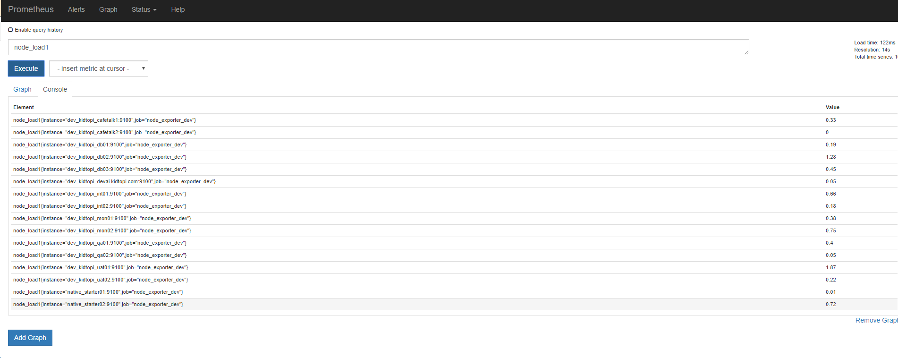
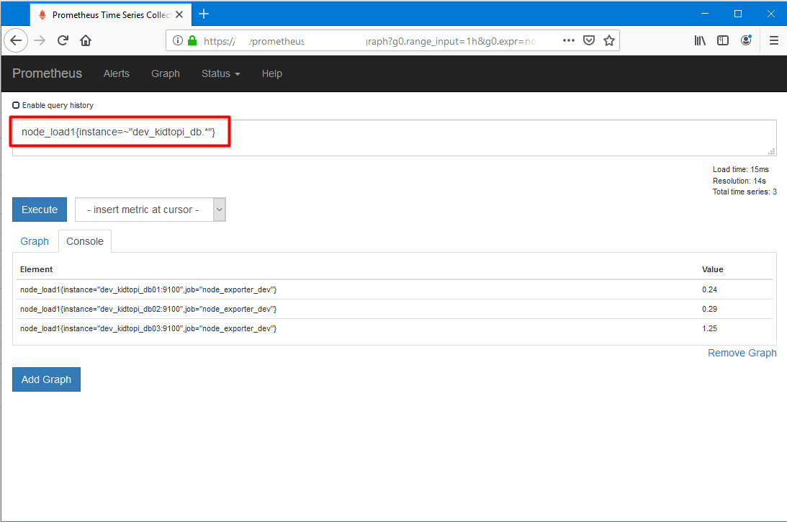
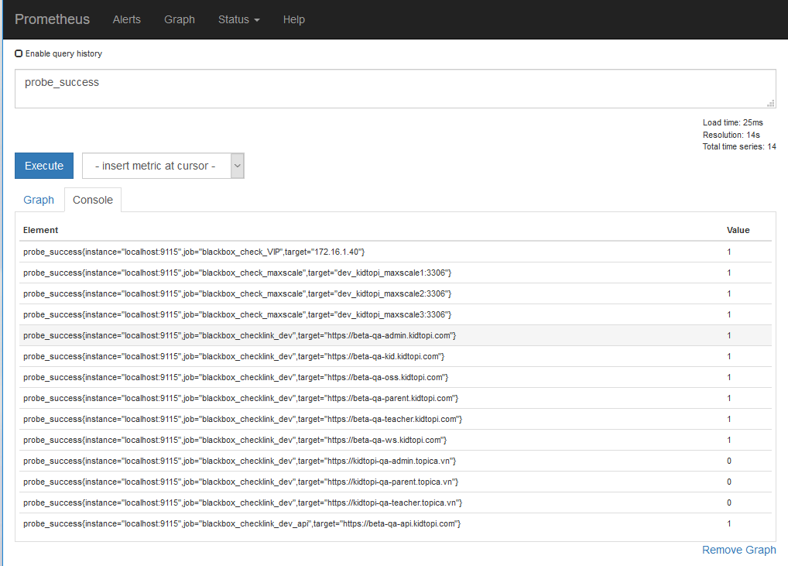
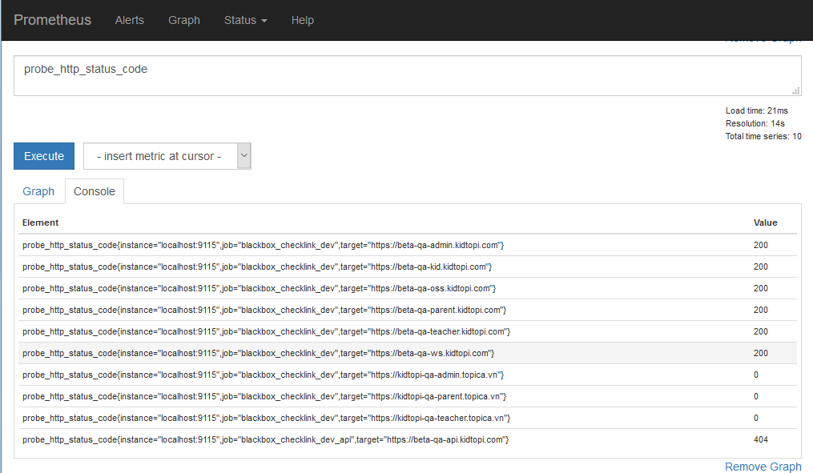
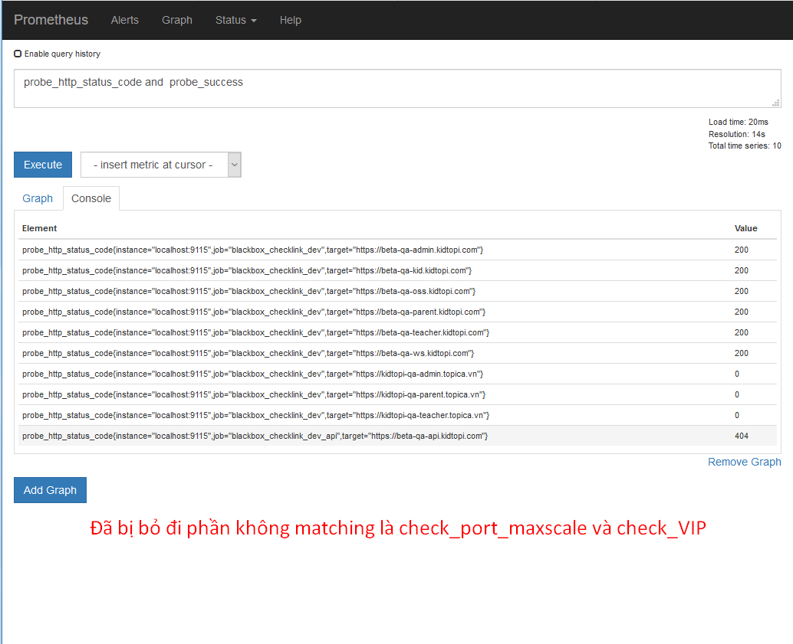
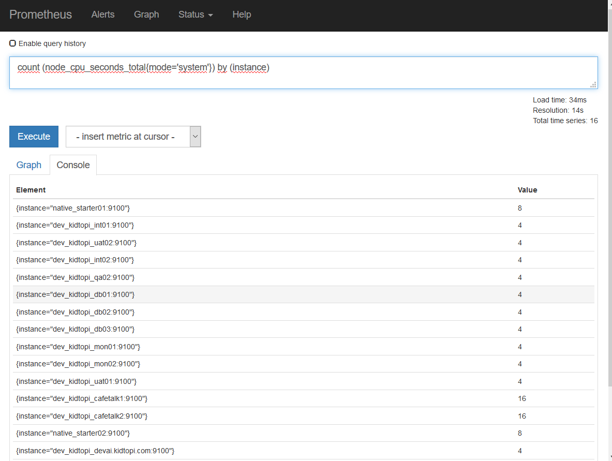

# Truy vấn metric từ prometheus  

Sau khi đã setup prometheus, các exporter lên các target cần giám sát, tiếp theo sẽ tìm hiểu về các metric, cách truy vấn metric từ trong database của prometheus. Thực hiện viết một số rule để check service, nếu đạt quá ngưỡng sẽ sinh ra cảnh báo. 

Phần tài liệu này mô tả các truy vấn metric và viết một số rule để áp lên cụm server dev Kidtopi. Các hệ thống khác thực hiện tương tự.

- [Truy cấn metric trên prometheus dashboard](#1)

- [Time series Selectors](#2)

- [Range Vector Selectors](#3)

  [Basic Operator](#4)
  [Aggregation operator](#5)
  [Thứ tự ưu tiên các toán tử](#6)

---

<a name = "1"></a>

## Truy vấn metric trên prometheus dashboard

Prometheus cung cấp ngôn ngữ truy vấn gọi là PromQL (Prometheus Query Language): cho phép người dùng select và aggregate time series data theo thời gian thực. Kết quả của truy vấn có thể được show trên trình duyệt dạng bảng hoặc dạng graph, hoặc có thể được sử dụng bởi các hệ thống bên ngoài thông qua API.

Tham khảo về query prometheus: https://prometheus.io/docs/prometheus/latest/querying/basics/

Trong ngôn ngữ biểu hiện của prometheus (prometheus's expression language), an expression or sub-expression (khả năng dịch là thể hiện của metric) có 4 kiểu sau:

- **instant vector**: một tập hợp chuỗi thời gian chứa một mẫu duy nhất cho mỗi chuỗi thời gian, tất cả đều chia sẻ cùng dấu thời gian (tức là giá trị metric trong cùng một khoảng thời gian nào đó): thường là giá trị tức thời tại một thời điểm
- **range vector:** chuỗi các giá trị metric theo thời gian. Hiểu như là giá trị tổng, trung bình, ... trong     vòng một khoảng thời gian nào đó của metric.
- **scalar**: giá trị số thực.
- **string**: giá trị chuỗi đơn giản, hiện đã không sử dụng nữa.

<a name = "2"></a>

## Time series Selectors

Instant vector selector

Instant vector selector cho phép chọn một bộ các dữ liệu theo thời gian và giá trị đơn mẫu cho mỗi timestamp được đưa ra: trong một form đơn giản nhất: chỉ cần tên của metrics. Kết quả này trả về các vector tức thời chứa các thành phần time series mà có chứa tên metrics.

Ví dụ khi xem metric Load avage trong 1' của các host, chọn metrics node_load1 như sau:



- **instance**: thông tin tên target mình add vào trong file cáu hình của prometheus.(Thường đi kèm hostname/IP và port mở của exporter)
- **job**: tên job name mình add cấu hình trên prometheus server.

Ngoài ra, ta có thể lọc các kết quả trả về bằng cách append các nhãn đẻ tiến hành match nhãn đó với metrics trong ngoặc nhọn (`{}`)

Ví dụ: để lấy ra thông tin số load avg của target host tên dev_kidtopi_uat02:


Một số operator có thể dùng để match metric:

- **=** : select các labels match chính xác với chuỗi string     cung cấp.
- **!=** : select các labels không match với chuỗi string cung     cấp.
- **=~** : Select các nhãn regex-match với chuỗi string cung     cấp.
- **!~** : Select các nhãn regex-match với chuỗi string cung     cấp.

Ví dụ regex-match: show các target có tên bắt đầu bằng chuỗi "dev_kidtopi_db":




<a name = "3"></a>

## Range Vector Selectors

Range vector hoạt động giống instant vector, ngoại trừ việc chúng sẽ chọn ra một dãy các mẫu từ thời điểm trước đó cho tới giá trị hiện tại. Cú pháp là sẽ chèn thêm khoảng thời gian sau trong dấu ngoặc vuông ([]) ở vị trí cuối cùng, để xác định khoảng thời gian trở về trước.

Khoảng thời gian được xác định bằng số, và theo các đơn vị sau:

- s - seconds
- m - minutes
- h - hours
- d - days
- w - weeks
- y - years

<a name ="4"></a>

## Basic Operator

Prometheus query language hỗ trợ một số toán tử logic và toán học cơ bản. Để thực hiện tính toán giữa 2 instant vector, cần phải thực hiện matching behavior.

Các toán tử toán học hỗ trợ:

- \+ (addition)
- \- (subtraction)
- \* (multiplication)
- / (division)
- % (modulo)
- ^ (power/exponentiation)

Các toán tử có thể thực hiện giữa các giá trị scalar/scalar , vector/scalar, và vector/vector.

- - Giữa scalar và scalar:  thực hiện toán tử giữa 2 số thông thường.
  - Giữa instant vector và  scalar: toán tử được áp dùng trên toàn bộ giá trị mẫu của vector. Ví dụ:      chuỗi giá trị kết quả của một truy vấn cho nhân với 2, kết quả là tất cả  các giá trị đầu ra của mỗi phần tử trong vector được nhân với 2.
  - Giữa 2 instant vector:  Toán tử được thực hiện với từng phần tử matching với nhau của vector bên      trái và vector bên phải của phép toán, dựa trên việc matching một label  chung giữa 2 vector.

Hiểu hôn **¯\\_(ツ)_/¯ mình không hiểu**

Các toán tử logic:

- vector1 and vector2 : trả về kết quả vector1 khi mà các phần tử (label set) của vector1 matching chính xác với các phần tử (label set) của vector2.
- vector1 or vector2 : kết quả or giữa 2 vector chứa tất cả các phần tử ban đầu (label set + values) của vector1 và thêm vào các thành phàn của vector2 mà không matching label set trong vector1.
- vector1 unless vector2: kết quả bao gồm các phần tử của vector 

Ví dụ 2 vector and: 







<a name = "5"></a>

## Aggregation operator

Premetheus hỗ trợ một số toán tử kết hợp có thể sử dụng để tích hợp các phần tử của một instant vector, trả về một vector mới với ít phần tử hơn do đã được kết hợp lại. (nghe ngu vl. ncl lab thì hiểu :v ) 

- sum (calculate sum over dimensions)
- min (select minimum over dimensions)
- max (select maximum over dimensions)
- avg (calculate the average over dimensions)
- stddev (calculate population standard     deviation over dimensions)
- stdvar (calculate population standard     variance over dimensions)
- count (count number of elements in the     vector)
- count_values (count number of elements with     the same value)
- bottomk (smallest k elements by sample     value)
- topk (largest k elements by sample value)
- quantile (calculate φ-quantile (0 ≤ φ ≤ 1) over dimensions)

Cú pháp như sau: 

```bash
<aggr-op>([parameter,] <vector expression>) [without|by (<label list>)]
```

Tham khảo thêm tại: https://prometheus.io/docs/prometheus/latest/querying/operators/

Ví dụ: Đếm tổng số core cpu trên mỗi target: 



*(Tại sao lại đếm theo **mode='system'**, bởi vì bất kì core cpu nào đều hoạt động cho các service của system => core cpu nào trên bất kì host nào cũng đều có thành phần cpu system. Nên chọn đếm số metric node_cpu_seconds_total mode system theo nhóm các metric có chung label instance sẽ cho ta số lượng core cpu trên host.)*

<a name = "6"></a>

## Thứ tự ưu tiên các toán tử

Các toán tử được ưu tiên theo thứ tự sau:

1. ^
2. *, /, %
3. +, -
4. ==, !=, <=, <, >=, >
5. and, unless
6. or

Và ưu tiên theo chiều từ trái sang phải nếu 2 toán tử có độ ưu tiên bằng nhau. Ngoại trừ phép ^ ưu tiên từ phải sang: 2^3^2 = 2^(3^2) = 2^9

 Phần trên là một số kiến thức cơ bản để truy vấn metric của prometheus. Phần tiếp theo sẽ tiến hành viết một số rule để check service và sinh ra alert. Khi mới bắt đầu dùng prometheus, có thể chưa quen các query hay dùng, nên đến bước này, tiếp theo sẽ setup grafana và import một số dashboard có sẵn của nó. Từ đó vào xem các query mẫu của họ, mình sẽ dễ hiểu hơn phần vừa học trên và có thể áp dụng được cho hệ thống của mình.

### Tham khảo

[1] https://prometheus.io/docs/prometheus/latest/querying/basics/
[2] https://prometheus.io/docs/prometheus/latest/querying/operators/

