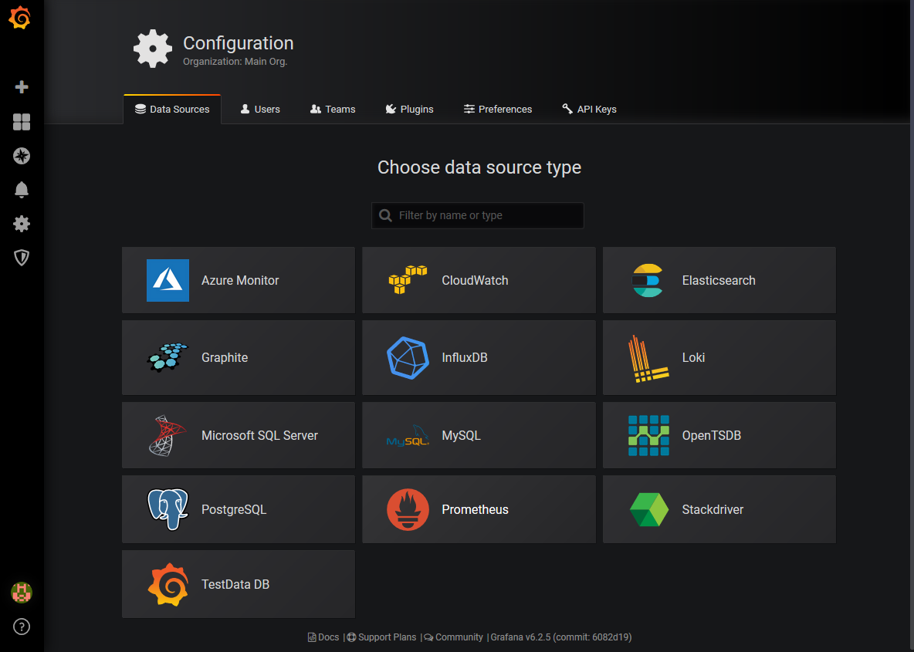
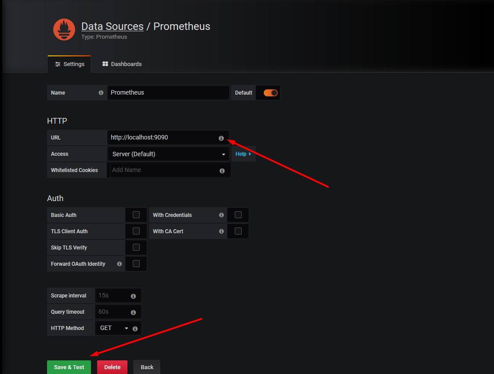
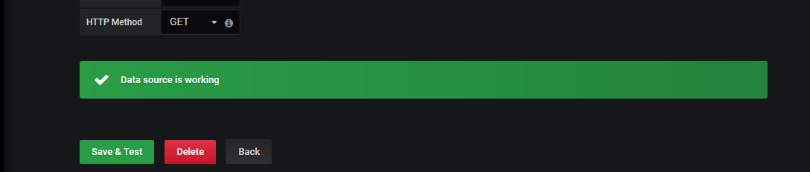

# Setup Grafana

Tham khảo tại: https://grafana.com/docs/installation/

Hướng dẫn cài đặt Grafana trên ubuntu 16.04 (do hệ thống hiện tại đang dùng nó)

Cài Grafana lên luôn server setup prometheus. Chạy các lệnh sau với user có quyền sudo:

```bash
$ sudo apt-get install -y software-properties-common
$ sudo add-apt-repository "deb https://packages.grafana.com/oss/deb stable main"
$ sudo wget -q -O - https://packages.grafana.com/gpg.key | apt-key add -
$ sudo apt-get update && sudo apt-get install grafana -y
```

Trên centos:

- Cài đặt các thư viện hỗ trợ:

  ```bash
  $ sudo yum update curl nss nss-util nspr
  ```

- Tạo file repo cho grafana:

  ```bash
  $ sudo vim /etc/yum.repos.d/grafana.repo
  ```

  Thêm nội dung sau vào:

  ```
  [grafana]
  name=grafana
  baseurl=https://packages.grafana.com/oss/rpm
  repo_gpgcheck=1
  enabled=1
  gpgcheck=1
  gpgkey=https://packages.grafana.com/gpg.key
  sslverify=1
  sslcacert=/etc/pki/tls/certs/ca-bundle.crt
  ```

- Cài đặt grafana: 

  ```bash
  $ sudo yum install grafana
  $ grafana-server -v
  ```

---

Sau khi cài đặt, cấu hình của grafana trong các thư mục sau:

- Installs binary to `/usr/sbin/grafana-server`
- Installs Init.d script to `/etc/init.d/grafana-server`
- Creates default file (environment vars) to `/etc/default/grafana-server`
- Installs configuration file to `/etc/grafana/grafana.ini`
- Installs systemd service (if systemd is available)     name `grafana-server.service`
- The default configuration sets the log file at `/var/log/grafana/grafana.log`
- The default configuration specifies an sqlite3 db     at `/var/lib/grafana/grafana.db`
- Installs HTML/JS/CSS and other Grafana files at `/usr/share/grafana`

Start grafana-server :

```bash
$ sudo systemctl daemon-reload
$ sudo systemctl start grafana-server
$ sudo systemctl enable grafana-server
$ sudo systemctl status grafana-server
```

Mặc định, grafana hoạt động trên port 3000.

Setup google authentication theo hướng dẫn sau: https://grafana.com/docs/auth/google/

Login vào giao diện của grafana, user mặc định ban đầu là admin / admin.

Sau khi truy cập vào grafana: Thực hiện add source. Chọn data source là prometheus:



Điền thông tin prometheus server:



Click Save&Test. Báo thành công như sau là ok:



Sau khi đã add data source. Thực hiện import một số dashboard mẫu của grafana dành cho prometheus. Bạn có thể từ tra google. Một số dashboard gợi ý:

- Node Exporter Full (ID: `1860`) : Hiển thị các thông số thu thập được của node_exporter. một số panel mẫu khá đẹp.
- Blackbox Exporter Overview (ID: 5345): dashboard cho hiển thị up/down câc link mình check bởi blackbox.
- MySQL Overview (ID: 7362): dashboard hiển thị thông tin cơ bản lượng tài nguyên sử dụng cho database.
- RabbitMQ Metrics (ID: 2121): Hiển thị các thông số của rabbitmq.
- ... và một số dashboard tùy chỉnh cần add thêm plugin của grafana. Phần này sẽ hướng dẫn sau. 

Các dashboard mà mình đã modified lại một chút cho hợp và đẹp hơn được tổng hợp tại: [grafana dashboards](./templates/grafana/) 

Có thể thực hiện import dashboard thông qua ID hoặc file .json của dashboard.

 Khi đã làm quen với truy vấn của prometheus, tiếp theo sẽ thực hiện Setup Alertmanager.