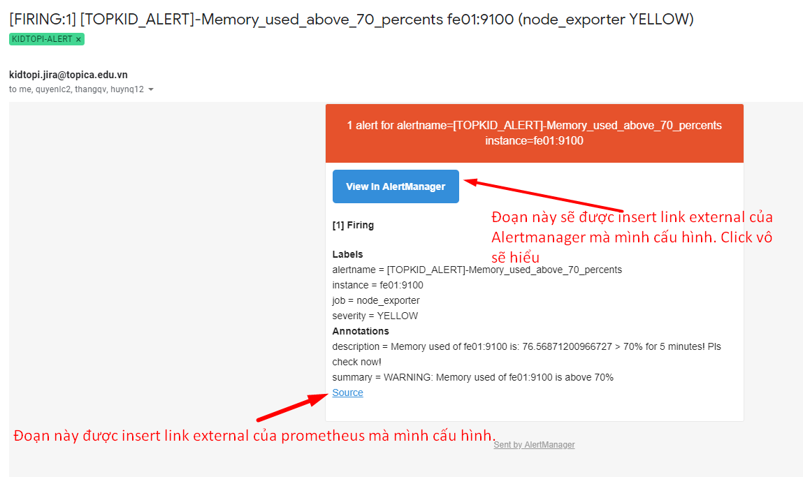
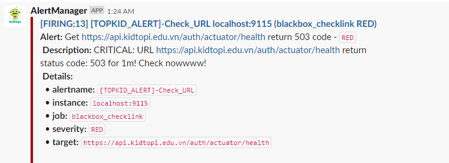

# Cấu hình receivers - Alertmanager 

Alertmanager hỗ trợ gửi thông báo qua nhiều kênh như email, chat slack, webhook, ... Phần này sẽ hướng dẫn tạo và cấu hình receiver gmail, slack và webhook (sms - được dựng sẵn) của Alertmanger. 

- [1) Gmail](#1)
- [2) Slack](#2)
- [3) Web hook khác (sms)](#3)
- [4) Cấu hình file hoàn chỉnh](#4)

---

<a name = "1"></a>

## 1) Gmail

Trước hết cần tạo tài khoản gmail cho phép dùng mail đó gửi thông báo tới các user gmail khác. 

Lưu ý bật tính năng cho phép phần mềm bên thứ ba (trong trường hợp này là Alertmanger) được phép sử dụng để gửi mail. 

Link hướng dẫn: https://www.jotform.com/help/392-How-to-Use-Your-Gmail-Account-as-Your-Email-Sender-via-SMTP

Cấu hình Alertmanager: file `/etc/alertmanager/alertmanager.yml` tại section global: 

```yaml
global:
  smtp_smarthost: 'smtp.gmail.com:587'
  smtp_from: 'noti-xyz@gmail.com'
  smtp_auth_username: 'noti-xyz@topica.edu.vn'
  smtp_auth_password: '<password_here>'
```

Trên là cấu hình cho gmail. Hạn chế khi dùng gmail gửi thông báo là sẽ bị giới hạn số lượng mail gửi tối đa trong ngày (*The Gmail mail server send limit is approximately 100-150 emails per day when connected to the server from a remote email client. You can send 500 emails each day through the Gmail SMTP server when logged into their web interface*). Khi số lượng mail gửi cảnh báo lớn hơn số lượng tối đa cho phép, dùng gmail có thể bị miss thông báo. Hiện tại các hệ thống giám sát sử dụng mail từ hệ thống server mail Tocose (Của Topica - công ty cũ của mình :D) tự dựng để không bị giới hạn số lượng gửi mail từ client. Cấu hình gửi mail từ mail server Tocose như sau: 

```yaml
global:
  smtp_smarthost: 'emailxyz.topica.edu.vn:25'
  smtp_from: 'noti_alert@topica.edu.vn'
  smtp_auth_username: 'noti_alert'
  smtp_auth_password: '<password_here>'
  smtp_require_tls: false
```

Cấu hình section receiver các user nhận thông báo từ gmail ví dụ như sau: 

```yaml
    email_configs:
    - to: 'tamntt4@topica.edu.vn, xyz@topica.edu.vn'
      send_resolved: true
```

Thông báo được gửi từ mail như sau: 



Phần link được chèn vào của Alertmanager và Prometheus chính là tham số cấu hình: `--web.external-url` trong file `/etc/systemd/system/alertmanger.service` và `/etc/systemd/system/prometheus.service`

<a name = "2"></a>

## 2) Slack

Tạo channel slack theo hướng dẫn sau: https://github.com/meditechopen/meditech-ghichep-omd/blob/master/docs/5.3-Send-Noitify_Slack.md

Sau khi lấy được Web hook ID của channel slack. Cấu hình vào section global của Alertmanager như sau: 

```yaml
slack_api_url: 'https://hooks.slack.com/services/<webhook_ID>'
```

Phần cấu hình section receiver slack như sau: 

```yaml
    slack_configs:
    - send_resolved: true
      channel: '#orange-level' ## channel name
      #text: "<!channel> \nsummary: {{ .CommonAnnotations.summary }}\ndescription: {{ .CommonAnnotations.description }}"
      text: >-
        {{ range .Alerts }}
          *Alert:* {{ .Annotations.summary }} - `{{ .Labels.severity }}`
          *Description:* {{ .Annotations.description }}
          *Details:*
          {{ range .Labels.SortedPairs }} • *{{ .Name }}:* `{{ .Value }}`
          {{ end }}
        {{ end }}
```

Kết quả thông báo được gửi trên channel Slack như sau: 



Các thông số cụ thể của alert gửi từ prometheus sẽ được liệt kê đầy đủ như trên. 

<a name = "3"></a>

## 3) Web hook khác (sms)

Đẩy vào cấu hình web hook của Alertmanager trên trang chủ: https://prometheus.io/docs/alerting/configuration/#webhook_config

<a name = "4"></a>

## 4) Cấu hình file hoàn chỉnh

File cấu hình Alertmanager hoàn chỉnh tham khảo tại: [alertmanager.yml](./templates/alertmanager.yml)

File cấu hình hoàn chỉnh gồm các section chính: global, route (xác định thông báo được gửi tới receiver nào), inhibit_rule và receivers (cấu hình thông tin các receiver). 

Các receiver được phân tách bởi name. Mọi cấp độ receiver đều nhận gmail và slack. 

