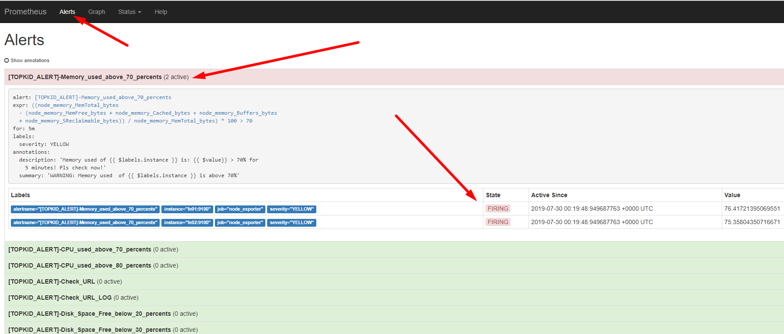
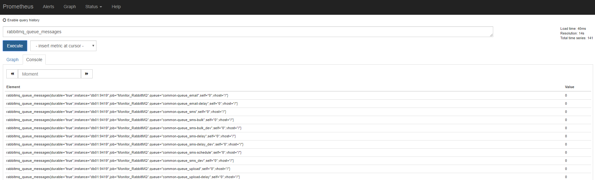
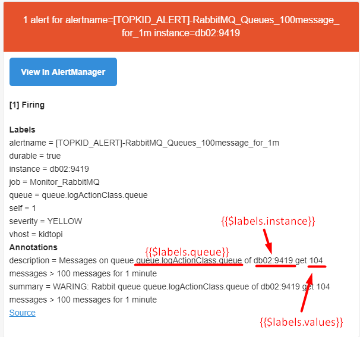
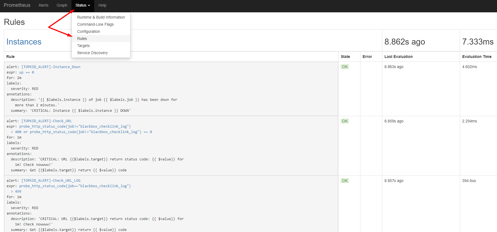

# Tạo rule check service

Đọc trước link tạo rule: [https://prometheus.io/docs/prometheus/latest/configuration/alerting_rules](https://prometheus.io/docs/prometheus/latest/configuration/alerting_rules/)

Alerting rule cho phép định nghĩa các điều kiện sinh ra cảnh báo dựa trên các truy vấn của prometheus và gửi thông báo về các cảnh báo đang xảy ra tới alertmanger.

Một file rule ví dụ như sau:

```
groups:
- name: example
  rules:
  - alert: HighRequestLatency
    expr: request_latency_seconds{job="myjob"} > 0.5
    for: 10m
    labels:
      severity: page
    annotations:
      summary: High request latency
```

- Tùy chọn `for`: định nghĩa khoảng thời gian mà prometheus chờ từ lúc dấu hiện đầu tiên xuất hiện cho đến thời điểm đủ để sinh ra  alert. Trong ví dụ trên, prometheus sẽ kiểm tra cảnh báo tiếp tục diễn ra     trong mỗi khoảng thời gian 10' thì sẽ đẩy đi 1 alert tới alertmanger. Các dấu hiệu đang xảy ra nhưng chưa đủ thời gian để firing (đẩy qua alertmanger để gửi thông báo) thì ở trạng thái pending.
- `labels`: cho phép xác định các nhãn được gắn vào cảnh báo. Bất kì label bị conflict nào sẽ bị ghi đè. Các giá trị label này có thể là mẫu có sẵn.
- `annotations`: cho phép xác định thêm các thông tin label để bổ sung thông tin cho thông báo: như mô tả về alert hay link để xem alert. Các giá trị annotation có thể là các giá trị mẫu có sẵn.
- `expr`: điều kiện truy vấn để sinh ra cảnh báo của prometheus.

**Check các  rule đang map - đang xảy ra**

Có thể check alert đang xảy ra, các alert đang xảy ra ở trạng thái firing hay pending bằng cách check thủ công tại tab **Alerts** của giao diện prometheus.



Khi đã quen với truy vấn trong prometheus rồi, thì việc tạo rule rất dễ dàng. Ví dụ một query để check số lượng message trong rabbitmq hiện tại: 

`rabbitmq_queue_messages`: 



Vậy giờ cần có alert khi mà số message trong queue luôn lớn hơn 100 message trong vòng 1' → khả năng hệ thống đang có vấn đề, số lượng queue tồn lại lớn chưa xử lý xong trong vòng 1'. Rule viết như sau: 

```
- name: Check_RabbitMQ_Queues
  rules:
  - alert: "[DEMO_ALERT]-RabbitMQ_Queues_100message_for_1m"
    expr: rabbitmq_queue_messages > 100
    for: 1m
    labels:
      severity: YELLOW
    annotations:
      description: 'Messages on queue  {{$labels.queue}} of {{$labels.instance}} get {{ $value}} messages ( >100 messages) for 1 minute'
      summary: "WARING: Rabbit queue  {{$labels.queue}} of {{$labels.instance}} get {{ $value}} messages ( >100 messages)for 1 minute"
 
```

- `alert`: tên Alert khi được thông báo được gửi đi để giúp receiver hình dung ra được cảnh báo vừa gửi tới là của đối tượng nào.

- `expr`: check điều kiện số message trong queue lớn hơn 100

- `for`: check điều kiện xảy ra liên tục trong vòng 1' thì sẽ sinh ra alert.

- `labels`: add thêm label severity gán nhãn là YELLOW. Dùng để thiết lập mức cảnh báo.

- `annotations`: thông tin mô tả về cảnh báo. Các giá trị: `{{$labels.queue}}` sẽ được lấy từ metric trả về từ truy vấn  `rabbitmq_queue_message`. 

  

Một số rule alert mà mình tổng hợp được tham khảo [tại đây](./templates/alert_rules/)

Check các rule đã cấu hình trên giao diện prometheus tại tab **Status** phần **Rules**:



