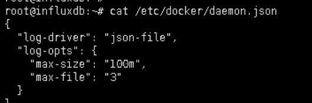

# Config rotate docker log

Mặc định, Docker sẽ bắt lấy tất cả các dữ liệu đầu ra (standard output và standard error) từ các container và ghi chúng vào các file log định dạng JSON. Định dạng JSON chú thích mỗi dòng một sự kiện (stdout hoặc stderr) theo mốc thời gian của nó. Mọi fie log sẽ chỉ chứa thông tin về một container. 

Trong khi triển khai docker container influxdb, mình gặp case khá khó chịu là dữ liệu lưu vào influxdb chỉ có vài GB trong khi log 2xx bắn ra thì nhiều kinh khủng - mỗi lần có một event write dữ liệu vào db thành công là bắn ra một dòng thông báo lưu vào log (`/var/lib/docker/containers/<id_container>-json.log`). File log này sau khoảng vài ngày thì lên tới mấy chục GB chiếm hêt dung lượng ổ cứng. 

Đang nghĩ chắc phải cấu hình rotate log sử dụng logrotate của linux :v thì tra google tẹo, ai ngờ ra ngay cái config log của docker ==' 

Link tham khảo:   https://docs.docker.com/config/containers/logging/ 

Đoạn mình cần là config log của docker với driver log là json-file, rotate file log khi file size đạt 100MB và chỉ giữ lại 3 file gần nhất. Tham khảo cấu hình tại :  https://docs.docker.com/config/containers/logging/json-file/ 

Lưu ý: Các cấu hình lại option cho log của docker trong file `/etc/docker/daemon.json` chỉ được apply sau khi restart lại docker. Và các tham số đó chỉ ảnh hưởng lên các container **mới tạo** lại sau khi restart docker. 