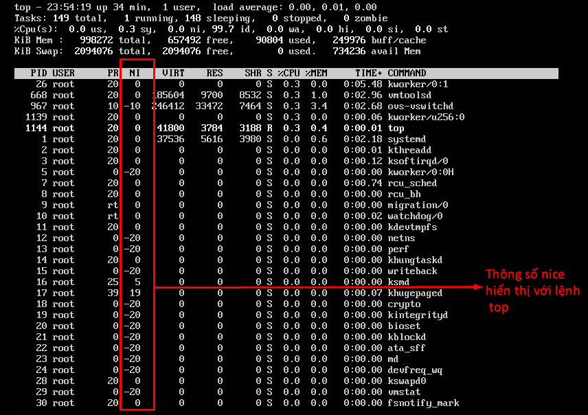

# `Nice` trong Linux

`nice` là một chương trình trên các hệ điều hành Unix hoặc Unix-like như Linux. Nó ánh xạ trực tiếp lời gọi từ kernel có cùng tên.

`nice` được sử dụng để gọi một tiện ích hoặc một shell script với độ ưu tiên cụ thể, do đó cho tiến trình nhiều hoặc ít thời gian CPU hơn các tiến trình khác.

Giá trị ưu tiên của nice từ -20 là ưu tiên cao nhất tới 19 là độ ưu tiên thấp nhất. 

Giá trị mặc định cho các tiến trình được kế thừa từ tiến trình cha và thường là 0.

## Tác dụng

`nice` có tác dụng khi một vài tiến trình có nhu cầu về tài nguyên nhiều hơn mà CPU có thể cung cấp. Trong trường hợp này, một tiến trình với độ ưu tiên cao hơn sẽ chiếm phần lớn thời gian CPU hơn là một tiến trình với độ ưu tiên thấp hơn. Chỉ người dùng superuser (root) mới có thể thiết lập thông số nice. 

Trên linux, có thể thay đổi trong file `/etc/security/limits.conf` để cho phép các người dùng hoặc nhóm thiết lập giá trị nice thấp hơn.

Nếu người dùng muốn nén một file lớn, nhưng không làm chậm các tiến trình khác có thể chạy lệnh sau để giảm độ ưu tiên sử dụng CPU:

```
$ nice -n 19 tar cvzf archive.tgz largefile
```

Hiệu quả toán học chính xác của việc thiết lập các thông số nice cụ thể cho một tiến trình phụ thuộc vào chi tiết các thiết lập lịch trình được thiết kế trên các hệ thống Unix. 

Thông số nice được kiểm tra qua các câu lệnh liên quan tới monitor CPU của hệ thống. 

Ví dụ:



### Một số câu lệnh liên quan

- `renice` là chương trình có thể được sử dụng để thay đổi độ ưu tiên của một tiến trình đang chạy sẵn rồi.

- Linux cũng có một chương trình nữa là `ionice`, tác động tới việc lên lịch của I/O hơn là thời gian CPU.

### Tham khảo

https://en.wikipedia.org/wiki/Nice_%28Unix%29