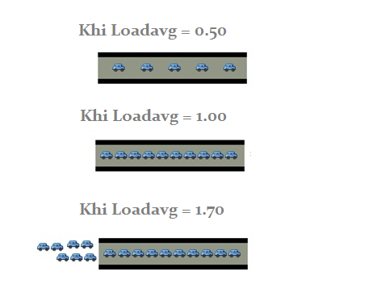
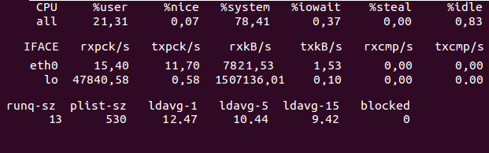
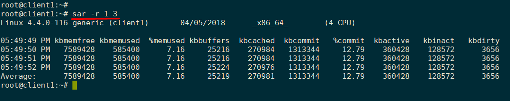
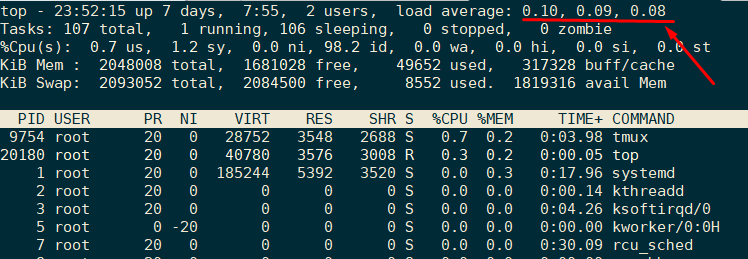

# Tìm hiểu thông số Loadavg (Load average)

### ***Mục lục***

[1. Thông số load avg là gì?](#1)


---

<a name = "1"></a>
## 1. Thông số loadavg là gì?

***Load avg là gì và thông số này được tính toán như thế nào?***

Tải hệ thống (system load) thể hiện số công việc hiện tại hệ thống đang thực thi. Tải của hệ thống có thể được tính toán dựa trên các tiến trình đang được xử lý (running on CPU) và các tiến trình runable (waiting for CPU)

Ngoài ra, tải còn bao gồm các tiến trình uninterruptible sleep states (waiting disk I/O hoặc network). Những tiến trình này cũng góp phần làm tăng cao tải hệ thống mặc dù nó không thực sự sử dụng CPU.

Một server hoàn toàn nhàn rỗi có load là 0.

Mỗi tiến trình đang chạy hoặc chờ CPU xử lý sẽ thêm vào là 1 tải (load)

Ví dụ: Với load = 5 nghĩa là có 5 tiến trình đang chạy hoặc đang chờ xử lý (thread running, waiting)

Để đánh giá tải của hệ thống, người ta sử dụng thông số tải trung bình - load average hay loadavg. Loadavg thể hiện lượng tải trung bình của hệ thống qua mỗi giai đoạn thời gian: cho thấy trung bình có bao nhiêu process mà server phải thực hiện. 

**Giá trị loadavg cho ta thấy được trung bình khối lượng công việc hệ thống phải xử lý trong mỗi khoảng thời gian : 1 phút, 5 phút, 15 phút.**

Các server không có một ngưỡng loadavg cố định. Loadavg phụ thuộc vào số CPU của server. Có thể xem số CPU của server bằng lệnh sau:

```
cat /sys/devices/system/cpu/online
```


Như vậy máy chủ hiện tại có 4 CPU.

Có thể hiểu đơn giản về loadavg như sau (coi mỗi CPU là một cây cầu, process qua mỗi CPU thể hiện như sau):



=> nếu có 4 CPU thì có thể xử lý mức loadavg <= 4,00 là mức lý tưởng.

Nếu loadavg tăng lên là 8 thì tốc độ xử lý của CPU lúc này chỉ đạt khoảng 50%. Tức là mỗi process chỉ còn sử dụng được 50% CPU để xử lý => Tốc độ chậm đi tương ứng.

<a name = '2'></a>
## 2. Các yếu tố ảnh hưởng tới loadavg

Có 3 yếu tố góp phần làm tăng tải hệ thống:

\- Cpu Utilazion

\- Disk I/O

\- Network Traffic

<a name = '2.1'></a>
### 2.1. CPU utilization

Là yếu tố làm tăng loadavg do có quá nhiều tiến trình cần xử lý tại một thời điểm và số tiến trình đó vượt mức khả năng xử lý của core CPU mà server hiện có. 

Trong trường hợp CPU của bạn được dùng cho những tính toán rất nhẹ nhàng có thể xong tức thì nhưng số lượng process cần CPU lại rất cao, các process cần xử lý tại một thời điểm vượt mức CPU core server hiện có. Điều này nói lên rằng CPU của bạn đang bị quá tải process. Có nhiều lý do dẫn đến trường hợp này và mỗi trường hợp có nhiều cách giải quyết khác nhau.

Một ví dụ hay thấy trường hợp này là máy chủ web. Việc render các trang web là không hề nặng, tuy vậy với các máy chủ web chịu trafic lớn (số lượng connection lớn), các process phục vụ request sẽ phải xếp hàng dẫn đến tình trạng trang web bị phục vụ với thời gian kéo dài hơn.

<a name = '2.2'></a>
### 2.2. Disk I/O

Yếu tố ảnh hưởng tới loadavg thứ hai chính là IOwait.

IOwait là giá trị thời gian mà một CPU (hoặc tất cả CPU) ***idle*** bởi các tiến trình runnable đang chờ đợi một hoạt động đọc ghi lên ổ cứng được hoàn thành trong khaongr thời gian nhất định.

Trường hợp hay gặp là trong database server: Máy chủ DB dành thời gian chủ yếu đợi thao tác vào ra (I/O) như khi truy vấn cơ sở dữ liệu. Số lượng query lớn, số lượng truy vấn cần sắp xếp lớn nhưng dữ liệu cần sắp xếp lại ít, thời gian đợi dữ liệu từ disk lại cao. Vì vậy: phần lớn CPU sẽ idle dẫn tới loadavg vẫn cao.

Nếu phần trăm IOwait lớn thì đây là lúc cần xem lại disk IO hệ thống của mình.

<a name = '2.3'></a>
### 2.3. Network traffic

Nếu cả 2 yếu tố trên không làm ảnh hưởng tới loadavg mà loadavg vẫn cao thì có thể hệ thống đang gặp phải trường hợp thứ 3 là do process đang chờ network IO.

Ví dụ chứng minh network cũng gây ảnh hưởng tới loadavg:

- Thực hiện traffic nhận 50 nghìn gói tin với khoảng 1.5GB dữ liệu qua interface `lo`.

	

	Ta thấy: CPU sử dụng 21% ở usermode và 79% ở kernel mode. Bởi tại thời điểm này, linux kernel đang phải làm việc rất nhiều để xử lý lượng lớn traffic.

<a name = '3'></a>
## 3. Các công cụ kiểm tra thông số loadavg







## Tham khảo

[1] https://tech.vccloud.vn/loadavg-phan-tong-quan-loadavg-442.htm

[2] https://tech.vccloud.vn//loadavg-phan-ii-cac-yeu-anh-huong-toi-loadavg-431.htm