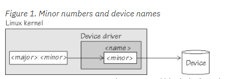
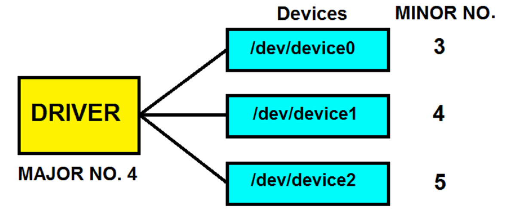
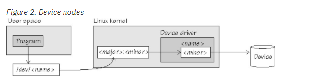
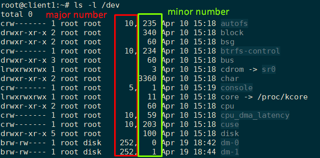

# Device names, device nodes, and major/minor numbers

maijor và minor number được gán với các file thiết bị trong thư mục `/dev` và được sử dụng bởi hệ điều hành để quyết định driver thực tế hoặc thiết bị nào được truy cập bởi yêu cầu của người dùng.

Nhân Linux biểu diễn các thiết bị bởi cặp số ` <major>:<minor>`

- Các major number đại diện cho các loại thiết bị cụ thể. Các major number khác được gán tự động vào các drive thiết bị khi Linux khởi động. Ví dụ, major number 94 luôn là số cho các thiết bị DASD trong khi driver của thiết bị  channel-attached tape devices không có number cố định. Một major number cũng có thể chia sẻ bởi nhiều driver thiết bị. 

- File `/proc/devices` tập hợp tất cả major number đã được gán trên các thiết bị Linux đang chạy.

- Major number được sử dụng để đánh chỉ số trong bảng các thiết bị của kernel, gán với các định tuyến để phân bổ cho tên thiết bị mà người dùng đọc được của phần cứng. (ý là: người dùng phân biệt các loại device bằng tên, còn kernel sử dụng major number)

	

- Major number là định danh cho các device driver để có thể truy cập được vào device. 

- Minor number định danh cho các khối cụ thể của loại thiết bị device driver điều khiển. 

- Drive thiết bị sử dụng số minor number để phân biệt các thiết bị vật lý hoặc logic riêng biệt. Ví dụ: thiết bị DASD gán với 4 số mỗi DASD: một đại diện cho tổng thể và 3 số còn lại cho 3 phân vùng.

- Các thiết bị đều có tên, theo trình đặt tên cho các thiết bị xác định. Mỗi tên thiết bị được gán với một minor number.

- Minor number chỉ được sử dụng bởi chính thiết bị của nó. Minor number thường được sử dụng để phân biệt các thiết bị con trong một loại thiết bị (vd: đánh số phân vùng của một ổ cứng hdd).

- Ví dụ: 

	

- Các chương trình user space truy cập các character device và block device thông qua các device node tham chiếu tới file device cụ thể (do linux nhìn nhận các thiết bị như một file). Mỗi thiết bị được gán với một số minor number cụ thể: 

	

- Để xem major number và minor number của các thiết bị: sử dụng lệnh `ls -l /dev/`:

	
	
## Tham khảo

[1] https://www.thegeekstuff.com/2009/06/how-to-identify-major-and-minor-number-in-linux/

[2] http://www.geekinterview.com/question_details/34062