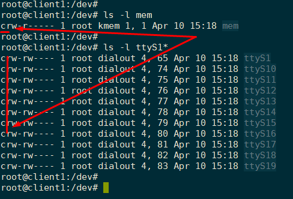
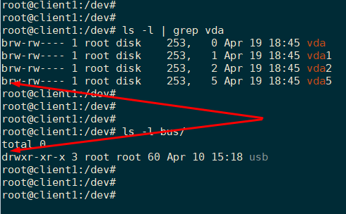
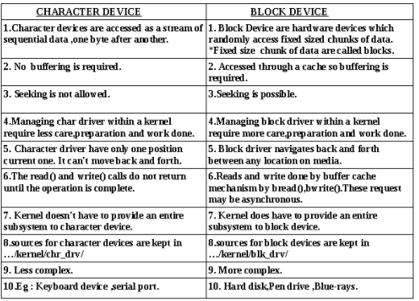

# Char devices and Block devices

Khi tìm hiểu về lưu trữ trong linux, hẳn sẽ gặp phải khái niệm về Character device và Block device. Ghi chép này tìm hiểu về sự khác nhau giữa 2 device trên.

**Character device**

- Thường là các thiết bị không đánh địa chỉ được, cung cấp cách truy cập dữ liệu theo luồng, và thường theo các kí tự (ví dụ dòng byte đầu vào). 

- Character device là các thiết bị như terminal, VDU, bàn phím, máy in, ... những thiết bị chuyển tải dữ liệu theo từng kí tự giữa thiết bị và chương trình của người dùng. 

- Các thiết bị charater  thường được sử dụng với terminal, máy in, thiết bị mạng, các kết nối serial như...

- Là thiết bị cuối, VDU, bàn phím, kết nối dữ liệu (serial connection) vì dữ liệu được truyền theo kí tự cùng lúc. Có nhiều tín hiệu bắt tay khác nhau để thông báo với bên gửi rằng character (kí tự) đã được nhận. 

- Character device truyền dữ liệu trực tiếp tới và từ các tiến trình người dùng. 

- Là bất kì thiết bị nào mà có thể có luồng kí tự được đọc từ nó hoặc ghi vào nó. Character device có thể được sử dụng khi cần sao chép dữ liệu trực tiếp đến hoặc từ một tiến trình người dùng. Bởi sự linh hoạt trong xử lý I/O, rất nhiều thiết bị là character device. Máy in, terminal tương tác, và trình hiển thị đồ họa là các ví dụ về các thiết bị character device.

- Trong Linux, các thiết bị char device thường được kí hiệu bởi kí tự `c` khi hiển thị dưới dạng file trong cây thư mục: 

	

- Các đặc điểm:

	- Là các thiết bị truy cập được luồng dữ liệu tuần tự, từng bit một.

	- Không yêu buffering.

	- Không cho phép tìm kiếm dữ liệu.

	- Managing char driver within a kernel require less care,preparation and work done.

	- Chỉ có một điểm dữ liệu là vị trí hiện tại. Không thể di chuyển đến trước hoặc quay lại được.

	- Lời gọi read() và write() không được trả về cho đến khi thao tác được hoàn thành.

	- Kernel doesn’t have to provide an entire subsystem to character device.

	- Ít phức tạp hơn.

**Block device**:

- Là các thiết bị xác định có thể đánh địa chỉ và hỗ trợ tìm kiếm và truy cập dữ liệu ngẫu nhiên. Block device được truy cập được thông qua các file cụ thể gọi là các block device node và thường được mount vào hệ thống để có thể sử dụng được. Ví dụ: ổ cứng, cdrom, usb, ổ đĩa từ, CD/DVD. 

- Là các thiết bị được và ghi dữ liệu theo các block (khối dữ liệu) chứ không đọc từng kí tự một theo luồng như character device, và thực hiện việc này mà không cần sử dụng bộ xử lý. Giao thức truyền trong block cần biết nới dữ liệu bắt đầu và độ dài của nó - nghĩa là yêu cầu xử lý của bộ xử lý thấp hơn `(._?)`

- Truy cập dữ liệu thông qua buffer cache. Thực hiện I/O bằng cách sử dụng các khối bộ đệm buffer từ buffer cache do kernel cung cấp. 

- Trong Linux, các thiết bị block device thường được kí hiệu bởi kí tự `b` khi hiển thị dưới dạng file trong cây thư mục: 

	

- Đặc điểm: 

	- Là các thiết bị phần cứng truy cập ngẫu nhiên có kích thước lưu trữ cố định. ***Fixed size chunk of data are called blocks***

	- Truy cập được thông qua cache nên yêu cầu buffering.

	- Có thể thực hiện thao tác tìm kiếm dữ liệu.

	- Có thể chuyển tới bất kì điểm dữ liệu nào trên thiết bị.

	- Thao tác đọc ghi được thực hiện bởi buffer cache bởi `bread()`, `bwrite()`. Những yêu cầu này có thể không đồng bộ.

	- Kernel does have to provide an entire subsystem to block device.

Quy định về số major và minor của các thiết bị này được quy định trong file: `/proc/devices`

## Tham khảo

[1] https://arstechnica.com/civis/viewtopic.php?t=787631

[2] https://jyotisingh92.wordpress.com/2017/12/23/block-driver-vs-character-driver/

[3] https://www.linuxquestions.org/questions/linux-newbie-8/character-device-vs-block-device-4175563059/