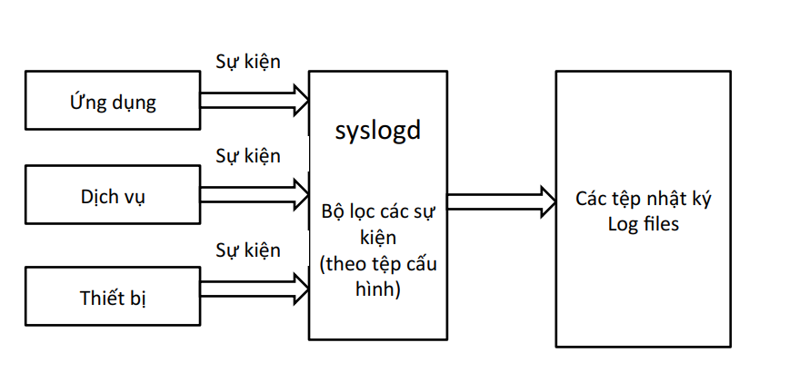
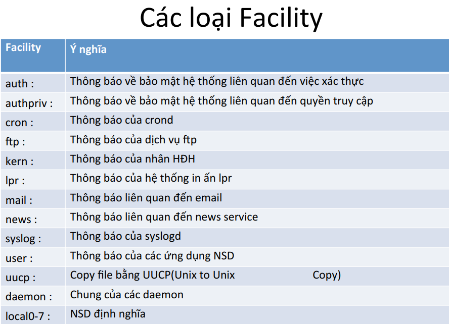
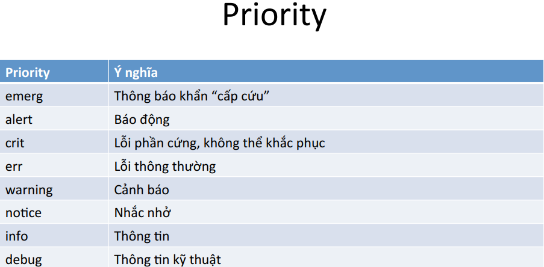
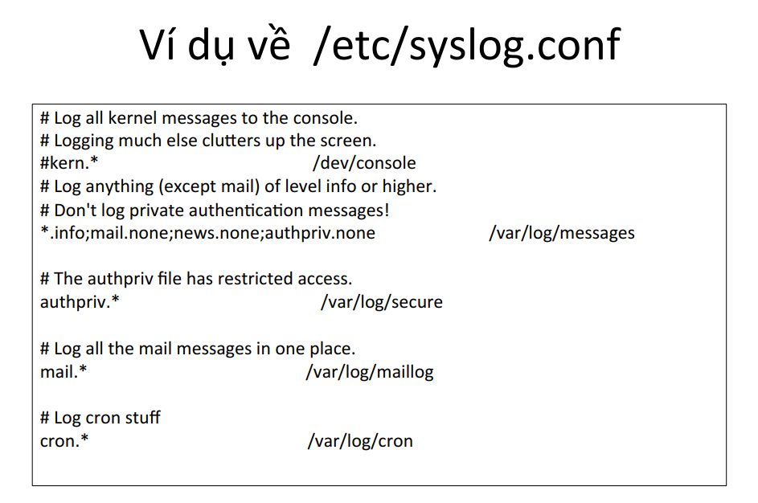
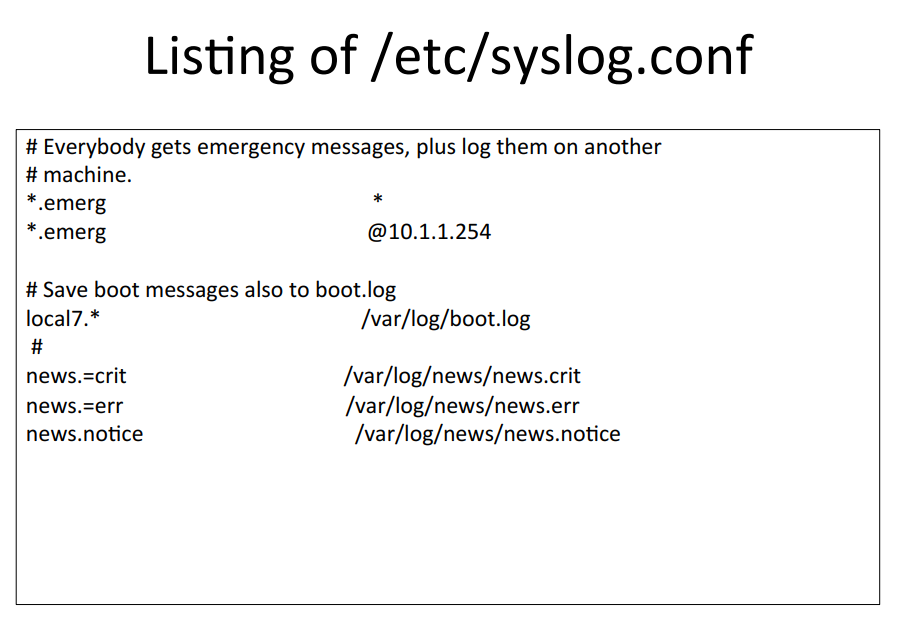
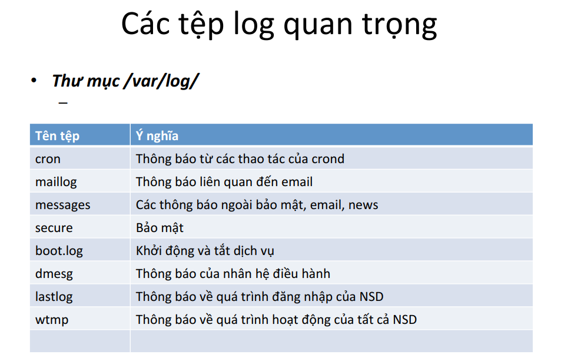

# Một số ghi chép về log trên linux

### ***Mục lục***
  - [1. Log là gì 1](#1-log-là-gì-1)
  - [2. Cơ chế ghi log](#2-cơ-chế-ghi-log)
  - [3. Syslog](#3-syslog)
    - [3.1. Syslog là gì 1](#31-syslog-là-gì-1)
    - [3.2. Cấu trúc file syslog.conf](#32-cấu-trúc-file-syslogconf)
    - [3.3. Cấu hình file /etc/rsyslog.conf](#33-cấu-hình-file-/etc/rsyslogconf)
  - [4. Logrotate](#4-logrotate)
    - [4.1. Rotate log là gì 1](#41-rotate-log-là-gì-1)
    - [4.2. Cấu hình logrotate](#42-cấu-hình-logrotate)
      - [Cấu hình xác định đối tượng logrotate](#cấu-hình-xác-định-đối-tượng-logrotate)
      - [Chu kì rotate log](#chu-kì-rotate-log)
      - [Cấu hình nén file log cũ](#cấu-hình-nén-file-log-cũ)
      - [Một số tùy chọn khác](#một-số-tùy-chọn-khác)
      - [Một số ví dụ:](#một-số-ví-dụ)
  - [Bonus: Khác nhau giữa syslog và rsyslog ?](#bonus-khác-nhau-giữa-syslog-và-rsyslog-1)
  - [Tham khảo](#tham-khảo)

---

## 1. Log là gì ?

- Log là nhật ký ghi lại các thao tác đã được thực hiện, các sự kiện đã xảy ra, là tập hợp các thông báo được hệ thống sinh ra và lưu trong tập nhật kí - log file.	

- Tại sao lại cần có log ? => Log ghi lại quá trình hoạt động của hệ thống, nên khi có vấn đề xảy ra, đọc lại log để biết các thao tác tác động tới hệ thống và tìm ra hướng xử lý.

- Các thông báo trong log có thể là: 

	–  Thông báo của hệ thống	

	–  Lỗi trong các thao tác hệ thống

	–  Quá trình đăng nhập, đăng xuất.	

	–  Thông báo từ một số ứng dụng.

## 2. Cơ chế ghi log

Cơ chế ghi log được phân thành 2 kiểu:

- **Độc lập**:

	–  Các ứng dụng tự ghi nhật ký vào các thư mục riêng rẽ

	–  Khó theo dõi các nhật ký

	–  Nhật ký nhân hệ điều hành không phải là ứng dụng

	–  Các ứng dụng khó sử dụng nhật ký của nhau

	–  Khó phát hiện ứng dụng	“có vấn đề”	

- **Tập trung**:

	–  Các ứng dụng gửi thông báo chung cho một ứng dụng chịu trách nhiệm ghi nhật ký

	–  Tùy theo mức độ ứng dụng nhật ký sẽ ghi các thông phù hợp vào nhật ký	

	

## 3. Syslog 

### 3.1. Syslog là gì ?

- Syslog là chương trình quản lý các thông báo từ các thành phần của hệ	thống	

- Được thực hiện bởi **syslogd daemon**.		

- Khởi	động	cùng	hệ	thống

	```
	/etc/init.d/syslog	{	start	|	stop	|	reload	}
	```

- Cấu hình của syslogd được lưu trong file `/etc/rsyslog.conf`

### 3.2. Cấu trúc file syslog.conf

Rsyslogd (có thể hiểu syslogd và rsyslogd tương đương nhau <muốn phân biệt thì tới phần [bonus]() nha :"> >) daemon chịu trách nhiệm thu thập các message service đến từ các ứng dụng và kernel, rồi gửi chúng tới các file log (thường được lưu trong thư mục `/var/log/`). Các tham số cấu hình cho rsyslogd được lưu trong file `/etc/rsyslog.conf`.

- Mỗi message được liên kết với một hệ thống ứng dụng con (gọi là "facility" - hiểu nôm na thì nó là nguồn gốc của bản tin log được sinh ra đó)

	

- Mỗi bản tin log (message) lại được gán độ ưu tiên (mức độ nghiêm trọng - priority) khác nhau. Mức độ nghiêm trọng được liệt kê theo giảm dần theo thứ tự sau: 

	

	- ***emerg***: “Help!” There is an emergency, the system is probably unusable.

	- ***alert***: hurry up, any delay can be dangerous, action must be taken immediately.

	- ***crit***: conditions are critical.

	- ***err***: error.

	- ***warn***: warning (potential error).

	- ***notice***: conditions are normal, but the message is important.

	- ***info***: informative message.

	- ***debug***: debugging message.

### 3.3. Cấu hình file /etc/rsyslog.conf

Quy tắc chung để cấu hình /etc/rsyslog.conf cấu hình cặp “selector” và “action”.

Selector định nghĩa ra các bản tin log liên quan, và action mô tả thao tác đối xử với bản tin log tương ứng.

- Cú pháp Selector: 

	- Selector được phân tách bởi dấu ";" để liệt kê các cặp subsystem.priority (ví dụ: auth.notice;
mail.info). Kí tự "*" đại diện cho mọi hệ thống với tất cả mức ưu tiên (priority) (ví dụ: *.alert hay mail.*). Một số hệ thống có thể được gộp nhóm, phân tách bởi dấu "," (ví dụ:auth,mail.info). Priority để biết được mức độ của bản tin log bằng hoặc cao hơn mức được cấu hình ngay sau facility, do đó nên auth.alert để cấu hình cho các bản tin hệ thống ở mức alert hoặc emerg. 

	- Với tiền tố **"!"** mang nghĩa đảo nghịch lại, hay nói cách khác là dành cho các mức priority thấp hơn. Ví dụ: auth.!notice - tức là sẽ áp cho các bản tin log từ auth với mức priority thấp hơn nó, là info hay debug. 

	- Tiền tố **"="** tương ứng với chỉ mức độ ưu tiên đó. (auth.=notice tức chỉ áp cho các bản tin log auth với mức priority là notice).

	- Mỗi thành phần trong list selector thì sẽ ghi đè lên các thành phần trước đó, nghĩa là sẽ áp dụng mức priority của thành phần cuối cùng. Ví dụ, kern.info;kern.!err nghĩa là bản tin log từ kernel với mức priority ở giữa là từ info trở lên và dưới mức error (tức là info, warn và notice).

	- **None** priority để không thiết lập priority và nó sẽ không nhận các log có priority là none. Ví dụ: *.crit;kern.none sẽ thu thập tất cả các log có priority cao hơn hoặc bằng crit, trừ các log đến từ kernel.

- Cú pháp Actions: Các actions - tác động với message tương ứng trong selector gồm: 

	- Thêm vào một file (ví dụ: /var/log/messages)

	- Gửi message tới một remote syslog server (ví dụ: @log.falcot.com)

	- Gửi tới một named pipe (ví dụ: |/dev/xconsole)

	- Gửi tới một hoặc nhiều user đã login và hệ thống (ví dụ: root,rhertzog)

	- Hoặc gửi tới tất cả các user đang đăng nhập vào hệ thống (ví dụ: *)

	- Viết message ra console (ví dụ: /dev/ty8).

- Việc ghi các log quan trọng ra một máy tách biệt khác là một giải pháp tốt bởi nó sẽ ngăn chặn việc bị xóa log bởi các tác động không mong muốn. Hơn nữa, với các vấn đề xảy ra trong hệ thống, việc có log trên một máy khác sẽ làm tăng  cơ hội tìm được nguyên nhân gây ra sự cố nhanh hơn. Để cho phép các bản tin log được gửi đến từ máy khác, bạn phải cấu hình lại file rsyslog cho hoạt động ở chế độ sẵn sàng nhận log. 
($ModLoad imudp and $UDPServerRun 514).

- Một số ví dụ về cấu hình file /etc/rsyslog.conf:

	

	

- Một số file log mặc định quan trọng trong linux: 

	

## 4. Logrotate

### 4.1. Rotate log là gì ? 

- Các file log có thể tăng kích thước nhanh chóng, và cần thiết để lưu lại. Kịch bản thông thường là lưu trữ luân chuyển: các file log được lưu trữ đều đặn, và chỉ giữ lại các bản lưu trữ mới nhất. 

- Logrotate là chương trình chịu trách nhiệm cho việc luân chuyển, theo dõi các thư mục được cấu hình trong file `/etc/logrotate.conf` và tất các các file trong thư mục `/etc/logrotate.d/`. Bạn có thể tăng  số lượng file lưu trữ lại hoặc chuyển chúng lưu sang một thư mục cụ thể, hơn là việc xóa đi. Đồng thời cũng có thể gửi đi bằng email để lưu ở bất kì đâu. 

- Thông thường, **logrotate** được chạy như daily cron job. Nó sẽ không nhiều hơn 1 lần trong ngày trừ khi có các tiêu chí khác dựa trên kích thước log và việc logrotate được thực hiện một lần mỗi ngày, hoặc là trừ khi dùng tùy chọn `-f` hay `--force` để bắt rotate log ngay lập tức. 

- Logrotate thực hiện dựa trên các tiêu chí được cấu hình trong file config (bao gồm cấu hình local áp dụng cho toàn bộ các file log hệ thống - file `/etc/logrotate.conf` và logrotate cho các ứng dụng, dịch vụ trong thư mục `/etc/logrotate.d/`). Các tiêu chí cấu hình trong từng file cho ứng dụng cụ thể sẽ được ưu tiên (hay ghi đè) nên các cấu hình tương ứng trong file config global (`/etc/logrotate.conf`). 

### 4.2. Cấu hình logrotate

- Tham khảo cấu hình logrotate tại đây: https://manpages.debian.org/jessie/logrotate/logrotate.8.en.html

- Một số cấu hình logrotate cần lưu ý: 

#### Cấu hình xác định đối tượng logrotate

#### Chu kì rotate log

- Việc rotate log có thể thực hiện theo chu kì thời gian như: 

	```
	daily # hàng ngày
	weekly # hàng tuần
	monthly # hàng tháng
	yearly # hàng năm 
	```

- Hoặc theo kích thước file: Ta có thể quy định tiến trình rotate dựa vào dung lượng file, ví dụ nếu file đó đạt dung lượng 100mb thì tiến hành rotate. Các đơn vị kích thước file có thể sử dụng là K, M, G.

	```
	size <size> # rotate khi file log đạt đến kích thước <size> như cấu hình
	minsize <size> # chỉ rotate khi đạt đến kích thước minsize
	maxsize <size> # rotate ngay khi đạt tới kích thước maxsize
	```

	- Khi cấu hình rotate log theo kích thước file thì độ ưu tiên kích thước file sẽ lớn hơn độ ưu tiên theo chu kì thời gian (daily, weekly, monthly, ...)

	-  Sử dụng `minsize` trong các trường hợp mà các size sau chu kì backup theo thời gian chưa lớn lắm, rotate theo kích thước sẽ đỡ tạo ra thêm nhiều file log mà kích thước nhỏ không đáng kể, 

	- Sử dụng `maxsize` trong trường hợp số lượng log theo chu kì quá lớn, nên tách ra thành các file có kích thước tối đa cụ thể để có thể dễ dàng tra lại log khi cần (tránh phải tra với các file có size quá lớn)


#### Cấu hình nén file log cũ

- `compress`: Tùy chọn cho phép nén các file log sau khi rotate. Mặc định dùng `gzip`. 

- `compresscmd`: Xác định câu lệnh được sử dụng để nén file log. Ví dụ: 

	```
	compresscmd bzip
	```

- `uncompresscmd`: xác định câu lệnh sử dụng để giải nén file log. Mặc định là gunzip. 

- `compressext`: Xác định phần mở rộng cho các file nén của file log, trong trường hợp kích hoạt nén file log. Mặc định là sẽ theo câu lệnh dùng để nén. 

- `delaycompress` sẽ hữu dụng trong trường hợp bạn không muốn file log cũ phải nén ngay sau khi vừa được rotate. Thay vào đó, công việc nén sẽ được delay trễ hơn bằng việc sẽ nén file log cũ đó vào lần chạy rotate kế tiếp. Tùy chọn này chỉ hoạt động đi kèm chức năng compress trong file cấu hình, tức bạn phải cấu hình compress trước đó.

#### Một số tùy chọn khác

- `rotate <count>` Các file log sau khoảng <count> lần rotate sẽ bị xóa khỏi hệ thống, hoặc được gửi mail tới mail cụ thể. 

- `maxage <number>` : xóa các file log đã rotate lâu quá <number> ngày. Số ngày chỉ được check khi log đã được rotate. 

=> ***Giải thích chút chỗ `rotate` và `maxage` này hơi nhập nhằng ý nghĩa với nhau. Ban đầu mình nghĩ, nếu đã rotate theo daily, weekly hay monthly rồi - nghĩa là đã có cụ thể cái thời gian tồn tại của các file log cũ, thì cần phải có tùy chọn `maxage` để xóa đi sau bao nhiêu ngày làm gì ? nếu dùng cả  2 tùy chọn này thì sẽ ra sao ? cái nào sẽ override cái nào. Sau một hồi gg mới vỡ lẽ ra, là 2 tùy chọn này sinh ra không dành cho nhau, không để dùng chung với nhau. Mà có lẽ `maxage` được sử dụng chung khi quy định rotate theo kích thước file log chẳng hạn. Như vậy, việc xóa đi các file log cũ đã được tùy chọn `maxage` xử lý chứ không hẳn là cần tới tùy chọn `rotate`. Theo mình nghĩ ra được thì là như thế, còn nhiều trường hợp khác mà mình nguxi chưa nghĩ ra :)*** 

- `missingok` : Nếu các file log có vấn đề (ví dụ như không có dữ liệu) thì việc rotate log sẽ tiếp tục với file tiếp theo mà không cần quan tâm tới thông báo lỗi. Ngược lại là `nomissingok`

- `create <mode> <owner> <group>, create <owner> <group>` : tùy chọn tạo file log mới sau khi rotate log, với tên giống như file log trước đó, <mode> để xác định permission của file log và <owner>, <group> chỉ định owner và group của file log. Tùy chọn này có thể bị vô hiệu nếu sử dụng tùy chọn `nocreate`

- `dateext`: Lưu các phiên bản cũ của file log với phần mở rộng thêm vào có định dạng ngày (kiểu như yyyymmdd) thay vì chỉ đơn giản là bởi số. Phần mở rộng có thể được cấu hình  sử dụng tùy chọn `dateformat` và `dateyesterday`

- `olddir <directory_name>` : Các file log được chuyển tới thư mục <directory_name> để rotate. Thư mục này phải cùng thiết bị vật lý với các file log.

- `postrotate/endscript` : Sử dụng để chạy các lệnh, hoặc script ngay sau khi các file log được rotate. 

- `prerotate/endscript` : thực hiện script trước khi thực hiện rotate log.

- `sharedscripts` : thông thường, các script prerotate và postrotate được chạy với mỗi file log khi được rotate, nghĩa là một script có thể chạy nhiều lần bởi có nhiều file log khác nhau. Nếu sử dụng tùy chọn `sharedscripts`, script sẽ chỉ chạy đúng 1 lần  khi tất cả các file log đã rotate xong. Tuy nhiên, nếu không có file log nào được rotate thì script sẽ không chạy lần nào cả. Và nếu các script có lỗi, thì các action tiếp theo sẽ khkoong được thực hiện nữa. 

#### Một số ví dụ: 

- File /etc/logrotate.conf: 

	```
	# see "man logrotate" for details
	# rotate log files weekly
	weekly

	# keep 4 weeks worth of backlogs
	rotate 4

	# create new (empty) log files after rotating old ones
	create

	# use date as a suffix of the rotated file
	dateext

	# uncomment this if you want your log files compressed
	#compress

	# RPM packages drop log rotation information into this directory
	include /etc/logrotate.d

	# no packages own wtmp and btmp -- we'll rotate them here
	/var/log/wtmp {
	    monthly
	    create 0664 root utmp
	        minsize 1M
	    rotate 1
	}

	/var/log/btmp {
	    missingok
	    monthly
	    create 0600 root utmp
	    rotate 1
	}

	# system-specific logs may be also be configured here.
	```

	- Đây là các tham số cấu hình toàn cục cho rotate log. Rotate log theo chu kì hàng tuần, giữ lại 4 tuần gần đây nhất, tạo file log mới sau khi rotate file log, nén file sau khi rotate và lưu lại thêm phần mở rộng là ngày tháng rotate. Cấu hình rotate log cho các ứng dụng trên hệ thống được lưu trong thư mục `/etc/logrotate.d/`

	- Với log `wtmp`: file log được rotate theo chu kì hàng tháng, file log mới tạo với permission 0664, owner là root, thuộc group utmp. Tuy nhiên file log chỉ được rotate khi đạt tới kích thước ít nhất là 1M cho dù đã tới chu kì rotate hàng tháng. Và file rotate được lưu lại chỉ 1 tháng. 
	
	- Với file log `btmp`: chu kì rotate hàng tháng, bỏ qua error tiếp tục rotate nếu có lỗi, tạo file log mới với permission 600 thuộc owner root, group utmp. 

- Ví dụ file log của nginx - `/etc/logrotate.d/nginx` như sau:

	```
		/var/log/nginx/*log {
	    create 0644 nginx nginx
	    daily
	    rotate 10
	    missingok
	    notifempty
	    compress
	    sharedscripts
	    postrotate
	        /bin/kill -USR1 `cat /run/nginx.pid 2>/dev/null` 2>/dev/null || true
	    endscript
	}
	```

	=> Sau khi rotate log hàng ngày, log được nén lại và thực hiện postscript. Tạo file log mới với permission 0644 thuộc owner nginx, group nginx. Không rotate nếu file log trống.


- Tham khảo thêm một số ví dụ khác: https://www.thegeekstuff.com/2010/07/logrotate-examples

## Bonus: Khác nhau giữa syslog và rsyslog ? 
Tham khảo tại: https://serverfault.com/questions/692309/what-is-the-difference-between-syslog-rsyslog-and-syslog-ng?rq=1

"These are 3 different kind of log managers : it enables your system to collect filter, and transmit/store logs.

- **Syslog** (daemon also named sysklogd) is the default LM in common Linux distributions. Light but not very flexible, you can redirect log flux sorted by facility and severity to files and over network (TCP, UDP).
- **rsyslog** is an "advanced" version of sysklogd where the config file remains the same (you can copy a syslog.conf file directly into rsyslog.conf and it works) ; but you have a lot of new cool stuff coming with it :

	- You can listen to TCP/UDP/... connections, with restrictions (ports, Source IPs)

	- You can load a lot of modules

	- You can discriminate the log filtering by program, source, message, pid etc. (for instance, each message tagged with the message "connexion closed" to the file closed.log)

	- You can discard message after one or more rules Visit http://www.rsyslog.com which is very good indeed

- **Syslog-ng** is "Next-Gen". I think it's the best way to manage logs : everything is object (source, destination, filter, and the very forwarding rule) and the syntax is clear. I doubt in terms of functionality that rsyslog and syslog-ng are different."

## Tham khảo

[1] The Debian administrator handbook (part 9.5, 8. 9.3)

[2] Tài liệu Linux online phần 11. 

[3] https://serverfault.com/questions/692309/what-is-the-difference-between-syslog-rsyslog-and-syslog-ng?rq=1

[4] Logrotate: https://github.com/MinhKMA/meditech-thuctap/blob/master/MinhNV/ghi_chep_log/logrotate.md 

[5] https://www.thegeekstuff.com/2010/07/logrotate-examples