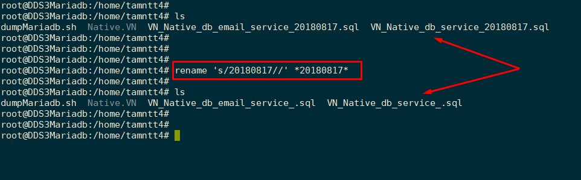

Thư mục lưu trữ một số script sưu tầm

## Một số lưu ý khi viết scrip

### 1) Đổi tên file

- Sử dụng lệnh rename để đổi, hoặc thay thế một chuỗi cụ thể trong tên file thành một chuỗi khác theo ý muốn.

    - Ví dụ: File có định dạng kết thúc bằng chuỗi 20180817, muốn thay thế các file đó, bỏ đi chuỗi 20180817 thực hiện như sau:

        `rename 's/20180817//' *20180817*` 

        Bỏ tất cả các chuỗi 20180817 có trong tên file (`*20180817*` : các file bất kì có xuất hiện chuỗi 20180817)

        

### 2)  Hiển thị tên file, bỏ phẩn mở rộng

- Ví dụ, trong một số trường hợp, bạn chỉ muốn lấy phần tên của file, không cần phần mở rộng (ví dụ: restore database từ file dump .sql , tên database lấy từ tên file dump). Sử dụng lệnh sau:

    `ls $file | cut -f1 -d'.' `

    (tránh dùng trong trường hợp file có nhiều đuôi mở rộng :v - kiểu .tar.gz)    

### 3) Một số câu lệnh với byobu

- Liệt kê các session hiện có:

    `byobu list-sessions`

- Kill sesseion cụ thể:

    `byobu kill-session <session_number>`
    