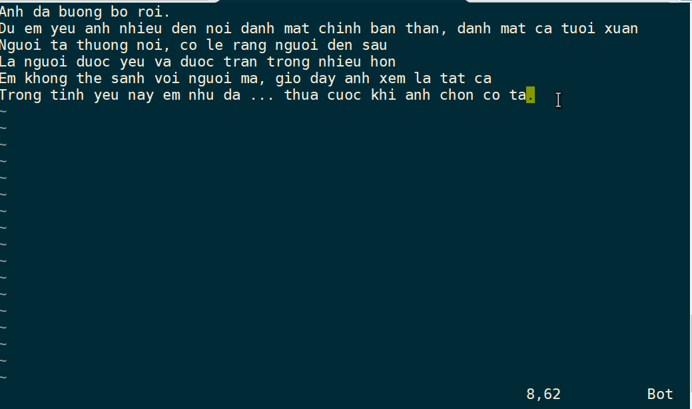

# Một vài tips với vi / vim

### ***Mục lục***

[1) Thao tác insert / comment nhiều dòng cùng lúc](#1)

[2) Thực hiện lệnh sed trong khi đang vi/vim file ](#2)

[3) Vim colors note](#3)

---

<a name = '1'></a>

## 1) Thao tác insert / comment nhiều dòng cùng lúc 

#### Cách 1: Sử dụng Ctrl+V để chuyển mode visual block

Thực hiện các bước sau: 

1. First, press `ESC`
2. Go to the line from which you want to start commenting. Then, press `ctrl` + `v`, this will enable the visual block mode.
3. Use the `down arrow` ( to select multiple lines that you want to comment.
4. Now, press `SHIFT` + `I` to enable insert mode.
5. Press `#` and it will add a comment to the first line. Then press `ECS` and wait for a second, # will be added to all the lines. 

#### Uncommenting Multiple Lines

1. Press `CTRL + V` to enable visual block mode.
2. Move down and select the lines till you want to uncomment.
3. press `x` and it will uncomment all the selected lines at once.

***Nguồn tham khảo:***  https://discuss.devopscube.com/t/how-to-comment-and-uncomment-multiple-line-vi-terminal-editor/64 


#### Cách 2: Comment theo số dòng với chế độ tương tự sed

Thực hiện bằng cách chèn thêm kí tự comment `#` vào đầu các dòng cần comment. Ví dụ comment từ dòng 3 tới dòng 10 trong file ahihi.txt thực hiện như sau: 

```visual basic
:set nu
:3,10s/^/#
```

Tương tự thì có tùy ý để thay thế các kí tự khác, bỏ comment hoặc thay thế các kí tự trong dòng.

***Nguồn tham khảo***: https://stackoverflow.com/a/19795760

<a name = '2'></a>

## 2) Thực hiện lệnh sed trong khi đang vi/vim file

Khi thực hiện thao tác với file sử dụng vi / vim, mình có thể thực hiện lệnh sed ngay trong mode edit. 

Ví dụ có file nội dung như sau: 




<a name = '3'></a>

## 3) Vim colors note 

- Set filetype theo filetype mong muốn: 

`:set filetype?`

`:set filetype=<filetype_name>`
