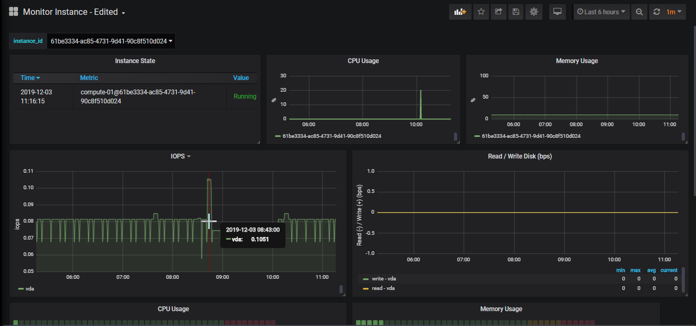
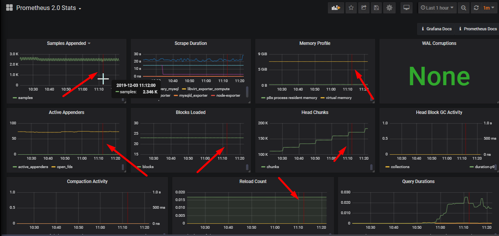
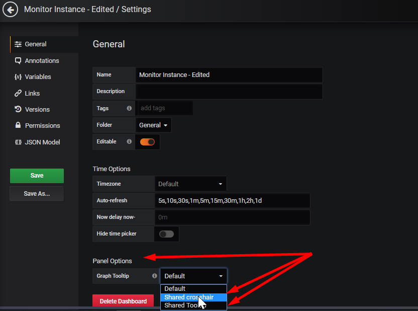
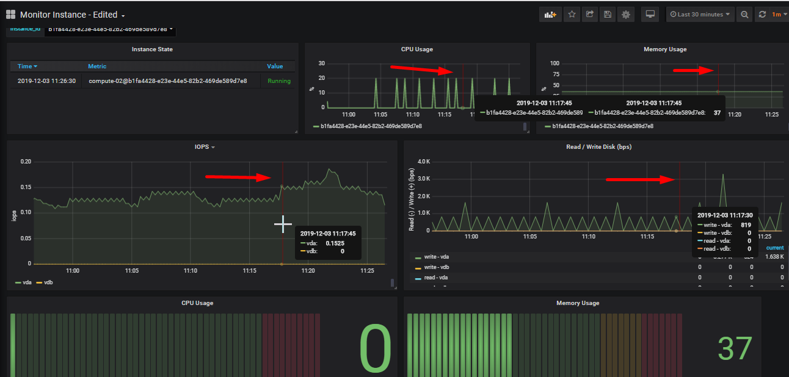

# Notes for use Grafana

Một số note nhỏ trong quá trình sử dụng grafana

Nhớ tới đâu thì note tới đó, đợt trước có mấy cái tip tạo dashboard nhìn cho đỡ xấu mà quên cmnr. 

### 1) Hiển thị trỏ chuột trên vùng time mọi panel cùng một dashboard

Nguồn:  https://github.com/grafana/grafana/issues/9282 

Grafana hỗ trợ tính năng cho phép show con trỏ chuột trên các graph khác nhau (trong cùng daaashboard)  ở cùng một thời điểm để tiện so sánh tương quan và đánh giá các sự kiện diễn ra trong thời điểm đó. Tất nhiên là con trỏ chuột cần phải được đồng bộ hóa thời gian trên cả 2 biểu đồ (graph) và có thể nhìn thấy trên cùng một page. 

Ví dụ: Các dashboard mình tự tạo ra, sẽ chỉ hiển thị các thông số trên từng graph khi di chuột vào vị trí đó: 

Vị trí chuột hiện ra thanh màu đỏ nhưng chỉ ở đúng graph mà mình đặt chuột vào. Không hiển thị tương quan trên các graph khác giống như dashboard mẫu import: 

Cách thực hiện được mô tả tại đây:  https://github.com/grafana/grafana/issues/9282 

Chọn dashboard setting, và chỉnh chọn Panel Options: Graph Tooltip là **Shared crosshair** hoặc **Shared tooltip**. (***shared crosshair will show a line over all graphs when you hover over any graph, shared tooltip will show tooltip as well on all graphs***)

Save lại, kết quả có như sau: 

**DONE  ᕙ(⇀‸↼‶)ᕗ**